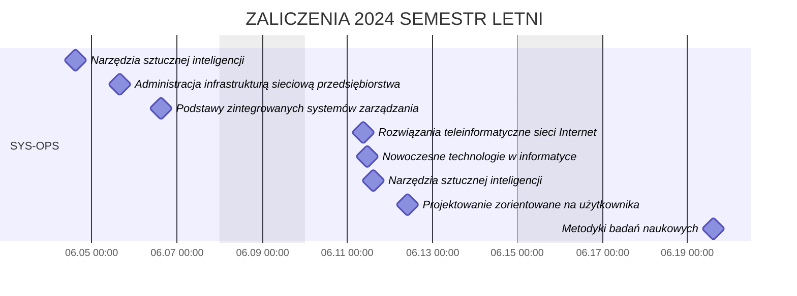

```yaml
date:         28.05.2024
copyright:    "All rights reserved (c) 2024 WEEK-END DEVELOPMENT"
version:      0x0001
```
# TABLICA INFORMACYJNA
- [TABLICA INFORMACYJNA](#tablica-informacyjna)
- [ZALICZENIA 2024 SEMESTR LETNI](#zaliczenia-2024-semestr-letni)
  - [SYS-OPS](#sys-ops)
- [EXTRA](#extra)
  - [STRONA Z NOTATKAMI](#strona-z-notatkami)
    - [Do Administracja sieciowymi systemami operacyjnymi](#do-administracja-sieciowymi-systemami-operacyjnymi)
---

# ZALICZENIA 2024 SEMESTR LETNI
## SYS-OPS
|   #   | PRZEDMIOT                                              |           TERMIN 0            |               TERMIN 1               | TERMIN 2 |
| :---: | ------------------------------------------------------ | :---------------------------: | :----------------------------------: | :------: |
|   1   | Metodyki badań naukowych                               |               -               |    14:30-16:45 19.06.2024 P5-101     |    -     |
|   2   | Narzędzia sztucznej inteligencji                       | 14:40-15:25 04.06.2024 P5-A-1 |    14:40-15:25 11.06.2024 P5-A-1     |    -     |
|   3   | Nowoczesne technologie w informatyce                   |               -               |    11:00-12:40 11.06.2024 P3-109     |    -     |
|   4   | Projektowanie zorientowane na użytkownika              |               -               |    10:05-10:50 12.06.2024 P1-114     |    -     |
|   5   | Ochrona danych w systemach i sieciach komputerowych    |               -               |                  -                   |    -     |
|   6   | Podstawy zintegrowanych systemów zarządzania           |               -               | 14:40-15:25 06.06.2024 P5-B-1/P1-204 |    -     |
|   7   | Rozwiązania teleinformatyczne sieci Internet           |               -               |    09:15-10:50 11.06.2024 P1-204     |    -     |
|   8   | Administracja infrastrukturą sieciową przedsiębiorstwa |               -               |    15:30-16:15 05.06.2024 P3-307     |    -     |



# EXTRA
## STRONA Z NOTATKAMI
### Do Administracja sieciowymi systemami operacyjnymi
[Strona Administracja Systemami SYS-OPS](https://week-end-development.github.io/WED/sys-ops.html)

Hasło:
```txt
wed8
```
