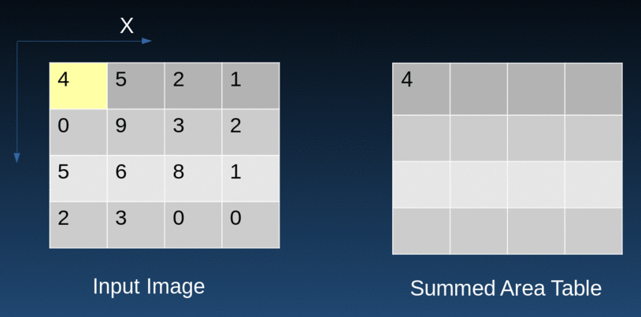

```
       All rights reserved (c) 2024 Week-End Development
██╗    ██╗███████╗███████╗██╗  ██╗     ███████╗███╗   ██╗██████╗
██║    ██║██╔════╝██╔════╝██║ ██╔╝     ██╔════╝████╗  ██║██╔══██╗
██║ █╗ ██║█████╗  █████╗  █████╔╝█████╗█████╗  ██╔██╗ ██║██║  ██║
██║███╗██║██╔══╝  ██╔══╝  ██╔═██╗╚════╝██╔══╝  ██║╚██╗██║██║  ██║
╚███╔███╔╝███████╗███████╗██║  ██╗     ███████╗██║ ╚████║██████╔╝
 ╚══╝╚══╝ ╚══════╝╚══════╝╚═╝  ╚═╝     ╚══════╝╚═╝  ╚═══╝╚═════╝
      ██████╗ ███████╗██╗   ██╗███████╗   Version: 001
      ██╔══██╗██╔════╝██║   ██║██╔════╝   DATE: 17/01/2024
      ██║  ██║█████╗  ██║   ██║███████╗   Author: bos-8
      ██║  ██║██╔══╝  ╚██╗ ██╔╝╚════██║         & Nikosky
      ██████╔╝███████╗ ╚████╔╝ ███████║
      ╚═════╝ ╚══════╝  ╚═══╝  ╚══════╝   PRESENT:
```
# SYSTEMY WIZYJNE
***10/2023 - 01/2024***

## Transformacja kamerowa
To proces określania pozycji obiektu lub robota na podstawie informacji z systemu wizyjnego.
Te równania pozwalają przeliczać współrzędne rzeczywiste na monitorowe i odwrotnie.
```math
x_r=\frac{a_1*x_m+a_2*y_m+a_3}{a_7*x_m+a_8*y_m+1}
```
```math
y_r=\frac{a_4*x_m+a_5*y_m+a_6}{a_7*x_m+a_8*y_m+1}
```
$$ \downarrow $$

$$ x_r(i)=a_1x_m(i)+a_2y_m(i)+a_3-a_7x_r(i)x_m(i)-a_8x_r(i)y_m(i) $$

$$ y_r(i)=a_4x_m(i)+a_5y_m(i)+a_6-a_7x_r(i)x_m(i)-a_8x_r(i)y_m(i) $$

GDZIE:

```math 
x_r,y_r-\text{współrzędne rzeczywiste punktu,}
```
```math
x_m,y_m-\text{współrzędne monitorowe punktu,}
```
```math
a_1,a_2,a_3,a_4,a_5,a_6,a_7,a_8-\text{współrzędne transformacji.}
```

Wzory transformacji uwzględniają współczynniki a1 do a8, które są stałe dla danego ustawienia kamery względem obiektu.

```math
\begin{bmatrix}
x_r(1) & y_m(1) & 1 & 0 & 0 & 0 & -x_r(1)x_m(1) & -x_r(1)y_m(1) \\
x_r(2) & y_m(2) & 1 & 0 & 0 & 0 & -x_r(2)x_m(2) & -x_r(2)y_m(2) \\
x_r(3) & y_m(3) & 1 & 0 & 0 & 0 & -x_r(3)x_m(3) & -x_r(3)y_m(3) \\
x_r(4) & y_m(4) & 1 & 0 & 0 & 0 & -x_r(4)x_m(4) & -x_r(4)y_m(4) \\
0 & 0 & 0 & x_m(1) & y_m(1) & 1 & -y_r(1)x_m(1) & -y_r(1)y_m(1) \\
0 & 0 & 0 & x_m(2) & y_m(2) & 1 & -y_r(2)x_m(2) & -y_r(2)y_m(2) \\
0 & 0 & 0 & x_m(3) & y_m(3) & 1 & -y_r(3)x_m(3) & -y_r(3)y_m(3) \\
0 & 0 & 0 & x_m(4) & y_m(4) & 1 & -y_r(4)x_m(4) & -y_r(4)y_m(4)
\end{bmatrix}
*
\begin{bmatrix}
a_1 \\
a_2 \\
a_3 \\
a_4 \\
a_5 \\
a_6 \\
a_7 \\
a_8
\end{bmatrix}
=
\begin{bmatrix}
x_r(1) \\
x_r(2) \\
x_r(3) \\
x_r(4) \\
y_r(1) \\
y_r(2) \\
y_r(3) \\
y_r(4)
\end{bmatrix}
```

Rozwiązanie tego układu pozwala na dokładne określenie współczynników transformacji, co z kolei umożliwia przeliczanie współrzędnych rzeczywistych na podstawie monitorowych i vice versa.

## Analiza BLOB
**(Binary Large OBject)** to efektywna technika przetwarzania obrazów, charakteryzująca się wysoką elastycznością.

Przykłady zastosowania analizy Blob:
1. Detekcja uszkodzonych bezpieczników,
2. Detekcja nadmiernej ilości segmentu uszczelki gumowej,


| Plusy analizy BLOB | Minusy analizy BLOB |
|---------------------|----------------------|
| Wysoka elastyczność | Ograniczona stosowalność do zadań wydobywania regionów obiektów |
| Znakomita wydajność | Alternatywa w postaci dopasowania szablonów |
| Detekcja obiektów o zmiennych kształtach | Dokładność obliczeń ograniczona do rozmiaru piksela |
| Przydatność w analizie obrazów medycznych | Trudności w przypadku blisko położonych obiektów |
| Stosowana w przemyśle do detekcji obiektów | Wrażliwość na szumy i zakłócenia |
| Możliwość detekcji obiektów różnych rozmiarów | Ograniczenia przy złożonych obrazach |

**Region** - jest dowolnym podzbiorem zbioru współrzędnych pikseli w obrazie.

**Typowe zastosowanie anallizy Blob (kroki):**
1. **Wydobycie (ang. Extraction)** - region odpowiadający obiektom jest wydobywany z obrazu zazwyczaj poprzez zastosowanie progowania obrazu.

2. **Przetwarzanie (ang. Processing)** -region poddawany jest rozmaitym transformacjom, których celem jest wzmocnienie jego zgodności do właściwego obiektu, bądź uwydatnienie cech, które będą podlegać inspekcji. Podczas tej fazy regin jest często dzielony w połączone ze sobą komponenty, tak, aby każdy z nich mógł osobno podlegać analizie.
3. **Wydobycie cech (ang. Feature Extraction)** - obliczenie numerycznych oraz geometrycznych cech opisujących przetworzone regiony, takie jak średnica, obwód, zwartość, itp. Cechy te mogą być oczekiwanym rezultatem transformacji, lub też mogą być użyte do odróżnienia regionów w celu ich klasyfikacji.


## OBRAZ BINARNY (uint8)

to rodzaj obrazu cyfrowego, w którym piksele są reprezentowane przez 8-bitowe wartości liczbowe, przyjmujące tylko dwa stany: 0 (czarny) i 255 (biały). Są one szeroko wykorzystywane w analizie obrazów, przetwarzaniu wizualnym, segmentacji obiektów i rozpoznawaniu. Mają prostą strukturę, co ułatwia ich przetwarzanie i analizę. Znajdują zastosowanie w wizji komputerowej, analizie medycznej, robotyce, detekcji krawędzi i innych dziedzinach, a także jako reprezentacja informacji logicznych.
## OBRAZ BINARNY (1 bit)

to prosty rodzaj obrazu cyfrowego, gdzie każdy piksel może mieć wartość 0 (czerń) lub 1 (biel). Są wykorzystywane w aplikacjach, gdzie istotne jest tylko wystąpienie lub brak danego elementu, a nie jego odcień czy detale. Obrazy binarne o 1 bit są przydatne w ikonach, maskach, algorytmach segmentacji i wykrywania krawędzi. Mają niskie wymagania pamięciowe i są skuteczne w kompresji danych. Popularnym formatem dla obrazów binarnych jest BMP, a do kompresji stosuje się techniki takie jak run-length encoding (RLE).
## KODOWANIE BIEŻĄCYCH DŁUGOŚCI (RLE)

to prosta metoda kompresji danych stosowana w kompresji obrazów i danych tekstowych. Polega na zastępowaniu powtarzających się sekwencji danych symbolem i liczbą powtórzeń. W przypadku kompresji obrazów, RLE analizuje powtarzające się sekwencje pikseli o tym samym kolorze i zastępuje je specjalnym symbolem i liczbą powtórzeń. Ta technika może znacznie zmniejszyć rozmiar pliku, szczególnie w przypadku obrazów z dużymi obszarami powtarzającymi się. Jednak skuteczność RLE zależy od charakterystyki danych wejściowych, a po dekompresji dane są przywracane do pierwotnej formy.

## Operacje podstawowe
$$ + \ \text{pixel on,} \ - \ \text{pixel off}$$
- **Suma** - Suma dwóch regionów jest regionem posiadającym piksele należące do każdego z wejściowych regionów.
```math 
\begin{bmatrix}
++++\\
++--\\
++--
\end{bmatrix}
+
\begin{bmatrix}
-+++\\
---+\\
---+
\end{bmatrix}
\rightarrow
\begin{bmatrix}
++++\\
++-+\\
++-+
\end{bmatrix}
```
- **Różnica** - Jej
wynikiem są piksele pierwszego regionu, lecz tylko te, które nie znajdują się w drugim regionie.
```math 
\begin{bmatrix}
++++\\
++--\\
++--
\end{bmatrix}
-
\begin{bmatrix}
-+++\\
---+\\
---+
\end{bmatrix}
\rightarrow
\begin{bmatrix}
+---\\
++--\\
++--
\end{bmatrix}
```
- **Iloczyn** - Część wspólna dwóch regionów jest regionem posiadającym piksele należące równocześnie do obu wejściowych regionów.
```math 
\begin{bmatrix}
++++\\
++--\\
++--
\end{bmatrix}
*
\begin{bmatrix}
-+++\\
---+\\
---+
\end{bmatrix}
\rightarrow
\begin{bmatrix}
-+++\\
----\\
----
\end{bmatrix}
```
- **Dopełnienie** - Dopełnienie jest jedyną operacją jednoargumentową dającą się zastosować do regionów.
```math 
\begin{bmatrix}
++++\\
+---\\
+---
\end{bmatrix}
\text{dopełnienie}\rightarrow
\begin{bmatrix}
----\\
-+++\\
-+++
\end{bmatrix}
```

## Operacje morfologiczne
- **Jądro** -
```math 
1.
\begin{bmatrix}
+++\\
+++\\
+++
\end{bmatrix}
2.
\begin{bmatrix}
-+-\\
+++\\
-+-
\end{bmatrix}
3.
\begin{bmatrix}
---\\
-++\\
-+-
\end{bmatrix}
```
- **Dylatacja** - Dylatacja jest operacją przeciwną do erozji. Polega na rozszerzaniu obszarów obiektów poprzez dodawanie pikseli do obszaru obiektu na podstawie określonego elementu strukturalnego.
```math 
\begin{bmatrix}
-------\\
--+----\\
-+-+++-\\
-+---+-\\
-------
\end{bmatrix}
\rightarrow
\begin{bmatrix}
-+-\\
+++\\
-+-
\end{bmatrix}
\rightarrow
\begin{bmatrix}
--+----\\
-+++++-\\
+++++++\\
+++++++\\
-+---+-
\end{bmatrix}
```
- **Erozja** - to jedna z podstawowych operacji morfologicznych w przetwarzaniu obrazów. Operacja ta polega na zmniejszaniu rozmiaru obiektów na obrazie poprzez usunięcie pikseli z obszarów obiektów. Proces ten jest często wykorzystywany do eliminacji małych detali, zmniejszania rozmiaru obiektów i separowania obiektów od krawędzi.
```math 
\begin{bmatrix}
--+----\\
-+++++-\\
+++++++\\
+++++++\\
-+---+-
\end{bmatrix}
\rightarrow
\begin{bmatrix}
-+-\\
+++\\
-+-
\end{bmatrix}
\rightarrow
\begin{bmatrix}
-------\\
--+----\\
-+++++-\\
-+---+-\\
-------
\end{bmatrix}
```
- **Otwarcie** - Otwarcie to sekwencja operacji erozji, a następnie dylatacji. Jest skuteczne w usuwaniu drobnych detali i szumów na obrazie oraz oddziela obiekty, które są blisko siebie, ale nie stykają się.
```math 
\begin{bmatrix}
-----+-\\
--+----\\
-++++-+\\
+++--+-\\
-+-----
\end{bmatrix}
\rightarrow
\begin{bmatrix}
-+-\\
+++\\
-+-
\end{bmatrix}
\rightarrow
\begin{bmatrix}
-------\\
--+----\\
-+++---\\
+++----\\
-+-----
\end{bmatrix}
```
- **Domknięcie** - Domknięcie to sekwencja operacji dylatacji, a następnie erozji. Pomaga w zamykaniu szczelin między obiektami oraz łączeniu obiektów, które są blisko siebie.
```math 
\begin{bmatrix}
-------\\
--+----\\
-+-+++-\\
-+---+-\\
-------
\end{bmatrix}
\rightarrow
\begin{bmatrix}
-+-\\
+++\\
-+-
\end{bmatrix}
\rightarrow
\begin{bmatrix}
-------\\
--+----\\
-+++++-\\
-+---+-\\
-------
\end{bmatrix}
```

## Histogram
korekta bitmapy, jak liczyć, do czego?

### Kontrast
Kontrast określa różnicę między najjaśniejszymi a najciemniejszymi obszarami obrazu.

$$ \text{KONTRAST}=\frac{MAX_{jasność}-MIN_{jasność}}{MAX_{jasność}+MIN_{jasność}} $$

### Jasność
Jasność obrazu jest średnią jasnością wszystkich pikseli.

$$ \text{JASNOŚĆ}=\frac{1}{N} \sum_{i=1}^{N} (\text{jasność pixela})_i $$

GDZIE:
- N to liczba wszystkich pikseli w obrazie.
- Jasność piksela_i to wartość jasności i-tego piksela.

#### Korekta jasności
$$ h'=255*\frac{h-h_{min}}{h_{max}-h_{min}} $$

GDZIE:
- h_min, h_max - pierwszy niezerowy oraz ostatni poziom jasności w bitmapie,
- h - jasność danego pixela,
- h' - nowa jasność po korekcie


### Ostrość
Ostrość w kontekście przetwarzania obrazów odnosi się do stopnia kontrastu między pikselami sąsiadującymi.

$$ \text{OSTROŚĆ}=\sqrt{(\frac{\partial I}{\partial x})^2+(\frac{\partial I}{\partial y})^2} $$

GDZIE:
- I to intensywność piksela,
- $\frac{\partial I}{\partial x}$ i $\frac{\partial I}{\partial y}$​ to pochodne cząstkowe jasności obrazu względem współrzędnych xx i yy.

W praktyce często używa się różnych modyfikacji tego wzoru, a także filtry do wygładzania lub wyostrzania obrazu w celu manipulacji ostrością.

### Saturacja
Saturacja odnosi się do nasycenia kolorów na obrazie.

$$ \text{SATURACJA}=\frac{Max_{RGB}-Min_{RGB}}{Max_{RGB}+Min_{RGB}} $$

GDZIE:
- Max to maksymalna wartość kanału koloru (czerwonego, zielonego lub niebieskiego),
- Min to minimalna wartość kanału koloru.

Wzory te pozwalają na ilościową ocenę ostrości oraz saturacji obrazu, co może być istotne w analizie wizyjnej, przetwarzaniu obrazów medycznych, grafice komputerowej i wielu innych dziedzinach.

## HISTOGRAM
Używany do analizy rozkładu intensywności pikseli w obrazie i dokonywania odpowiednich dostosowań w celu poprawy ekspozycji, kontrastu i balansu kolorów. Innymi słowy, odpowiednie pytanie, ile pikseli w bitmapie posiada konkretną jasność. W analizowanych bitmapach jasność pikseli może zmieniać się w zakresie między 0 a 255 – wynika więc z założenia, że histogram dotyczy albo bitmapy w skali szarości, albo badamy histogram w każdym kanale oddzielnie.

Przykładowe zastosowania histogramu obejmują:

- Korekcję ekspozycji, gdzie można dostosować krzywą tonalną, aby poprawić równomierne rozłożenie jasności w obrazie.
- Korekcję kontrastu, pozwala na rozciągnięcie zakresu tonalnego, aby zwiększyć różnicę między jasnymi i ciemnymi obszarami obrazu.
- Korekcję balansu kolorów, pozwala na identyfikację przewagi pewnych kolorów i dostosowanie ich proporcji w celu uzyskania bardziej neutralnego lub pożądanego efektu kolorystycznego.
- Korekcję przetwarzania nieliniowego, może posłużyć do manipulacji krzywymi tonalnymi, takimi jak korekcja gamma.

Na przykładzie obrazu Leny, wykres histogramu został rozciągnięty na całą długość, co spowodowało zwiększenie zakresu kolorów, a tym samym uczyniło obraz bardziej żywym i dynamicznym.

## Transformacja Hougha
(ang. Hough transform) – metoda wykrywania regularnych kształtów w widzeniu komputerowym.
### Zasada wykrywania prostych
Obraz (np. z kamery) jest reprezentowany przez piksele o współrzędnych kartezjańskich x, y. Prostą można zapisać jako kąt nachylenia $\theta$ i odległość od początku układu współrzędnych $\rho$

$$ x \ cos(\theta)+y \ sin(\theta)=\rho $$

Są to też dwie współrzędne, dlatego można utworzyć prostokątny zbiór punktów w układzie współrzędnych $\theta,\rho$ (przestrzeń parametrów), w którym każdy punkt reprezentuje prostą. Ponieważ oryginalny obraz ma ograniczone rozmiary, współrzędne $\theta,\rho$ zbioru punktów reprezentujących proste są ograniczone: $ 0<\theta<\pi, \ -R<\rho<R $ gdzie  R – przekątna obrazu, więc zbiór ten można ograniczyć, z założoną dokładnością, do skończonej liczby punktów.

## Integralność obrazu (Integral image)
**Integralny obraz (integral image)** - to technika przetwarzania obrazu używana do efektywnego obliczania sumy pikseli w określonym obszarze obrazu. Jest szeroko stosowana w algorytmach detekcji obiektów, filtrowania obrazu i przetwarzania obrazów czasu rzeczywistego. Dzięki temu, dla dowolnie dużego obrazu, obliczenia związane z wybranym pikselem są znacznie zredukowane, ograniczając się do operacji bazującej na jedynie czterech pikselach, które definiują obszar.

$$
\begin{bmatrix}
1 & 2 & 3 & 4 \\
5 & 6 & 7 & 8 \\
9 & 10 & 11 & 12 \\
13 & 14 & 15 & 16 \\
\end{bmatrix}
\rightarrow
\begin{bmatrix}
1 & 3 & 6 & 10 \\
6 & 14 & 24 & 36 \\
15 & 33 & 54 & 78 \\
28 & 60 & 96 & 136 \\
\end{bmatrix}
$$



## EXTRA
### Schemat blokowy procesu konfiguracji systemu wizyjnego
1. Utworzenie pliku konfiguracyjnego kamery
1. Utworzenie punktu TCP
1. Synchronizacja układów współrzędnych kamery i robota
1. Kalibracja obszaru pracy kamery
1. Tworzenie programu procesu wizyjnego
1. Tworzenie programu robota
1. Test programu
