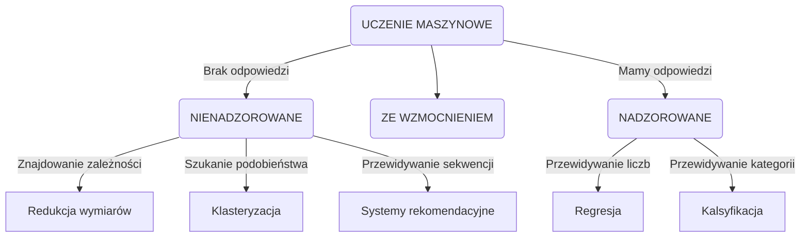

```yaml
authors:      ["Fr0zen", "BO$"]
date:         [02.06.2024]
copyright:    "All rights reserved (c) 2024 WEEK-END DEVELOPMENT"
version:      0x0003
```
- [Narzędzia sztucznej inteligencji](#narzędzia-sztucznej-inteligencji)
- [EtapTworzeniaModelu](#etaptworzeniamodelu)
- [Proces treningu sieci neuronowej](#proces-treningu-sieci-neuronowej)
- [Podział zbioru danych](#podział-zbioru-danych)
  - [Zbiór Train](#zbiór-train)
  - [Zbiór Validation](#zbiór-validation)
  - [Zbiór Test](#zbiór-test)
- [Metody strojenie modelu](#metody-strojenie-modelu)
- [Regresja Liniowa](#regresja-liniowa)
  - [Wydajność modeli regresji:](#wydajność-modeli-regresji)
  - [Wady](#wady)
  - [Zalety](#zalety)
  - [Wybór optymalnego modelu regresyjnego (kryteria)](#wybór-optymalnego-modelu-regresyjnego-kryteria)
- [Regresja logistyczna](#regresja-logistyczna)
  - [Funkcja Sigmoid](#funkcja-sigmoid)
  - [Regresja liniowa vs logistyczna](#regresja-liniowa-vs-logistyczna)
- [Metody próbkowania danych](#metody-próbkowania-danych)
  - [Bazujące na prawdopodobieństwie](#bazujące-na-prawdopodobieństwie)
  - [Bez prawdopodobieństwa](#bez-prawdopodobieństwa)
- [Ewaluacja modelu (ocena)](#ewaluacja-modelu-ocena)
  - [Dokładność (accurancy)](#dokładność-accurancy)
  - [Precyzja (precision)](#precyzja-precision)
  - [Recall (czułość)](#recall-czułość)
  - [F1-Score](#f1-score)
  - [MCC](#mcc)
  - [ROC](#roc)
  - [IoU](#iou)
  - [AUC](#auc)
  - [mAP](#map)
- [Definicje](#definicje)
  - [Data Science](#data-science)
  - [Data Warehouse](#data-warehouse)
  - [Data Lake](#data-lake)
  - [BigData](#bigdata)
    - [3V-5V](#3v-5v)
  - [Źródła danych](#źródła-danych)
  - [DataSet](#dataset)
  - [Machine Learning](#machine-learning)
  - [EDA ( Exploratory Data Analysis )](#eda--exploratory-data-analysis-)
  - [Przygotowanie danych](#przygotowanie-danych)
  - [Czyszczenie danych](#czyszczenie-danych)
  - [Próbkowanie danych (data sampling)](#próbkowanie-danych-data-sampling)
  - [Skalowanie cech](#skalowanie-cech)
  - [Transformacja danych (Data wrangling)](#transformacja-danych-data-wrangling)
  - [Filtrowanie cech](#filtrowanie-cech)
  - [Przeuczenie(Overfitting)](#przeuczenieoverfitting)
  - [Przewidywanie wartości ciągłych](#przewidywanie-wartości-ciągłych)
  - [Przewidywanie etykiet klas](#przewidywanie-etykiet-klas)
  - [Parametry](#parametry)
  - [Hiperparametry](#hiperparametry)
  - [Metoda Zespołowa (Ensemble learning)](#metoda-zespołowa-ensemble-learning)
  - [Macierz pomyłek](#macierz-pomyłek)

Narzędzia sztucznej inteligencji
================================================================



[LINK do całego pliku](https://github.com/Week-end-Development/INF-I/blob/main/sem6/ai-tools/ait-cheat-sheet.md)