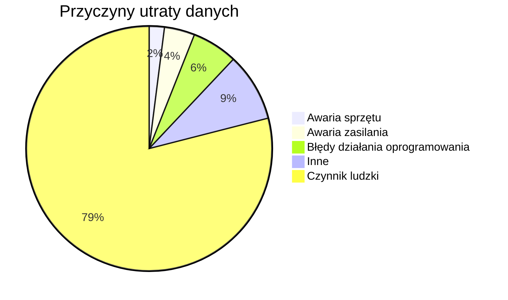
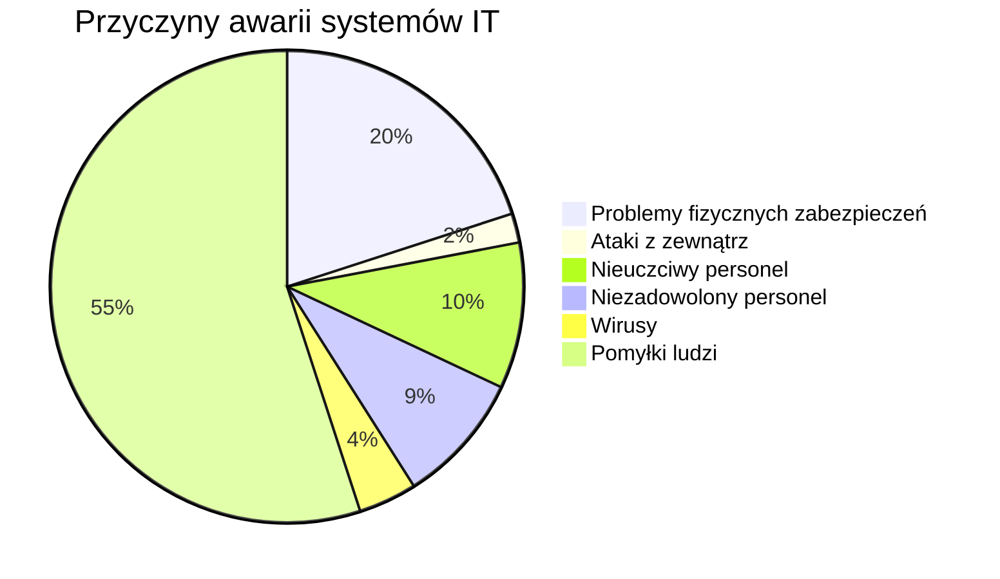
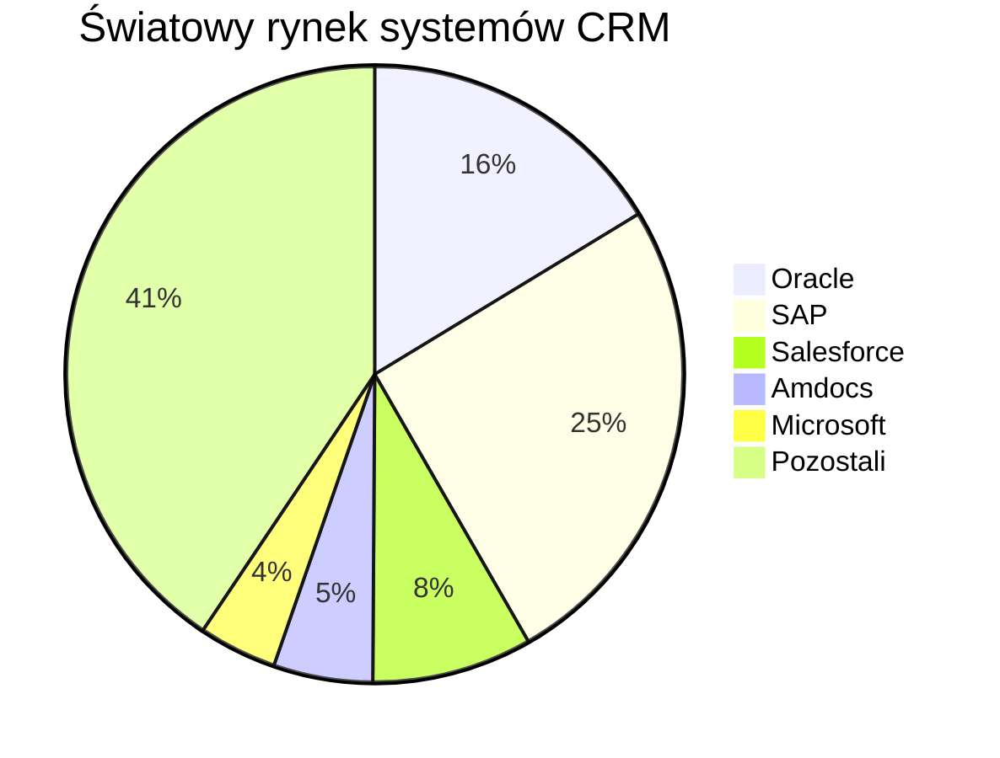

```yaml
authors:      "BO$"
date:         [12.06.2024]
copyright:    "All rights reserved (c) 2024 WEEK-END DEVELOPMENT"
version:      0x0001
```
Podstawy zintegrowanych systemów zarządzania
================================================================

# Systemy Planowania Zasobów Przedsiębiorstwa (ERP)
to zintegrowane systemy informatyczne zarządzające funkcjami przedsiębiorstwa.

## Korzyści wdrożenia systemu ERP:
- Efektywne zarządzanie zamówieniami sprzedaży i planowaniem produkcji,
- Analiza procesów biznesowych w interaktywnym środowisku,
- Synchronizacja działań między działami (zasoby ludzkie, finanse, produkcja),
- Monitorowanie i śledzenie przepływu informacji wewnątrz organizacji,
- Nadzór nad stanami zapasów,
- Kontrola zakupów materiałów,
- Automatyzacja wprowadzania danych,
- Synchronizacja zamówień, wycen i raportowania,
- Ograniczenie przestojów produkcyjnych, kosztów zapasów, kosztów produkcji i błędów w danych,
- Optymalizacja wartości uzyskiwanej z zasobów i wyposażenia przedsiębiorstwa.

### Typologia Systemów Informatycznych Zarządzania:
1. **System cząstkowy** - działa w jednej dziedzinie, obejmując wybrane funkcje dziedziny.
2. **System dziedzinowy (jednodziedzinowy)** - działa w jednej dziedzinie
3. **System wielodziedzinowy** - obejmuje co najmniej dwie dziedziny.
   - **System prosty** - wielodziedzinowy, nie obsługuje działalności podstawowej organizacji.
   - **System bazowy** - obsługuje funkcje bazowe
   - **System rozwinięty** - obsługuje podstawowe agendy oraz dodatkowe dziedziny.
   - **Systemy kompleksowo zintegrowane (kompleksowe)** - integrują techniczne przygotowanie produkcji i automatyczne sterowanie procesami produkcyjnymi z zarządzaniem całej organizacji.

# System
- to obiekt fizyczny lub abstrakcyjny, składający się z powiązanych elementów.
- W filozofii system to zbiór tez i twierdzeń tworzących spójną całość, zasady organizacji, przepisy lub reguły.
- System jest wyodrębnionym z otoczenia zbiorem powiązanych elementów i relacji między nimi.

## Klasyfikacja Systemów
- **Abstrakcyjne**: pojęcia, reguły i modele
- **Fizyczne**: zbudowane z materii lub energii
- **Statyczne**: niezmienne w czasie
- **Dynamiczne**: zmieniają się w zależności od zmian w ich elementach
- **Otwarte, zamknięte i autonomiczne**: Podział systemów fizycznych zależy od stopnia interakcji z otoczeniem.

## System Informacyjny
Transformują informacje wejściowe na wyjściowe przy użyciu określonych procedur i modeli. Uzyskane informacje służą do podejmowania decyzji.

## System Informatyczny
Wyodrębniona część systemu informacyjnego, która jest skomputeryzowana. Składa się z elementów społecznych (ludzie) i technicznych (technologia informatyczna), współpracujących dla osiągnięcia określonych celów.
- **Proste**: rejestr wejścia do budynku uruchamiany na jednym komputerze.
- **Złożone**: system kontroli lotów, system bankowy, system zarządzania produkcją w mleczarni.

### Elementy Systemu Informatycznego
- **Sprzęt**: Komputery, czujniki, kamery, skanery
- **Oprogramowanie**
- **Zasoby osobowe**: Ludzie
- **Elementy organizacyjne**: Procedury korzystania z systemu, instrukcje robocze.
- **Elementy informacyjne i bazy wiedzy**: Ontologie dziedzin, podręczniki (np. księgowania w systemie finansowo-księgowym).

## Podsystemy organizacji według modelu Leavitta
1. **Ludzie**: Członkowie organizacji z ich kwalifikacjami, wartościami, postawami, motywacjami, aspiracjami, celami osobistymi i relacjami.
2. **Zadania**: Cele i zadania organizacji, które członkowie formułują i realizują.
3. **Technologia**: Metody i techniki osiągania celów oraz realizowania zadań organizacji, stanowiące podsystem techniczny.
4. **Struktura**: Właściwości strukturalne elementów organizacji, takie jak struktura organizacyjna, funkcjonalna, przestrzenna, informacyjna, techniczna, zadaniowa i czasowa.

# Fazy procesu decyzyjnego
- **SES** - Systemy ewidencyjno-sprawozdawcze
  - Opis sytuacji decyzyjnej
- **SIK** - Systemy informowania kierownictwa
  - Analiza sytuacji decyzyjnej
- **SWD** - Systemy wspomagania decyzji
  - Badanie odchyleń sytuacji decyzyjnej od warunków zadanych
  - Określenie zbioru możliwych wariantów decyzji
  - Ocena wariantów decyzji
  - Podjęcie decyzji (wybór wariantu)
  - Przekazanie decyzji do realizacji
- **SBW** - Systemy z bazą wiedzy

# Czynniki wpływające na organizację
- **Globalizacja** - konieczność konkurencji z przedsiębiorstwami z całego świata,
- **Wzrost wymagań klientów**
- **Strategiczne znaczenie wiedzy**
- **Technologie teleinformatyczne**

# Formy zarządzania organizacją gospodarczą
| Forma zarządzania        | Obiekt (cel) oddziaływań sterujących | Sposób podejmowania decyzji                                            | Zakres informatyzacji                                                                                                          |
| ------------------------ | ------------------------------------ | ---------------------------------------------------------------------- | ------------------------------------------------------------------------------------------------------------------------------ |
| Zarządzanie strategiczne | ORGANIZACJA                          | – wybory intuicyjne <br> – wybory kompromisowe                         | prowadzone są badania nad zastosowaniami systemów informatycznych do rozwiązywania nieustrukturyzowanych problemów decyzyjnych |
| Zarządzanie operacyjne   | PRZEDSIĘ-WZIĘCIE                     | – wybory kompromisowe <br> – ocena wariantów <br> – wykonanie obliczeń | częste stosowanie informatyki w obliczeniach optymalizacyjnych w systemach informatycznych zarządzania                         |
| Zarządzanie wykonawcze   | PROCES                               | – wykonanie obliczeń                                                   | pełna informatyzacja procesów ewidencyjnych i rutynowych procesów decyzyjnych                                                  |


# Modele w architekturze ANSI/SPARC
- **Model wewnętrzny**: Rzeczywista, fizyczna struktura bazy danych zawierająca indeksy, uporządkowania pól i zestawy znaków. Uzupełnia schemat koncepcyjny.
- **Model koncepcyjny**: Reprezentuje informacje zawarte w bazie danych, zawiera struktury, operacje i ograniczenia modelu danych, takie jak tabele, reguły integralności oraz język SQL w bazie relacyjnej.
- **Model zewnętrzny**: Kolekcja perspektyw używanych przez aplikacje korzystające z bazy danych. Dane są prezentowane użytkownikowi w formie odwzorowanej z zapisu fizycznego na postać w schemacie koncepcyjnym.

Trzy punkty widzenia
- **External view:** punkt widzenia użytkownika, np. programisty bazy danych
- **Conceptual view:** punkt widzenia systemu bazy danych, abstrakcyjny opis kawałka rzeczywistości
- **Internal view:** punkt widzenia rozmieszczenia danych.

# Architektura klient-serwer

## Architektura dwuwarstwowa
- Rozwinęła się dynamicznie pod koniec lat 80-tych.
- Systemy podzielono na dwie części:
  - Przechowywanie danych i zachowanie ich pełnej spójności.
  - Aplikacje przetwarzające dane od użytkownika i przesyłające je do serwera.

## Architektura dwu i półwarstwowa
- Aplikacja kliencka nie odwołuje się bezpośrednio do bazy danych, lecz wywołuje operacje w serwerze danych.
- Serwer realizuje reguły biznesowe wspólne dla wszystkich aplikacji klienckich.

## Architektura trójwarstwowa
- Wprowadza trzecią warstwę, niezależną od serwera i aplikacji klienckiej, odpowiedzialną za przetwarzanie funkcjonalne informacji.
- Aplikacja kliencka komunikuje się z serwerem aplikacji, który odwołuje się do bazy danych.
- **WARSTWY**
  - bazy danych (serwer)
  - aplikacji (serwer)
  - prezentacji (stacje robocze)

## Architektura R/3
- Transakcja - dokonywanie zmian w bazie, przepływ danych
  - faza interaktywna - przygotowanie zmian i rekordów
  - faza uaktualnienia - przetworzenie zmian
  - TYPY
    - Wyświetlanie danych dotyczących obiektu
    - Wyświetlanie listy obiektów powiązanych
    - Tworzenie obiektu
    - Zmiana danych obiektu
- Krok dialogowy - zbiór kroków tworzy transakcje
- Logiczne jednostki pracy - ochrona integralności transakcji
- Instancja
- Procesy robocze
| TYP PROCESU ROBOCZEGO | WYKORZYSTANIE                                                                                                              |
| --------------------- | -------------------------------------------------------------------------------------------------------------------------- |
| Dialog (D)            | Komunikacja (dialog) użytkownika z systemem                                                                                |
| Update (V,V2)         | Aktualizacja przetworzonych rekordów bazy danych (faza uaktualnienia w transakcji)                                         |
| Background (B)        | Realizuje prace pochłaniające duże ilości czasu oraz prace, które wykonane mają być automatycznie, bez udziału użytkownika |
| Enqueue (E)           | Zarządzanie blokadami, umożliwia synchroniczny dostęp wielu serwerom aplikacji do bazy danych i utrzymuje spójność danych  |
| Spool (S)             | Formatowanie wydruku, obsługa kolejki wydruku                                                                              |
- Message Server
- Dispatcher

# SAP R/3
## Cechy
- Zintegrowana budowa modułowa
- Trójwarstwowa architektura klient-serwer
- Skalowalność
- Otwarta architektura
- Przenośność
- Obszerne środowisko rozwoju aplikacji (ABAP)
- Międzynarodowość
- Rozwiązania branżowe

# DEFINICJE
## ZSZ
**Zintegrowany system zarządzania** - system modułowy obsługujący wszystkie sfery działalności organizacji.

## ZSI
**Zintegrowany system informatyczny przedsiębiorstwa** - system informatyczny zarządzający różnymi funkcjami przedsiębiorstwa.

## KSZ
**Komputerowy system zarządzania** - system informatyczny wspomagający zarządzanie.

## ALE (Application Link Enabling)
technologia umożliwiająca swobodną komunikację pomiędzy kilkoma aplikacjami, zawierająca mechanizmy kontrolujące spójność danych

## Administrator
jest kluczową osobą odpowiedzialną za efektywne zarządzanie systemem informatycznym w przedsiębiorstwie.

### Zadania:
1. Nadzorowanie pracy serwerów.
2. Zarządzanie kontami użytkowników.
3. Konfiguracja komputerów.
4. Instalowanie oprogramowania.
5. Dbanie o bezpieczeństwo systemu.
6. Archiwizacja danych.
7. Eliminowanie nieprawidłowości.
8. Utrzymywanie porządku treści w sieci.

### Podział zadań ze względu na częstotliwość wykonywania:
**Zadania cykliczne:**
- Krótkookresowe (wykonywane codziennie):
  - Monitorowanie pracy serwerów.
  - Nadzorowanie dostępności systemu dla użytkowników.
  - Wykonywanie kopii zapasowych danych.
  - Aktualizacja oprogramowania zabezpieczającego.
- Średniookresowe (wykonywane tygodniowo):
  - Przeglądanie i aktualizowanie listy kont użytkowników.
  - Skanowanie systemu w poszukiwaniu potencjalnych zagrożeń.
  - Analiza wydajności systemu i optymalizacja zasobów.
- Długookresowe (wykonywane co miesiąc):
  - Przeprowadzanie gruntownych przeglądów bezpieczeństwa systemu.
  - Aktualizacja i konserwacja sprzętu komputerowego.
  - Dokonywanie analizy trendów w zużyciu zasobów systemowych i podejmowanie odpowiednich działań zapobiegawczych.

**Zadania niecykliczne (wykonywane okazjonalnie):**
- Migracja danych na nowy sprzęt lub nową wersję oprogramowania.
- Rozwiązywanie awarii sprzętowych lub programowych.
- Przeprowadzanie szkoleń dla pracowników dotyczących bezpieczeństwa informatycznego.
- Opracowywanie strategii rozwoju systemu informatycznego zgodnie z potrzebami firmy.
- Wdrażanie nowych rozwiązań technologicznych zgodnie z rozwojem branży i wymaganiami rynku.

### Cechy dobrego administratora:
- **Kompetencje techniczne:** Administrator powinien być fachowcem w swojej dziedzinie, posiadającym głęboką wiedzę techniczną.
- **Umiejętność współpracy:** Ważne jest, aby potrafił efektywnie współpracować z całym zespołem oraz innymi działami firmy.
- **Umiejętność zarządzania pomocą:** Potrafi ocenić, kiedy potrzebna jest dodatkowa pomoc z zewnątrz, aby szybko rozwiązać problemy.
- **Elastyczność czasowa:** Gotowość do pracy poza standardowymi godzinami pracy, w tym nocami i weekendami, gdy wymaga tego sytuacja.
- **Planowanie i organizacja:** Umiejętność przewidywania czasu potrzebnego na wykonanie zadań, aby zapewnić ciągłość pracy użytkowników bez przerw i utrudnień.
- **Ciągłe doskonalenie:** Skłonność do ciągłego szkolenia się oraz śledzenia nowych rozwiązań i technologii, aby móc dostarczać nowoczesne rozwiązania i wsparcie.
- **Zorientowanie na rozwój systemu:** Umiejętność adaptacji do zmieniających się potrzeb i możliwości rozwoju systemu informatycznego firmy.

## Bezpieczeństwo informatyczne
to kompleksowy zestaw działań i procedur mających na celu ochronę systemów komputerowych, danych oraz infrastruktury przed zagrożeniami cybernetycznymi.

## Przyczyny utraty danych


## Przyczyny awarii systemów IT


## Strategie ochrony
1. **oparta na analizie ryzyka:**
   - Polega na przeprowadzeniu szczegółowej analizy ryzyka, aby zidentyfikować kluczowe obszary systemu informatycznego, które wymagają zabezpieczeń
   - Priorytetowo należy zabezpieczyć:
     1. Zasoby o największej wartości
     2. Zasoby narażone na wysokie zagrożenia
     3. Zasoby, które są najbardziej podatne na różne formy zagrożeń
2. **reaktywna:**
   - Przyjmuje się, że nadużycia bezpieczeństwa w systemach IT, takie jak ataki wirusów czy inne formy ataków, są nieuniknione.
   - Według tej strategii kluczowe jest odpowiednie przygotowanie się do reakcji na takie incydenty oraz szybkie ich rozpoznanie i skuteczne reagowanie w celu minimalizacji szkód.

## Polityka bezpieczeństwa przedsiębiorstwa
1. **Polityka personalna:**
   - Zapewnienie kwalifikacji, kompetencji i lojalności pracowników.
   - Obejmuje procesy rekrutacji, szkoleń, oraz monitorowanie działań pracowników w kontekście bezpieczeństwa.
2. **Polityka organizacyjna:**
   - Zapewnienie racjonalnego podziału zadań i odpowiedzialności.
   - Kontrola realizacji zadań w sposób zapewniający bezpieczeństwo informacji i systemów.
3. **Polityka obrony fizycznej:**
   - Zapewnienie kompleksowej ochrony fizycznej zasobów przedsiębiorstwa.
   - Kontrola dostępu do budynków, pomieszczeń oraz fizyczna ochrona infrastruktury IT.
   - Monitorowanie i skuteczność systemów ochrony.
4. **Polityka bezpieczeństwa informacji:**
   - Zapewnienie selektywnego i kontrolowanego dostępu do informacji.
   - Obejmuje zarządzanie uprawnieniami dostępu, szyfrowanie danych, oraz monitorowanie działań podejrzanych.
   - Ustala standardy bezpieczeństwa informacji i procedury zapobiegające naruszeniom.

Te elementy polityki bezpieczeństwa współdziałają, aby zapewnić kompleksową ochronę przedsiębiorstwa przed zagrożeniami zarówno wewnętrznymi, jak i zewnętrznymi, oraz minimalizować ryzyko związanego z nieuprawnionym dostępem do informacji i usług.

### Podstawowe elementy polityki bezpieczeństwa
- Zabezpieczenia lokalizacyjne,
- Zabezpieczenia sprzętowe (serwer i stacje robocze),
- Zabezpieczenia programowe,
- Analiza architektury sieci lokalnej,
- Archiwizacja danych,
- Kontrola dostępu do systemu (system haseł i praw),
- Szkolenia użytkowników systemu.

## RAID
(Redundant Array of Independent Disks) to technologia, która umożliwia zabezpieczenie danych poprzez organizację dysków w macierze.

| Poziom RAID | Opis                                                                                           | Zalety                                                                                       | Wady                                                                                 |
| ----------- | ---------------------------------------------------------------------------------------------- | -------------------------------------------------------------------------------------------- | ------------------------------------------------------------------------------------ |
| RAID 0      | Striping bez redundancji; dane są dzielone na fragmenty i zapisywane na wielu dyskach.         | Zwiększona wydajność odczytu i zapisu.                                                       | Brak zabezpieczenia danych - awaria jednego dysku powoduje utratę wszystkich danych. |
| RAID 1      | Mirroring; dane są replikowane na co najmniej dwóch dyskach.                                   | Wysoki poziom niezawodności, dane dostępne po awarii jednego dysku.                          | Wymaga dwukrotności miejsca na dyskach.                                              |
| RAID 5      | Striping z parzystością; dane dzielone na bloki, a dane parzystościowe rozproszone na dyskach. | Kombinacja wydajności i niezawodności; możliwość odtworzenia danych po awarii jednego dysku. | Mniejsza wydajność zapisu w porównaniu do RAID 0.                                    |
| RAID 6      | Podobny do RAID 5, lecz z dwoma blokami parzystości; większa odporność na awarie.              | Bardziej zaawansowana ochrona danych, możliwość odtworzenia danych po awarii dwóch dysków.   | Kosztuje więcej miejsca na dyskach niż RAID 5.                                       |

## UPS (Uninterruptible Power Supply)
czyli zasilacz awaryjny, jest urządzeniem elektrycznym, które zapewnia zabezpieczenie przed przerwami w dostawie energii elektrycznej.

## Dyski hot swap
to rodzaj dysków twardych, które można wymieniać w systemie komputerowym bez konieczności wyłączania urządzenia.

## Podstawowe zabezpieczenia programowe
1. **Zapory sieciowe (Firewall)**:
   - Służą do monitorowania i kontrolowania ruchu sieciowego, decydują o zezwoleniu lub blokowaniu komunikacji między siecią zewnętrzną a wewnętrzną.
   - Zapewniają ochronę przed nieautoryzowanym dostępem i atakami z sieci.
2. **Programy antywirusowe**:
   - Przeszukują systemy komputerowe w poszukiwaniu potencjalnie szkodliwych programów, wirusów, robaków i innych zagrożeń.
   - Wykrywają, blokują i usuwają złośliwe oprogramowanie, chroniąc przed utratą danych i uszkodzeniami systemu.
3. **Systemy przeciwdziałania włamaniom (IDS - Intrusion Detection System)**:
   - Monitorują sieć lub system komputerowy w celu wykrywania nieautoryzowanych dostępów, ataków i nadużyć.
   - Reagują na podejrzane działania poprzez generowanie alarmów lub podejmowanie działań zapobiegawczych.
4. **Systemy kontroli treści (stron WWW oraz poczty e-mail)**:
   - Monitorują i kontrolują treści przesyłane przez Internet, w tym zawartość stron internetowych oraz wiadomości e-mail.
   - Służą do filtrowania i blokowania niepożądanych treści, spamu, złośliwych załączników itp.

## Rodzaje niebezpiecznych programów
- Wirus
- Bakteria (królik)
- Koń trojański
- Bomba czasowa (bomba logiczna)
- Robak

## IDS (Intrusion Detection System)
system wykrywania włamań, jest narzędziem monitorującym bezpieczeństwo sieci. Pozwala na:
- Analizę ruchu sieciowego w celu identyfikacji znanych wzorców ataków, zwanych sygnaturami.
- Raportowanie ogólnych nieprawidłowości w komunikacji sieciowej, które mogą wskazywać na potencjalne zagrożenia.
- Wykorzystanie algorytmów heurystycznych do adaptacji do zmieniających się warunków sieciowych i nowych typów ataków.

## Archiwizacja (backup)
to proces tworzenia kopii danych w celu zabezpieczenia ich przed utratą spowodowaną różnymi zdarzeniami losowymi, takimi jak powódź, pożar, włamanie, awaria sprzętu, awaria oprogramowania, oraz przypadkowe skasowanie danych przez użytkownika.

### Rodzaje
- Backup pełny
- Różnicowy backup - po zmianie
- Backup przyrostowy

## Kontrola dostępu
- **Uwierzytelnianie** - hasła
- **Oddzielne logowanie do systemu zarządzania**
- **Automatyczne zakończenie sesji po długim braku aktywności**
- **Blokowanie konta po wielokrotnych nieudanych próbach logowania**
- **Prowadzenie historii haseł i blokowanie powtórnie używanych haseł**
- **Automatyczne blokowanie konta nieaktywnego przez długi czas**
- **Wymuszanie regularnej zmiany hasła**

## CRM (Customer Relationship Management),
zarządzanie relacjami z klientami, to kompleksowa strategia biznesowa, procesy oraz kultura organizacyjna, które skupiają się na budowaniu trwałych i wartościowych relacji z klientami.

### Istotą CRM jest:
- Bycie strategią zarządzania organizacją nastawioną na klienta.
- Realizacja tej strategii wymaga dogłębnej znajomości klientów, co umożliwia dostosowywanie działań i produktów organizacji do ich potrzeb i oczekiwań.
- Zarządzanie relacjami z klientami wymaga zbierania i analizowania dużej ilości danych, co wymaga odpowiednich rozwiązań teleinformatycznych.
- Wdrożenie strategii CRM wymaga zaangażowania wszystkich pracowników organizacji.
- Wszystkie procesy w firmie powinny być podporządkowane strategii CRM.

### Potrzeba stosowania strategii CRM wynika z następujących powodów:
- Pozyskanie nowego klienta kosztuje 7 razy więcej niż zatrzymanie starego.
- Zadowolony klient może zachęcić 3 innych do korzystania z produktu, podczas gdy niezadowolony może zniechęcić aż 9 potencjalnych klientów.
- Ponad 75% klientów rezygnuje z produktów lub usług z powodu braku pomocy ze strony handlowca lub braku wiedzy fachowej, a tylko 17% z powodu zbyt wysokich cen.
- 60% firm traci swoich klientów z powodu niewłaściwej obsługi, zaniedbywania potrzeb klientów przez pracowników.
- Typowa firma traci połowę swoich klientów w ciągu 5 lat.
- Niski wskaźnik utraty klientów powoduje znaczny wzrost zysków firmy.
- Zasada Pareta (zasada 20/80) mówi, że niewielka grupa klientów (20%) generuje większość (80%) zysku przedsiębiorstwa.

### System klasy CRM składa się z trzech głównych podsystemów:
- **CRM operacyjny (front-office)**: Automatyzuje podstawowe procesy biznesowe, takie jak marketing, sprzedaż i obsługa klienta, zajmując się bezpośrednią interakcją z klientami i gromadzeniem danych.
- **CRM analityczny (back-office)**: Analizuje zachowania klientów na podstawie zgromadzonych danych operacyjnych, identyfikując wzorce i tendencje oraz wspierając podejmowanie decyzji biznesowych opartych na danych.
- **CRM komunikacyjny (interactive)**: Zapewnia różne kanały komunikacji, takie jak e-mail, telefon, czat online, umożliwiając interakcję z klientami w czasie rzeczywistym.

### Zastosowanie
- **Wsparcie marketingu (TEM)**: Obejmuje narzędzia wspierające działania marketingowe, takie jak analiza danych klientów, prowadzenie kampanii reklamowych i zarządzanie leadami.
- **Wsparcie sprzedaży (TES)**: Dotyczy procesów sprzedaży, w tym zarządzania klientami, prognozowania sprzedaży, analizy wyników sprzedaży i automatyzacji procesów sprzedażowych.
- **Obsługa klienta i serwis (CSS)**: Zajmuje się obsługą klienta na różnych etapach cyklu życia klienta, od wsparcia technicznego po zarządzanie reklamacjami i rozwiązywanie problemów.

### Rodzaje systemów klasy CRM
- PRM (ang. Partner Relationship Management)- zarządzanie relacjami z partnerami,
- SRM (ang. Supplier Relationship Management)- zarządzanie relacjami z dostawcami,
- VRM (ang. Visitors Relationship Management)- zarządzanie relacjami z odwiedzającymi strony internetowe,
- eCRM (ang. Elecronic CRM)- zarządzanie relacjami z e- klientami,
- mCRM (ang. Mobile CRM)- mobilny CRM,
- ERM (ang. Employee Relationship Management)- zarządzanie relacjami z pracownikami,

### Koszty wdrożenia systemu CRM zależą od:
- Zakresu funkcjonalnego,
- Zakresu integracji wewnętrznej i zewnętrznej,
- Wielkości i i struktury organizacji,
- Modyfikacji infrastruktury informatycznej.

### Korzyści
Dopiero w dłuższym czasie pojawiają się korzyści kwantyfikowalne:
- Obniżenie kosztów,
- Wzrost przychodów,
- Wzrost liczby klientów,
- Zmniejszenie wskaźnika utraty klientów.

## Światowy rynek systemów CRM
