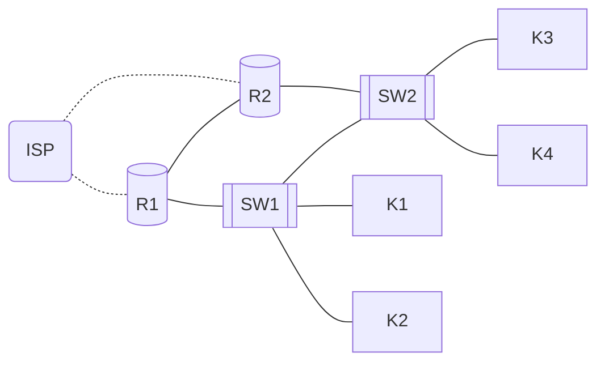

```yaml
author:       ["Członkowski"]
date:         18.02.2024
copyright:    "All rights reserved (c) 2024 WEEK-END DEVELOPMENT"
version:      0x0001
task_no:      06
```
# Redundancja w Sieci Przedsiębiorstwa: HSRP




To jest przykładowa konfiguracja dla x = 19 i y = 1\
Sieć kliencka: 192 . 168 . 4*x . 0 / 22\
Do połączeń pomiędzy routerami: 10 . 10 . x . 16*y / 28

## R1
```shell
enable
configure terminal
hostname R1
interface g0/0/0
ip address 192.168.76.1 255.255.252.0
no shutdown
interface g0/0/1
ip address 10.10.19.17 255.255.255.240
no shutdown
interface s0/1/0
ip address 10.10.10.1 255.255.255.252
no shutdown
router ospf 1
router-id 1.1.1.1
network 192.168.76.0 0.0.3.255 area 0
network 10.10.19.16 0.0.0.15 area 0
exit
interface g0/0/0
standby 1 ip 192.168.79.254
standby 1 priority 150
standby 1 preempt
exit
service password-encryption
username <twoje imie> secret <twoje hasło>
line console 0
password <twoje hasło>
login
exit
enable secret <twoje hasło>
ip domain-name twojadomena.com
crypto key generate rsa general-keys modulus 2048
line vty 0 15
transport input ssh
login local
exit

```

## R2
```shell
enable
configure terminal
hostname R2
interface g0/0/0
ip address 192.168.76.2 255.255.252.0
no shutdown
interface g0/0/1
ip address 10.10.19.18 255.255.255.240
no shutdown
interface s0/1/0
ip address 10.10.10.5 255.255.255.252
no shutdown
router ospf 1
router-id 2.2.2.2
network 192.168.76.0 0.0.3.255 area 0
network 10.10.19.16 0.0.0.15 area 0
exit
interface g0/0/0
standby 1 ip 192.168.79.254
exit
service password-encryption
username <twoje imie> secret <twoje hasło>
line console 0
password <twoje hasło>
login
exit
enable secret <twoje hasło>
ip domain-name twojadomena.com
crypto key generate rsa general-keys modulus 2048
line vty 0 15
transport input ssh
login local
exit

```

## ISP
*ISP nie jest podane do konfiguracji w instrukcji ale znacznie ułątwiatestowanie połączenia*
```shell
enable
configure terminal
hostname ISP
interface s0/2/0
ip address 10.10.10.2 255.255.255.252
no shutdown
interface s0/2/1
ip address 10.10.10.6 255.255.255.252
no shutdown
router ospf 1
router-id 3.3.3.3
network 10.10.10.0 0.0.0.3 area 0
network 10.10.10.4 0.0.0.3 area 0
exit
```

## Klient
Przykładowa konfiguracja
```
Adres IP: 192.168.76.10
Maska podsieci: 255.255.252.0
Brama domyślna: 192.168.79.254
Preferowany serwer DNS: 8.8.8.8
```