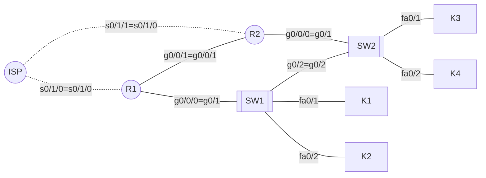

```yaml
author:       "BO$"
date:         21.02.2024
copyright:    "All rights reserved (c) 2024 WEEK-END DEVELOPMENT"
task_no:      0x06
version:      0x0003
```
## Redundancja w Sieci Przedsiębiorstwa: HSRP

## DANE

x = index % 31

y = index % 14

```yaml
username:     "bos"
secret:       "C1$c012345"
domain-name:  "bos.dev"
x:            14
y:            7
```
## TABELA IP
```yaml
network:
  main:
    ip: 192.168.4*x.0 -> 192.168.56.0
    mask: 255.255.252.0
    bit: /22
  routers:
    ip: 10.10.x.16*y -> 10.10.14.112
    mask: 255.255.255.252
    bit: /30
```

| NETWORK |      IP      |      MASK       |  BIT  | HOSTS |
| :-----: | :----------: | :-------------: | :---: | :---: |
|  MAIN   | 192.168.56.0 |  255.255.254.0  |  /22  | 1022  |
| ROUTERS | 10.10.14.112 | 255.255.255.240 |  /28  |  14   |
|    _    |      _       |        _        |   _   |   _   |
|  R1-R2  | 10.10.14.112 | 255.255.255.252 |  /30  |   2   |
| ISP-R1  | 10.10.14.116 | 255.255.255.252 |  /30  |   2   |
| ISP-R2  | 10.10.14.120 | 255.255.255.252 |  /30  |   2   |

| DEVICE |    g0/0/0    |    g0/0/1    |    s0/1/0    |    s0/1/1    |
| :----: | :----------: | :----------: | :----------: | :----------: |
|  ISP   |      -       |      -       | 10.10.14.117 | 10.10.14.121 |
|   R1   | 192.168.56.1 | 10.10.14.113 | 10.10.14.118 |      -       |
|   R2   | 192.168.56.2 | 10.10.14.114 | 10.10.14.122 |      -       |

| DEVICE |      IP      |     MASK      |  BIT  |    GATEWAY     |   DNS   |
| :----: | :----------: | :-----------: | :---: | :------------: | :-----: |
|   K1   | 192.168.56.3 | 255.255.252.0 |  /22  | 192.168.56.254 | 8.8.8.8 |
|   K2   | 192.168.56.4 | 255.255.252.0 |  /22  | 192.168.56.254 | 8.8.8.8 |
|   K3   | 192.168.56.5 | 255.255.252.0 |  /22  | 192.168.56.254 | 8.8.8.8 |
|   K4   | 192.168.56.6 | 255.255.252.0 |  /22  | 192.168.56.254 | 8.8.8.8 |

## Konfiguracja ISP
Hostname:
```sh
en
conf t
ho ISP
```
Interfaces:
```sh
int s0/1/0
ip add 10.10.14.117 255.255.255.252
ip ospf hello-interval 3
ip ospf dead-interval 10
ip ospf 1 area 0
no shut
int s0/1/1
ip add 10.10.14.121 255.255.255.252
ip ospf hello-interval 3
ip ospf dead-interval 10
ip ospf 1 area 0
no shut
exit
```
OSPF
```sh
router ospf 1
router-id 3.3.3.3
network 10.10.10.0 0.0.0.3 area 0
network 10.10.10.4 0.0.0.3 area 0
```
SSH & SECRET
```sh
username bos password C1$c012345

ip domain-name bos.dev
crypto key generate rsa general-keys modulus 2048
ip ssh version 2
line vty 0 15
transport input ssh
login local
exit
enable password C1$c012345
```
SAVE
```sh
end
copy run start
```

## Konfiguracja R1
Hostname
```sh
en
conf t
ho R1
```
Interfaces
```sh
int s0/1/0
ip add 10.10.14.118 255.255.255.252
ip ospf hello-interval 3
ip ospf dead-interval 10
ip ospf 1 area 0
no shut
int g0/0/0
ip add 192.168.56.1 255.255.252.0
ip ospf hello-interval 3
ip ospf dead-interval 10
ip ospf 1 area 0
no shut
int g0/0/1
ip add 10.10.14.113 255.255.255.252
ip ospf hello-interval 3
ip ospf dead-interval 10
ip ospf 1 area 0
no shut
exit
```
OSPF
```sh
router ospf 1
router-id 1.1.1.1
network 10.10.10.0 0.0.0.3 area 0
network 10.10.10.8 0.0.0.3 area 0
network 192.168.56.0 0.0.3.255 area 0
passive-int g0/0/0
exit
```
HSRP
```sh
int g0/0/0
standby 1 ip 192.168.56.254
standby 1 priority 150
standby 1 preempt
no shut
exit
```
SSH & SECRET
```sh
service password-encryption
username bos secret C1$c012345
line console 0
password C1$c012345
login local
exit

enable secret C1$c012345

ip domain-name bos.dev
crypto key generate rsa general-keys modulus 2048
line vty 0 4
transport input ssh
login local
```
SAVE
```sh
end
copy run start
```

## Konfiguracja R2
Hostname
```sh
en
conf t
ho R2
```
Interfaces
```sh
int s0/1/0
ip add 10.10.14.122 255.255.255.252
ip ospf hello-interval 3
ip ospf dead-interval 10
ip ospf 1 area 0
no shut
int g0/0/0
ip add 192.168.56.2 255.255.252.0
ip ospf hello-interval 3
ip ospf dead-interval 10
ip ospf 1 area 0
no shut
int g0/0/1
ip add 10.10.14.114 255.255.255.252
ip ospf hello-interval 3
ip ospf dead-interval 10
ip ospf 1 area 0
no shut
exit
```
OSPF
```sh
router ospf 1
router-id 2.2.2.2
network 10.10.10.4 0.0.0.3 area 0
network 10.10.10.8 0.0.0.3 area 0
network 192.168.56.0 0.0.3.255 area 0
passive-int g0/0/0
exit
```
HSRP
```sh
int g0/0/0
standby 1 ip 192.168.56.254
exit
```
SSH & SECRET
```sh
service password-encryption
username bos secret C1$c012345
line console 0
password C1$c012345
login local
exit

enable secret C1$c012345

ip domain-name bos.dev
crypto key generate rsa general-keys modulus 2048
line vty 0 4
transport input ssh
login local
```
SAVE
```sh
end
copy run start
```

## Konfiguracja SW1
Hostname
```sh
en
conf t
ho SW1
```
VLAN
```sh
int vlan 1
ip add 192.168.56.250 255.255.252.0
no shut
exit
```
SSH & SECRET
```sh
service password-encryption
username bos secret C1$c012345
line console 0
password C1$c012345
login
exit

enable secret C1$c012345

ip domain-name bos.dev
crypto key generate rsa general-keys modulus 2048
line vty 0 15
transport input ssh
login local
```
SAVE
```sh
end
copy run start
```

## Konfiguracja SW2
Hostname
```sh
en
conf t
ho SW2
```
VLAN
```sh
int vlan 1
ip add 192.168.56.251 255.255.252.0
no shut
exit
```
SSH & SECRET
```sh
service password-encryption
username bos secret C1$c012345
line console 0
password C1$c012345
login
exit

enable secret C1$c012345

ip domain-name bos.dev
crypto key generate rsa general-keys modulus 2048
line vty 0 15
transport input ssh
login local
```
SAVE
```sh
end
copy run start
```

## SPRAWDZENIE
```sh
show standby brief
```
