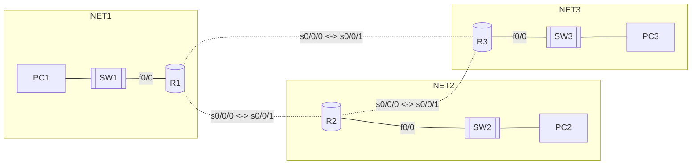

```yaml
author:       "BO$"
date:         25.02.2024
copyright:    "All rights reserved (c) 2024 WEEK-END DEVELOPMENT"
task_no:      0x07
version:      0x0003
```
## Protokół OSPF

## LINK
[INSTRUKCJA](https://github.com/Week-end-Development/INF-I/blob/main/sem6/net-ops-admin/noa-task07.md)
