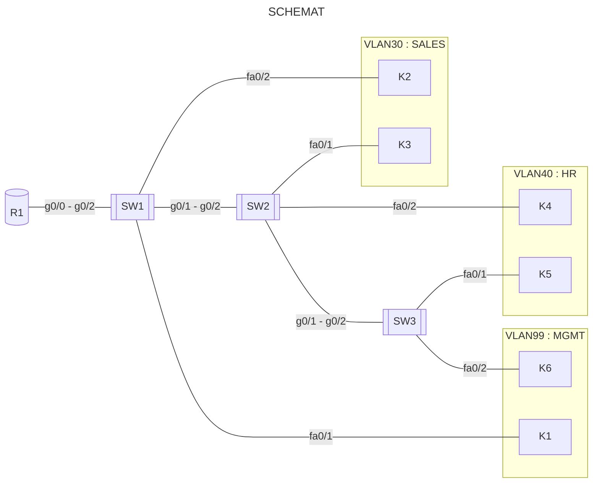

```yaml
author:       "BO$"
date:         30.03.2024
copyright:    "All rights reserved (c) 2024 WEEK-END DEVELOPMENT"
task_no:      0x09
version:      0x0001
```
- Packet Tracer - Integrujące VLAN-y
- Urządzenia
- Adresacja
  - VLAN
  - ROUTER
  - Przydzielenie IP
- Konfiguracja SW1
- Konfiguracja SW2
- Konfiguracja SW3
- Konfiguracja R1
- Konfiguracja K1
- Konfiguracja K2
- Konfiguracja K3
- Konfiguracja K4
- Konfiguracja K5
- Konfiguracja K6

## Packet Tracer - Integrujące VLAN-y



## Urządzenia
```yaml
R1: 1941
SW1: 2960
SW2: 2960
SW3: 2960
```
## LINK
[INSTRUKCJA](https://github.com/Week-end-Development/INF-I/blob/main/sem6/net-ops-admin/noa-task09.md)
