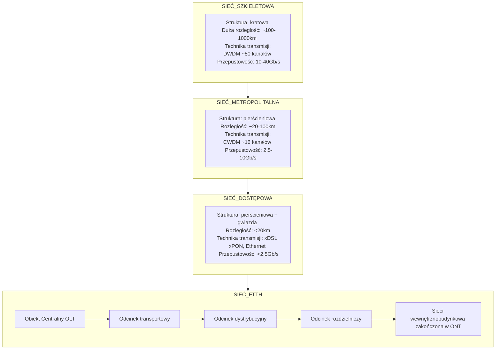
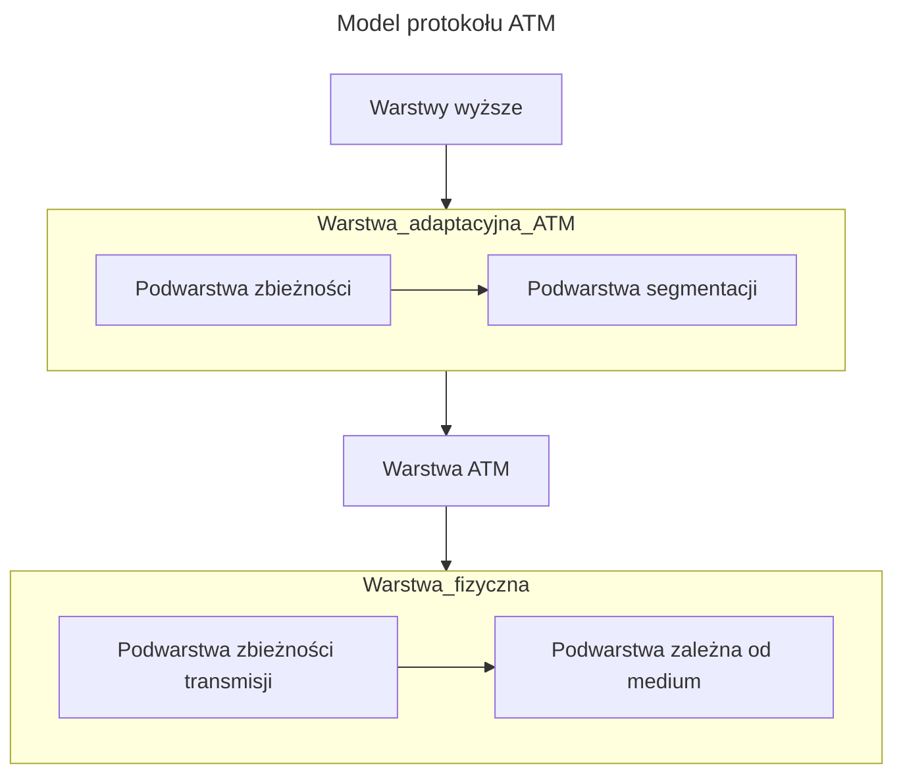

```yaml
author:       "BO$"
date:         08.06.2024
copyright:    "All rights reserved (c) 2024 WEEK-END DEVELOPMENT"
version:      0x0003
```
> [!CAUTION]
> **WEEK-END DEVELOPMENT** ***Nie gwarantuje poprawności informacji!!!***

- [Model sieci](#model-sieci)
  - [Segment dostępu](#segment-dostępu)
  - [Segment dystrybucji](#segment-dystrybucji)
  - [Segment szkieletowy](#segment-szkieletowy)
- [DEFINICJE](#definicje)
  - [IP (Internet Protocol)](#ip-internet-protocol)
  - [ATM (Asynchronous Transfer Mode)](#atm-asynchronous-transfer-mode)
  - [SDH (Synchronous Digital Hierarchy)](#sdh-synchronous-digital-hierarchy)
  - [DWDM (Dense Wavelength Multiplexing)](#dwdm-dense-wavelength-multiplexing)
  - [Sieci telekomunikacyjna](#sieci-telekomunikacyjna)
  - [Komutacja](#komutacja)
    - [kanałów vs pakietów](#kanałów-vs-pakietów)
    - [kanałów (łączy, obwodów)](#kanałów-łączy-obwodów)
    - [pakietów](#pakietów)
    - [ramek](#ramek)
    - [komórek](#komórek)
  - [WAN (Wide Area Networks)](#wan-wide-area-networks)
    - [Cechy](#cechy)
    - [ANALOGOWE](#analogowe)
    - [CYFROWE](#cyfrowe)
  - [MAN](#man)
  - [CAN](#can)
  - [PDN (pakiet data network)](#pdn-pakiet-data-network)
  - [PCM (Pulse Code Module)](#pcm-pulse-code-module)
    - [parametry systemu PCM 30/32](#parametry-systemu-pcm-3032)
  - [PDH (Plesiochronous Digital Hierarchy)](#pdh-plesiochronous-digital-hierarchy)
  - [SDH (Synchronous Digital Hierarchy)](#sdh-synchronous-digital-hierarchy-1)
    - [Budowa ramki](#budowa-ramki)
      - [elementy nagłówka](#elementy-nagłówka)
    - [Sekcja](#sekcja)
    - [Ścieżka](#ścieżka)
    - [Sygnały wejściowo/wyjściowe](#sygnały-wejściowowyjściowe)
    - [Odwzorowanie (odwzorowanie odwrotne)](#odwzorowanie-odwzorowanie-odwrotne)
    - [Kontener](#kontener)
    - [Kontener wirtualny](#kontener-wirtualny)
    - [Jednostka składowa](#jednostka-składowa)
    - [Jednostka administracyjna](#jednostka-administracyjna)
    - [Grupa jednostek administracyjnych AUG](#grupa-jednostek-administracyjnych-aug)
    - [Synchroniczny moduł transportowy](#synchroniczny-moduł-transportowy)
    - [Wskaźnik](#wskaźnik)
    - [Nagłówek sekcji](#nagłówek-sekcji)
    - [Nagłówek ścieżki](#nagłówek-ścieżki)
    - [Budowa modułu transportowego STM-1](#budowa-modułu-transportowego-stm-1)
  - [SONET](#sonet)
  - [X.25](#x25)
  - [X.21bis](#x21bis)
  - [Frame Relay](#frame-relay)
  - [QoS (Quality of Service) i CoS (Class of Service)](#qos-quality-of-service-i-cos-class-of-service)
  - [ATM](#atm)
    - [VCC (ang. Virtual Channel Connection)](#vcc-ang-virtual-channel-connection)
    - [VPC (ang. Virtual Path Connection)](#vpc-ang-virtual-path-connection)
    - [VPI (Virtual Path Identifier)](#vpi-virtual-path-identifier)
    - [Rodzaje komórek ATM](#rodzaje-komórek-atm)
    - [Kategorie Usług warstwy ATM](#kategorie-usług-warstwy-atm)
    - [Podział kategorii usług na klasy](#podział-kategorii-usług-na-klasy)
  - [MPLS](#mpls)


# Model sieci

## Segment dostępu
-> zapewnia dostęp do sieci użytkownikowi (niski koszt, duża ilość obsługiwanych portów)

## Segment dystrybucji
-> łączność oparta na regułach, OLT(ang. Optical Line Termination), działa na 2 i 3 warstwie ISO/OSI

## Segment szkieletowy
-> zapewnia optymalne trasy między lokalizacjami

# DEFINICJE

## IP (Internet Protocol)
-> służy do przesyłania danych w sieciach dostepowych
- agregowany w segmencie dystrybucyjnym

## ATM (Asynchronous Transfer Mode)
-> odmiana komutacji pakietów, w której pakiety zastąpiono krótkimi komórkami o stałej długości, co pozwala na sprzętową realizacje komutacji.
- W komutacji komórek ATM są aktualizowane wartości wirtualnych ścieżek i kanałów (VPI/VCI).
- korzysta z istniejącej infrastruktury i urządzeń SDH

## SDH (Synchronous Digital Hierarchy)
-> w segmencie sieci szkieletowych przesyłane są za pomocą urządzeń optycznych ze zwielokrotnianiem w dziedzinie długości fali WDM

## DWDM (Dense Wavelength Multiplexing)

## Sieci telekomunikacyjna
-> to ogół węzeł oraz łącz między węzłami linii telekomunikacyjne i urządzenia transmisyjne, którym celem jest transfer danych.

## Komutacja
-> to technika zestawiania połączeń w celu transferu danych od źródła, poprzez węzły tranzytowe, do punktu docelowego.

| KOMUTACJA |    TECHNIKI     | natężenia strumienia | procedury przetwarzania w węzłach |
| :-------: | :-------------: | :------------------: | :-------------------------------: |
|  kanałów  | PSTN, ISDN, GSM |        stałe         |              proste               |
|  komórek  |       ATM       |        &darr;        |              &darr;               |
|   ramek   |   Frame Relay   |        &darr;        |              &darr;               |
| pakietów  |  TCP/IP, X.25   |       zmienne        |              złożone              |

### kanałów vs pakietów
|          #           |       KANAŁÓW        |         PAKIETÓW         |
| :------------------: | :------------------: | :----------------------: |
|   czas opóźnienia    |         stał         |         zmienny          |
|     przepływność     |        stała         |         zmienna          |
| korzystanie z kanału |       tylko 1        | wiele (1 w danej chwili) |
|        bufor         |  nie jest konieczny  |         wymagane         |
|       przykład       | rozmowa telefoniczna |         Ethernet         |

### kanałów (łączy, obwodów)
- wielostrumieniowa

> **ZALETY**
> - wysoka jakość transmisji

> **WADY**
> - niska efektywność
> - wysokie koszty eksploatacji
> zajmuje zasoby centrali


### pakietów
-> należy do najbardzie elastycznych technik komutacji stosowanych we współczesnych sieciach, przesył pakietów, pozwala na nawiązywanie połączenia z wieloma innymi użytkownikami jednocześnie

Nagłówki zawierają informacji, które umożliwiają pakietowi
- dojście z punktu źródłowego do docelowego,
- węzłom sieci sprawdzenie poprawności zawartych w pakiecie danych
- punktom docelowym właściwie zestawić i odtworzyć podzieloną informację.

Nagłówek zawiera następujące informacje:
- adresy źródłowy i docelowy,
- numer pakietu,
- wskaźnik ostatniego pakietu, a także
- identyfikator zawartej w pakiecie informacji.

Pakiety mogą być przesłane metodą:
- połączeniową
    -> Charakteryzuje się przesyłaniem pakietów przez zestawienia połączenia wirtualnego. (sekwencja węzłów i kanałów)
    - kanał logiczny -> powstały w ten sposób służy do przesyłania nim kolejno pakietów powstałych przez podzielenie informacji.
    - Połączenie wirtualne -> ma przypisany swój unikalny numer, który zastępuje konieczność stosowania w nagłówku informacji zawierających adres źródłowy i docelowy.
      - połączenia tymczasowe SVC (ang. Switched Virtual Circuit), jest zestawiane na pewien określony czas. FAZY:
        - zestawienie połączenia
        - transmisja pakietów zawierających dane
        - rozłączania
      - połączenia stałe PVC (ang. Permanent Virtual Circuit)
        - efektywna metoda
        - kosztowna
        - transfer plików o dużej pojemności
- bezpołączeniową
    -> pakiety wędrują po sieci samodzielnie (bez kanałów wirtualnych)
    - węzły dobierają trasę dla pakietu korzystając z adresu docelowego zawartego w nagłówku pakietu
    - pakiety moga dotrzeć do celu w innej kolejności

### ramek
-> redukcja mechanizmów pozwalających na korekcję błędów i kontrolę przepływu w porównaniu z komutacją pakietów

### komórek
-> szybka transmisja danych
- dane są dzielone na stałe długości (komórki)
- przeznaczona dla łączy o bardzo dobrej jakości (światłowodowe)


## WAN (Wide Area Networks)
-> to kombinacje sieci lokalnych i dodatkowych połączeń między nimi.
- warstwa fizyczna
  - sieci cyfrowe PDH/SDH
  - dostęp do sieci: dostęp poprzez połączenia analogowe lub cyfrowe
- protokoły sieci
  - X.25
  - Frame Relay
  - ATM
  - IP/MPLS

### Cechy
- łączą ze sobą urządzenia rozmieszczone na dużych obszarach geograficznych;
- w celu ustanowienia łącza lub połączenia między dwoma miejscami korzystają z usług operatorów telekomunikacyjnych;
- wykorzystują różne odmiany transmisji szeregowej.
- sieć WAN działa w warstwie fizycznej oraz warstwie łącza danych modelu odniesienia OSI;
- sieci WAN umożliwiają wymianę ramek i pakietów danych pomiędzy routerami i przełącznikami obsługiwanych sieciami LAN.

### ANALOGOWE
- pomimo niskiej jakości i stosunkowo niewielkiej przepustowości, analogowe linie telefoniczne mogą być wykorzystywane do łączenia sieci;
- zdalni użytkownicy mogą łączyć się z sieci za pomocą modemu i zwykłego łącza telefonicznego
- modem jest urządzeniem, które interpretując sygnały cyfrowe i analogowe, umożliwia przesyłanie danych przez zwykłą linię telefoniczną.

### CYFROWE
- częstą metodą łączenia sieci WAN jest korzystanie z dzierżawionych kanałów cyfrowych (DDS - Didital Data Service).
- linie te mają istotną przewagę nad analogowymi ze względu na większą szybkość i niewielką liczbę błędów transmisji.
- komunikacja cyfrowa nie wymaga modemu, zamiast niego włącza się w sieć lokalną router przekazujący dane specjalnej jednostce CSU/DSU.
-  urządzenie CSU/DSU (Channel Service Unit/Data Service Unit) konwertuje dane pochodzące z sieci na cyfrowe sygnały bipolarne, odpowiednie dla synchronicznego środowiska komunikacyjnego.

## MAN
(Metropolitan Area Network) – sieć obejmująca niewielki obszar geograficzny (miasto lub region)

## CAN
(Campus Area Network) – termin stosowany do określania sieci WAN łączącej poszczególne wydziały w ośrodku akademickim.

## PDN (pakiet data network)
-> ogólna nazwa sieci wykorzystujących komutację ramek i komórek

## PCM (Pulse Code Module)
modulacji impulsowo-kodowej

podział na 3 etapy:
- próbkowanie,
- kwantowanie,
- kodowanie


**Przepustowość jednego kanału PCM to 64kb/s (E0)**

### parametry systemu PCM 30/32
| Zakres częstotliwości              | 300-3400 Hz |
| ---------------------------------- | ----------- |
| Częstotliwość próbkowania          | 8000 Hz     |
| Liczba bitów kodowania             | 8           |
| Liczba szczelin kanałowych w ramce | 32          |
| Liczba kanałów rozmównych w ramce  | 30          |
| Liczba bitów w ramce               | 256         |
| Przepłynność                       | 2048kb/s    |
| Zasada kodowania                   | A, A=87.6   |

## PDH (Plesiochronous Digital Hierarchy)

Elementy sieci PDH są ze sobą zsynchronizowane, ale nie idealnie, gdyż każdy z elementów sieci posiada swój zegar (prawie synchroniczne).

Systemy PDH przy multipleksacji wykorzystują zwielokrotnienie z podziałem czasu TDM (ang. Time Division Multiplexing).

PDH - Plesiochronous Digital Hierarchy - plezjochroniczna hierarchia cyfrowa
- elementy sieci zsynchronizowane w oparciu o własne wewnętrzne zegary,
- zastosowanie modulacji impulsowo kodowej (PCM),
- przepływność pojedynczego kanału –64 kb/s,
- multipleksacja z podziałem czasu –TDM,
- zwielokrotnienie na kolejnych poziomach,
- T*(USA), E*(Europa), J*(Japonia).

**WADY**
- brak standaryzacji powyżej przepływności 140 Mbit/s,
- energochłonność,
- hierarchia demultiplekserów do wydzielenia E1 z E4,
- różne standardy na świecie,
- aktualnie wypierane przez systemy SDH.

## SDH (Synchronous Digital Hierarchy)
Synchroniczna Hierarchia Systemów Cyfrowych -> Jest to technologia transmisji danych charakteryzująca się tym, że wszystkie urządzenia działające w sieci SDH są zsynchronizowane zarówno do nadrzędnego zegara (PRC) jak i do siebie nawzajem.

STM-1 155.52 Mb/s
STM-768 120 Gb/s - aktualna

### Budowa ramki
9 kolumn - nagłówek
261 kolumn - dane

#### elementy nagłówka
- A1, A2 – framing bytes – znacznik początku ramki
- B1 – bit interleaved parity – bit parzystości
- E1 – orderwire – voicechannel
- D1-3, 4-12 – section data communication channel (zarządzanie, monitorowanie, alarmy)
- S1 – synchronization status

**ZALETY**
- wyższe przepływności (powyżej 1Gb/s) z zastosowaniem światłowodów
- synchronizacja z zegarem dokładność $10^{-11}$
- ramki co $125\mu s$
- duża niezawodność
- ekonomiczniejszy dostęp do "ładunku"
- większy nacisk na zapobieganie błędów
- mniejsza podatność na uszkodzenia
- możliwość automatycznej rekonfiguracji

### Sekcja
-> odcinek toru pomiędzy dwoma sąsiednimi urządzeniami, w których przeprowadza się regenerację lub zwielokrotnienie;
### Ścieżka
-> kanał wirtualny pomiędzy węzłem wejściowym a wyjściowym, utworzony w celu transmisji kontenera wirtualnego
### Sygnały wejściowo/wyjściowe
-> sygnały transportowane za pomocą sieci, np.: sygnały PDH, z sieci MAN, ATM itp.
### Odwzorowanie (odwzorowanie odwrotne)
-> adaptacja sygnału o pewnej przepływności do przepływności SDH; powstają kontenery wypełnione bitami z sygnału wejściowego oraz bity uzupełniające;
### Kontener
-> Ciąg ściśle określonej liczby bajtów pochodzących z sygnału wejściowego oraz bajtów wypełnienia; czas trwania kontenera μs (oznaczany jako C-m, C-n)
### Kontener wirtualny
-> kontener opatrzony nagłówkiem (ozn. VC-m,m VC-n)
### Jednostka składowa
-> pole użytkowe (kontenery wirtualne niższego rzędu); zawiera kontener wirtualny oraz wskaźnik - TU-m;
### Jednostka administracyjna
-> struktura informacyjna zawierająca kontener wirtualny wyższego rzędu i wskaźnika - AU-n;
### Grupa jednostek administracyjnych AUG
### Synchroniczny moduł transportowy
-> struktura informacyjna złożona z nagłówka, pola wskaźnika i pola użytkowego - STM-N;
### Wskaźnik
-> adres pierwszego bajtu kontenera wirtualnego, bajtu dopełnienia, bajtu sterowania procesem dopasowania;
### Nagłówek sekcji
-> pole informacyjne w module transportowym, dotyczące zarządzania, utrzymania zwielokrotnienia i regeneracji – SOH;
### Nagłówek ścieżki
-> informacje dot. zarządzania i utrzymania ścieżki wyższego lub niższego rzędu – POH

### Budowa modułu transportowego STM-1
- nagłówek SOH (M-SOH i R-SOH) 82 bajty
  - R-SOH -> stanowi zbiór danych sterujących i informacyjnych dla sekcji regenerowania sygnału
  - M-SOH -> nagłowek dla multiplekserów
- blok wskaźników PTR 9 bajtów -> składa się z 3 wskaźników po 3 bajty, służy do określenia tzw. kontenera wirtualnego względem ramki STM
- Payload 2349 bajtów

**KONTENER + NAGŁOWEK = KONTENER WIRTUALNY**

> [!NOTE]
> Pozycja kontenerów w ramce STM-1 nie musi być stała.

> [!WARNING]
> System SDH o większej przepustowości niż STM-1, sa tworzone poprze zwielokrotnienie systemu 155.52 Mbit/s metodą **przeplatania bajtowego**.


## SONET
- stany zjednoczone
- przepływowość podstawowa SONET (OC-1) – 54 Mbit/s,
- rozmiar ramki OC-1 to 9 rzędów po 90 bajtów = 810 bajtów,
- czas transmisji pojedynczej ramki to zawsze 125 μs (8000 ramek na sekundę),
- gdy łącze obsługuje szybszą transmisję – zwiększa się rozmiar ramki.


|  SONET  |   SDH   | Symbol OC | Szybkość transmisji (Mbit/s) |
| :-----: | :-----: | :-------: | :--------------------------: |
|  STS-1  |    -    |   OC-1    |            51.84             |
|  STS-3  |  STM-1  |   OC-3    |            155.52            |
|  STS-9  |  STM-3  |   OC-9    |            466.56            |
| STS-12  |  STM-4  |   OC-12   |            622.08            |
| STS-18  |  STM-6  |   OC-18   |            933.12            |
| STS-24  |  STM-8  |   OC-24   |           1 244.16           |
| STS-36  | STM-12  |   OC-36   |           1 866.24           |
| STS-48  | STM-16  |   OC-48   |           2 488.32           |
| STS-96  | STM-32  |   OC-96   |           4 976.64           |
| STS-192 | STM-64  |  OC-192   |           9 953.28           |
|         | STM-256 |           |          39 813.12           |
|         | STM-512 |           |          80 Gbit/s           |
|         | STM-768 |           |          120 Gbit/s          |


## X.25
- to standard protokołu komunikacyjnego dla publicznych sieci WAN
- przepustowość od 64kb/s do 2Mb/s
- połączenie między: DTE (Data Terminal Equipment) a DCE (Data Communications Equipment)
- pracuje w trybie pakietowym
- obejmuje: warstwy: fizyczną, łacza danych, sieci modelu OSI

**CECHY**
- **komutację pakietów o zmiennej długości** z zastosowaniem trybu połączeniowego do ich transmisji, co oznacza, że poszczególne pakiety nie muszą zawierać adresów nadawcy i odbiorcy;
- **możliwość tworzenia połączeń wirtualnych**, gwarantujących przybywanie pakietów do użytkownika końcowego w tej samej kolejności, w jakiej zostały wysłane;
- **implementację rozbudowanego systemu korekcji błędów i sterowania przepływem**, co oznacza, że każdy węzeł sprawdza kompletność i poprawność odebranego pakietu przed dalszym jego wysłaniem;
- **wykrywanie nieprawidłowości informacji przez dowolny węzeł na trasie przekazu**, powodujące żądanie retransmisji błędnego pakietu i nadmiarowość w transmisji pakietów, co powoduje zmniejszenie ogólnej przepustowości sieci;
- **niezawodny przekaz informacji przez łącza o niższej jakości**, lecz z opóźnianiem pakietów przez kolejne węzły, zapewnianie współpracy z liniami transmisyjnymi o standardowej przepływności do 64 kb/s z rozszerzeniem (od 1993 r.) do 2 Mb/s.

**URZĄDZENIA**
- terminale danych (DTE),
- urządzenia zakończenia obwodów danych (DCE),
- przełączniki wymiany pakietów (PSE).
- multiplekser sieciowy PAD (Packet Assembly and Disassembly)
  - Multiplekser PAD oczekuje na 128 bajtów z terminala, zanim wyśle pojedynczy pakiet i podobnie rozdziela pakiet docierający do odbiornika, aby stworzyć specyfikę strumieniowego przesyłu danych

Multipleksery PAD znajdywały się pomiędzy urządzeniem DTE, a urządzeniem DCE i spełniały trzy podstawowe funkcje:
- buforowanie (przechowywanie danych do czasu, aż urządzenie będzie gotowe do ich przetworzenia),
- składaniem danych w pakiety,
- demultipleksacją pakietów na strumień danych do DTE.

W X.25 implementowane są najczęściej następujące protokoły:
- Packet-Layer Protocol (PLP) – w warstwie sieci,
    Potok PLP działa w pięciu różnych trybach:
    - zestawianie połączenia,
    - przesyłanie danych,
    - bezczynność,
    - usuwania połączenia
    - ponowne uruchamianie.
- Link Access Procedure Balanced (LAPB) – w warstwie łącza danych,
  - to protokół warstwy łącza danych, który zarządza komunikacją i ramkowaniem pakietów między urządzeniami DTE i DCE.
- fizyczne interfejsy szeregowe (takie jak EIA / TIA-232, EIA / TIA -449, EIA-530 i G.703) – w warstwie fizycznej.

**Istnieją cztery typy pól pakietów PLP:**
- **Identyfikator formatu ogólnego (GFI - General Format Identifier)** - Identyfikuje parametry pakietu, takie jak to, czy pakiet zawiera dane użytkownika lub informacje sterujące, jaki rodzaj okienek jest używany i czy wymagane jest potwierdzenie dostarczenia.
- **Identyfikator kanału logicznego (LCI - Logical Channel Identifier)** - identyfikuje obwód wirtualny w lokalnym interfejsie DTE / DCE.
- **Identyfikator typu pakietu (PTI - Packet Type Identifier)** - identyfikuje pakiet jako jeden z 17 różnych typów pakietów PLP.
- **Dane użytkownika (UD - User Data)** - zawierają enkapsułowane informacje z wyższej warstwy. To pole występuje tylko w pakietach danych. W przeciwnym razie dodawane są dodatkowe pola zawierające informacje sterujące.

Istnieją trzy typy ramek LAPB:
- informacyjne I,
- nadzorcze S, (sterujące) -> przenoszą tylko numery sekwencji odbioru
- nienumerowane U. -> nie mają numerów sekwencyjnych

Ramki LAPB zawierają:
- nagłówek,
- enkapsułowane dane
- zakończenie.

Występują znaczące opóźnienia przy przejściu pakietu przez węzeł rzędu 15-20 ms.

## X.21bis
- definiuje elektryczne i mechaniczne procedury korzystania z fizycznego nośnika.
- obsługuje aktywację i dezaktywację fizycznego nośnika łączącego urządzenia DTE i DCE.
- Obsługuje połączenia punkt-punkt, prędkość do 19.2 kb/s oraz synchroniczną, pełno dupleksową transmisję przez media czteroprzewodowe.


## Frame Relay
- sieć z komutacją pakietów, używana do łączenia odległych sieci lokalnych (LAN), przesyłania danych, obrazu i głosu oraz dostępu do Internetu.
- W tej technice informacja jest dzielona na ramki o zmiennej długości, które przenoszą dane między sieciami LAN, co pozwala na przekazywanie informacji między urządzeniami końcowymi sieci rozległych (WAN).

**Cechy sieci Frame Relay**
- technologia sieci WAN;
- sieci publiczne i prywatne;
- szybka technologia przełączania pakietów;
- sięga 2 warstwy modelu OSI;
- zapewnia szybkość komunikacji od 56kb/s do 45Mb/s (T3) w oparciu o obwody wirtualne i transmisję zorientowaną połączeniowo.

**Typy urządzeń i styków**
- **DCE (Data Communications Equipment)** – urządzenie stanowiące węzeł siec FR – przełącznik ramek;
- **DTE (Data Terminal Equipment)** – urządzenie końcowe transmisji, np. FRAD (FR Access Devices) – urządzenie dostępowe do sieci, routery z interfejsem FR;
- **UNI (User-Network Interface)** - Styk pomiędzy abonentem, a siecią -  – DTE – DCE;
- **NNI (Network Node Interface)** - Styk wewnątrzsieciowy - – pomiędzy DCE.

**Typy obwodów wirtualnych**
- **PVC (Permanent Virtual Circuit)** – czyli połączenia zestawiane na stałe podczas konfiguracji sieci – zapewnia to stabilne parametry transmitowanych danych;
- **SVC (Switched Virtual Circuit)** – komutowane połączenie, zestawiane na życzenie abonenta na krótki okres czasu – możliwość obejścia awarii w sieci.

**RAMKA**
- **Flaga** – ciąg – służy do synchronizacji blokowej ramki
- **Nagłówek** – 2, 3 lub 4 bajty, zawiera min. pole DLCI (Data Link Connection Identifier) - identyfikator połączenia logicznego,
- **DE (Discard Eligibility)** - bit priorytetu ramki i inne.
- **Dane** – stosowany mechanizm „bit stuffing” - transport przezroczysty, zmienna ilość danych, maksymalnie bajtów na ramkę.
- **FCS (Frame Check Sequence)** – np. CRC-16, przełączniki FR dokonują jedynie detekcji błędnych ramek, brak korekcji błędów. Konieczna retransmisja.


> **Transmisja danych i głosu; Wideokonferencje i telekonferencje.**


**Parametry ruchu FR dla obwodu wirtualnego VC**
- **CIR (Committed Information Rate)** – określa gwarantowany przez sieć transfer danych w bit/sek. – określony w kontrakcie;
- **EIR (Excess Information Rate )** – określa maksymalną przepływność, której przekroczenie wiąże się z utratą danych;
- **Bc (Committed Burst Size)** – określa maksymalną ilość danych, którą dostawca gwarantuje przesłać w czasie T (Bc=T x CIR) podaną w bitach;
- **Be (Excess Burst Size)** – maksymalna ilość danych powyżej Bc jaka zostanie przesłana przez sieć, ale z obniżonym priorytetem podaną również w bitach;

Proste mechanizmy korekcji błędów:
- nagłówka,
- formatu,
- cyklicznego kodu nadmiarowego FCS (Frame Check Sequence).


## QoS (Quality of Service) i CoS (Class of Service)
-> Wprowadzono trzy klasy jakości:
- Real Time Variable Frame Rate (Głos)
- Non-Real Time Variable Frame Rate (LAN-LAN, Ethernet-Ethernet)
- Available/Unspecified Frame Rate (transfer plików, poczta elektroniczna, usługi dostępu internetowego)


## ATM
-> (ang. Asynchronous Transfer Mode) - szerokopasmowy standard komunikacji, realizujący przesył pakietów poprzez łącza wirtualne.
- łączy podstawowe zalety techniki synchronicznej STM oraz pakietowej PTM.
- Wybór drogi (rouEng) jest dokonywany tylko raz, przy zestawianiu łącza.
- Wszystkie pakiety należące do jednego połączenia wirtualnego są wysyłane tą samą trasą.
- Jest stosowany w sieciach MAN i WAN.
- W sieciach ATM stosuje się wyłącznie technikę multipleksacji etykietowanej LM (Label Multiplexing)
- Informacja w tym standardzie przesyłana jest w postaci komórek składających się z:
  - nagłówka: 5 bajtów
  - pola informacyjnego: 48 bajtów.
- W standardzie ATM zdefiniowane są dwa podstawowe rodzaje styków (interfejsów) UNI i NNI.
  - UNI (ang. User Network Interface) – styk użytkownika z siecią szerokopasmową, styk umieszczony pomiędzy sprzętem użytkownika a zakończeniem sieci, w którym są realizowane protokoły dostępu do sieci.
  - NNI (ang. Network-to-Network Interface) – styk umieszczony w węźle sieci wykorzystywany do połączenia z innymi węzłami
  - MAX 4kB długość pakietu i szybkości 100Mb/s

| Wielkość pakietu | czas oczekiwania |
| :--------------: | :--------------: |
|       4kB        |  $327.68\mu s$   |
|       53B        |   $4.24\mu s$    |


### VCC (ang. Virtual Channel Connection)
-> Pomiędzy stacją źródłową, a docelową zostaje zestawione logiczne połączenie

### VPC (ang. Virtual Path Connection)
-> Kanały o tym samym węźle docelowym tworzą

### VPI (Virtual Path Identifier)
-> zapewnia realizację koncepcji ścieżek i kanałów wirtualnych w istniejącej topologii

| TECHNIKA TRANSMISJI                         | STM (synchroniczna) | PTM (pakietowa) | ATM (asynchroniczna) |
| ------------------------------------------- | :-----------------: | :-------------: | :------------------: |
| PODSTAWOWE CECHY                            |
| komutacja łączy (szczeliny czasowe)         |          +          |        -        |          +           |
| wymagana faza nawiązywania                  |          +          |        -        |          +           |
| komutacja pakietów                          |          -          |        +        |          +           |
| niepotrzebna faza nawiązywania połączenia   |          -          |        +        |          +           |
| GŁÓWNE ZALETY                               |
| duża szybkość transmisji                    |          +          |        -        |          +           |
| możliwość pracy w czasie rzeczywistym       |          +          |        -        |          +           |
| elastyczny przydział zasobów sieciowych     |          -          |        +        |          +           |
| dynamiczny przydział pasma transmisji       |          -          |        +        |          +           |
| GŁÓWNE WADY                                 |
| nieefektywna gospodarka zasobami            |          +          |        -        |          -           |
| brak możliwości pracy w czasie rzeczywistym |          -          |        +        |          -           |


### Rodzaje komórek ATM

```mermaid
gantt
    title Rodzaje komórek ATM
    dateFormat ss
    axisFormat %S bits

    section UNI
    GFC 4 bits: 00, 4s
    VPI 8 bits: 8s
    VCI 16 bits: 16s
    PT 3 bits: 3s
    CLP 1 bit: 1s
    HEC 8 bits: 8s
    NAGŁÓWEK 40 bits (5 B): crit, 00, 40s
    DANE 384 bits (48 B): done, 5s

    section NNI
    VPI 12 bits: 00, 12s
    VCI 16 bits: 16s
    PT 3 bits: 3s
    CLP 1 bit: 1s
    HEC 8 bits: 8s
    NAGŁÓWEK 40 bits (5 B): crit, 00, 40s
    DANE 384 bits (48 B): done, 5s
```


**UNI** – User Network Interface - styk użytkownika z siecią szerokopasmową, umieszczony pomiędzy sprzętem użytkownika a zakończeniem sieci, w którym są realizowane protokoły dostępu do sieci.

**NNI** – Network to Network Interface - styk umieszczony w węźle sieci wykorzystywany do połączenia z innymi węzłami.


- **Pole kontroli dostępu GFC**: Występuje tylko dla styku UNI i umożliwia wielu stacjom roboczym korzystanie z tego samego styku, określa klasę usługi i ułatwia sterowanie przepływem informacji, a gdy nie jest używane, jego wartość wynosi 0000.
- **Identyfikator połączenia wirtualnego VPI**: Opisuje logiczną grupę kanałów wirtualnych, umożliwiając utworzenie 256 ścieżek wirtualnych dla styku UNI i 4096 dla styku NNI.
- **Identyfikator kanału wirtualnego VCI**: Opisuje logiczne połączenie między dwoma urządzeniami ATM, z możliwością zdefiniowania do 65536 kanałów wirtualnych w obrębie jednej ścieżki wirtualnej.
- **Typ danych PT**: Określa, czy przesyłane są dane użytkownika (bit zerowy) czy dane kontrolne ATM (bit jedynkowy), oraz wskazuje przeciążenie sieci w drugim bicie.
- **Bit priorytetu CLP**: Sieć ATM wstawia jedynkę, gdy wysłanie komórki przekracza uzgodnione parametry, co sygnalizuje, że taka komórka ma być usunięta w razie przeciążenia przed komórkami o CLP=0.
- **Pole kontrolne HEC**: Suma kontrolna pierwszych czterech bajtów nagłówka komórki ATM, używana do wykrywania błędów transmisji, identyczna dla styków UNI i NNI.
- **Pole informacyjne**: Przeznaczone dla informacji użytkownika, ma długość 48 bajtów, a jego podział nie wpływa na działanie warstwy ATM.




|               WARSTWA                | FUNKCJE                                                                                                                                                                                                                                                           |
| :----------------------------------: | ----------------------------------------------------------------------------------------------------------------------------------------------------------------------------------------------------------------------------------------------------------------- |
|                Wyższe                | Funkcje warstw wyższych                                                                                                                                                                                                                                           |
| Adaptacyjna warstwa ATM <br> **CS**  | Tworzenie bloków danych o właściwej długości poprzez: <br> - grupowanie bitów lub bajtów ewentualnie wydłużanie pakietów. <br> - generowanie ewentualnych zabezpieczeń CRC                                                                                        |
| Adaptacyjna warstwa ATM <br> **SAR** | Podział bloków na segmenty. <br> Tworzenie nagłówków i/lub zakończeń bloków. <br> Generowanie zabezpieczeń CRC. <br> Ewentualne multipleksowanie połączeń.                                                                                                        |
|             Warstwa ATM              | Tworzenie komórek. <br> Generowanie i wydzielanie nagłówków. <br> Translacja pol VPI/VCI. <br> Multipleksowanie i demultipleksowanie komórek. <br> Sterowanie ruchem – kontrola przepływu komórek (GFC)                                                           |
|     Warstwa Fizyczna <br> **TC**     | Dopasowywanie szybkości transmisji komórek. <br> Weryfikacja nagłówków w komórkach. <br> Wydzielanie komórek ze strumienia bitów. <br> Adaptacja strumienia komórek do struktury ramki transmisyjnej <br> Generowanie i odtwarzanie ramek systemu transmisyjnego. |
|     Warstwa Fizyczna <br> **PM**     | Odtwarzanie podstawy czasu. <br> Transmisja bitów. <br> Fizyczny dostęp do medium.                                                                                                                                                                                |

Podwarstwa zbieżności transmisji TC (Transmission Convergence Sublayer) adaptuje strumień pakietów do medium fizycznego, oblicza nadmiar kodowy dla pakietów i weryfikuje nagłówki.

Podwarstwa medium fizycznego PM (Physical Medium) zarządza transferem bitów, synchronizacją, podstawą czasu, transformacją sygnału i kodowaniem liniowym w zależności od używanego medium transmisyjnego.

### Kategorie Usług warstwy ATM
- **CBR (ang.Constant Bit Rate)** - stały strumień informacji przy konieczności synchronizacji nadajnika z odbiornikiem,

- **rt-VBR (ang.real time Variable Bit Rate)** - zmienny strumień informacji oraz ścisłe zależności nadawanie - odbiór,
- **nrt_VBR (ang. non real time Variable Bit Rate)** - zmienny strumień informacji, brak synchronizacji nadawanie odbiór,

- **UBR (ang.Unspecified Bit Rate)** - niemożliwe jest określenie parametrów ruchowych i jakości połączenia,
- **ABR (ang.Available bit Rate)** - zmienny strumień informacji, brak ścisłych relacji czasowych źródło – przeznaczeni


- **CBR**
  - Telefonia
  - Emulacja komutacji kanałów
  - Wideo
  - Transfer zbiorów
- **VBR**
  - Wideo z kompresją MPEG
  - Telefonia pakietowa
  - Frame Relay (CIR <> 0)
- **UBR & ABR**
  - Emulacja LAN
  - IPX
  - Ethernet
  - TCP/IP
  - Frame Relay (CIR = 0)
  - Poczta elektroniczna


### Podział kategorii usług na klasy
|              KLASA              |                    A                    |              B               |      C       |         D         |
| :-----------------------------: | :-------------------------------------: | :--------------------------: | :----------: | :---------------: |
| Sygnalizacja między terminalami |                Wymagana                 |           Wymagana           | Nie wymagana |   Nie wymagana    |
|         Szybkość bitowa         |                  Stała                  |           Zmienna            |   Zmienna    |      Zmienna      |
|         Tryb połączenia         |              Połączeniowa               |         Połączeniowa         | Połączeniowa |  Bezpołączeniowa  |
|             Typ AAL             |                  AAL1                   |             AAL2             |   AAL3/4/5   |     AAL3/4/5      |
|          Zastosowanie           | dźwięk <br> obraz <br> wideokonferencje | skompresowane wideo i dźwięk |      -       | Ethernet LAN. MAN |

**warstwę adaptacyjną AAL** (ATM Adaptation Layer), realizuje typowe funkcje dla różnych usług związanych z segmentacją (dzieleniem na fragmenty) i składaniem jednostek transmisyjnych między wyższymi warstwami a warstwą ATM.


## MPLS
-> (ang. Multiprotocol Label Switching)  – technika stosowana przez routery, w której trasowanie pakietów zostało zastąpione przez tzw. przełączanie etykiet

nazywany również: *protokołem warstwy 2.5* ponieważ korzysta z zalet warstwy 2 (modelu OSI) – wydajności i szybkości oraz warstwy 3 – skalowalności.

Technologia MPLS zastępuje tradycyjne trasowanie pakietów przełączaniem etykiet, gdzie na brzegu sieci do pakietu dodawana jest etykieta wejściowa, która jest używana jako indeks do tablicy etykiet wewnętrznych routera. Etykieta wejściowa jest zastępowana etykietą wyjściową i pakiet jest przekazywany dalej w sieci.

MPLS pozwala na efektywną klasyfikację i routowanie pakietów do jednej klasy (FEC) oraz umożliwia tworzenie stosów etykiet, które są obsługiwane w trybie LIFO. Technologia ta jest szeroko stosowana w sieciach operatorskich i VPN, zwiększając efektywność transmisji danych, łącząc rozproszone urządzenia i sieci LAN w jedną sieć WAN, co przyczynia się do obniżenia kosztów IT i zwiększenia konkurencyjności usług.

**Zalety MPLS Network:** MPLS oferuje wsparcie QoS i usługi z gwarantowanym poziomem usług (SLA), co jest szczególnie korzystne dla transmisji głosu i wideo. Technicznie, MPLS pozwala na efektywne i bezpieczne wykorzystanie zasobów sieci oraz poprawia przepustowość i stabilność usług przez alternatywne trasy sieciowe.

**Protokół IP a MPLS:** Współczesne sieci IP nie zapewniają QoS, co utrudnia transmisję multimediów w czasie rzeczywistym. MPLS, opracowany przez IETF w latach 90-tych XX wieku, uzupełnia protokół IP, oferując efektywne zarządzanie ruchem i wsparcie dla technologii takich jak TCP/IP, ATM, Frame Relay, oraz SONET. MPLS łączy zalety warstw łącza danych i sieciowej w modelu ISO OSI.

**Mechanizm działania MPLS:** W MPLS routing IP jest zastąpiony przełączaniem etykiet. Routery brzegowe (LER) dodają i usuwają nagłówki MPLS, a wewnętrzne routery (LSR) przełączają etykiety, umożliwiając transmisję pakietów różnymi ścieżkami. Pakiety są klasyfikowane do Forwarding Equivalence Class (FEC), co zapewnia identyczne traktowanie i trasę dla wszystkich pakietów w grupie.

**Budowa i działanie MPLS:**
Etykieta MPLS (32-bitowa) jest dodawana przez LER, umieszczana między nagłówkiem warstwy 2 (Ethernet) a warstwy 3 (IP). Składa się z pola etykiety (20 bitów), pola EXP (3 bity) dla klasy ruchu, pola BS (1 bit) sygnalizującego dno stosu etykiet, oraz pola TTL (Time To Live). Routery przełączają etykiety zgodnie z tablicą przełączania, a ostatni router (LER) usuwa etykietę MPLS. Przełączanie etykiet zamiast analizy nagłówka IP przyspiesza transmisję danych i umożliwia budowanie stosu etykiet, co jest przydatne dla tworzenia VPN.

**Quality of Service i Inżynieria Ruchu:**
MPLS pozwala na ustalone kierowanie pakietów przez zdefiniowaną listę węzłów, co umożliwia rezerwację zasobów i spełnianie wymogów QoS. Monitorowanie stanu łącza przy użyciu protokołów OSPF lub IS-IS pozwala na odpowiednie zestawienie ścieżek LSP dla różnych klas ruchu.

**Tunelowanie i VPN:**
MPLS umożliwia tworzenie tuneli między węzłami, co ułatwia budowanie wirtualnych sieci prywatnych (VPN). Dzięki stosowi etykiet, pakiety mogą być logicznie oddzielane między różnymi sieciami VPN, używając wspólnej infrastruktury, co zwiększa skalowalność i upraszcza dodawanie nowych użytkowników. Komunikacja między wszystkimi użytkownikami jest możliwa bez konieczności tworzenia rozległej sieci połączeń punkt-punkt.

**Motywacja wprowadzenia MPLS:**
MPLS zostało wprowadzone jako prostsza alternatywa dla skomplikowanej techniki ATM, przyspieszająca procesy w węzłach i oferująca prostą inżynierię ruchu oraz wsparcie dla współpracy IP/ATM.

**IP, ATM, MPLS:**
IP polega na trasowaniu i przełączaniu, ATM na przełączaniu VP/VC z zaawansowanym QoS, a MPLS na elastycznym przełączaniu etykiet dla zaklasyfikowanego ruchu.

**Normalizacja i dystrybucja etykiet MPLS:**
MPLS WG skupiło się na protokole RSVP-TE dla sygnalizacji inżynierii ruchu, odrzucając nowe prace nad CR-LDP. Etykiety w MPLS są dystrybuowane przez systemy sygnalizacji takie jak CR-LDP i RSVP-TE.

**Węzły MPLS:**
LSR przełączają etykiety i kierują pakietami, natomiast E-LSR (LER) klasyfikują ruch (FEC), przydzielają etykiety i inicjują ścieżki LSP.

**Ścieżki LSP i zagnieżdżanie:**
LSP to jednokierunkowe ścieżki dla pakietów, które mogą być zagnieżdżane w inne LSP dla skalowalności. LSR kierują pakiety na podstawie etykiet na szczycie stosu.

**Odporność MPLS:**
MPLS oferuje protekcję (szybkie przywrócenie transmisji) i odtwarzanie (optymalizacja użycia zasobów).

**RSVP:**
RSVP to protokół sygnalizacyjny rezerwujący zasoby, zorientowany na odbiorcę, obsługujący jednokierunkową transmisję danych.

**Powołanie LSP:**
LSP mogą być inicjowane przez sygnalizację, gdzie każdy LSR decyduje o kolejnym skoku na podstawie lokalnej tabeli routingu IP. Protokół LDP realizuje mapowanie FEC/label.

**LDP – Label Distribution Protocol:**
LDP definiuje reguły dystrybucji etykiet między LSR, gdzie przepływ etykiet jest realizowany w kierunku przeciwnym do strumienia danych. LDP wykorzystuje wiadomości do odkrywania sąsiadów, zestawiania i utrzymywania sesji oraz zarządzania etykietami.

**LDP – Dystrybucja etykiet:**
LDP wykorzystuje dwa mechanizmy dystrybucji etykiet: Downstream Unsolicited, gdzie Downstream LSR wysyła Label Mapping bez żądania ze strony Upstream LSR, oraz Downstream-on-demand, gdzie Upstream LSR żąda etykiety od Downstream LSR.

**Powołanie LSP:**
LSP Setup Control może być realizowane przez Independent Control, gdzie LSR wysyła Label Mappings w dowolnym czasie, lub Ordered Control, gdzie dystrybucję inicjuje Egress LSR, a Downstream LSR wysyła Label Mappings po otrzymaniu żądania.

**CR-LDP – Rozszerzenie:**
CR-LDP, jako hard-state protocol, umożliwia elastyczne wybieranie trasy oraz optymalizację ścieżek z zasadą make-before-break. Wymaga rozszerzeń LDP dla ścieżek i parametrów QoS.

**OSPF + LDP oraz OSPF + RSVP-(TE):**
OSPF definiuje routing i propaguje trasy z LDP. RSVP korzysta z OSPF dla routingu, przenosi informacje o rezerwacji przepustowości i zestawia tunele na żądanie. OSPF przenosi również informacje o stanach łączy (TED), a rezerwacje RSVP są ograniczone w czasie (soft-state).

**Podsumowanie:**
MPLS oferuje wieloprotokołowość, skalowalność, wszechstronną inżynierię ruchu opartą na sygnalizacji, QoS i trasowaniu statycznym, jednak wymaga zaawansowanych systemów sygnalizacji i ewoluuje w kierunku G-MPLS.