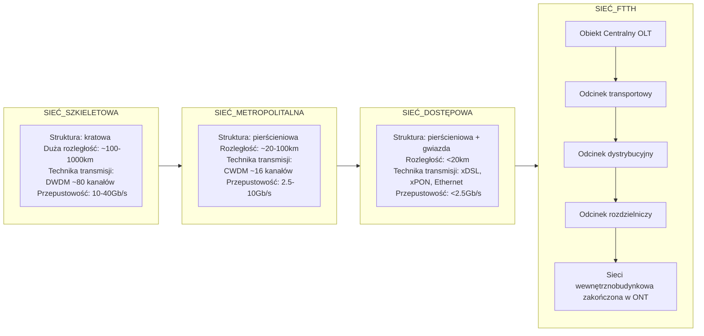
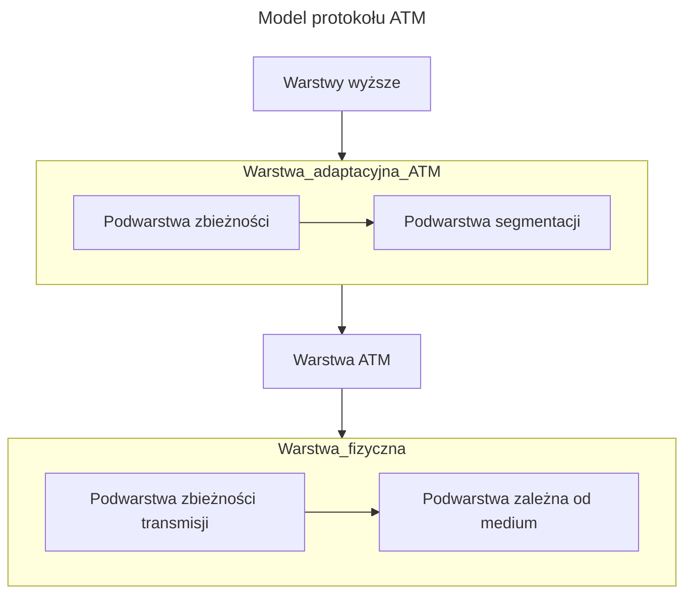

```yaml
author:       "BO$"
date:         09.06.2024
copyright:    "All rights reserved (c) 2024 WEEK-END DEVELOPMENT"
version:      0x0003
```
> [!CAUTION]
> **WEEK-END DEVELOPMENT** ***Nie gwarantuje poprawności informacji!!!***

# Model sieci


# KOMUTACJA
to technika zestawiania połączeń w celu transferu danych od źródła, poprzez węzły tranzytowe, do punktu docelowego.

| KOMUTACJA |    TECHNIKI     | natężenia strumienia | procedury przetwarzania w węzłach |
| :-------: | :-------------: | :------------------: | :-------------------------------: |
|  kanałów  | PSTN, ISDN, GSM |        stałe         |              proste               |
|  komórek  |       ATM       |        &darr;        |              &darr;               |
|   ramek   |   Frame Relay   |        &darr;        |              &darr;               |
| pakietów  |  TCP/IP, X.25   |       zmienne        |              złożone              |

## KANAŁÓW (obwodów, łączy)
> **WADY**
> - niska efektywność
> - wysokie koszty eksploatacji
> - zajmuje zasoby centrali

> **ZALETY**
> - wysoka jakość transmisji

## PAKIETÓW
należy do najbardziej elastycznych technik komutacji stosowanych we współczesnych sieciach, pozwala na nawiązywanie połączenia z wieloma innymi użytkownikami jednocześnie

### NAGŁÓWEK
Zawiera informacje:
- adresy źródłowy i docelowy,
- numer pakietu,
- wskaźnik ostatniego pakietu, a także
- identyfikator zawartej w pakiecie informacji.

### PRZESYŁ METODĄ
#### POŁĄCZENIOWĄ
Charakteryzuje się przesyłaniem pakietów przez zestawienia połączenia wirtualnego. (sekwencja węzłów i kanałów)
- Unikalny numer połączenia zamiast adresów w nagłówku
- **SVC (Switched Virtual Circuit)**
  - Tymczasowe połączenie
  - FAZY: `zestawienie`, `transmisja`, `rozłączenie`
- **PVC (Permanent Virtual Circuit)**
  - Stałe połączenie
  - Efektywna, ale kosztowna
  - Dla dużych plików

#### BEZPOŁĄCZENIOWA
- Pakiety przemieszczają się samodzielnie
- Węzły wybierają trasę na podstawie adresu docelowego
- Pakiety mogą dotrzeć w innej kolejności

## RAMEK
Redukcja mechanizmów korekcji błędów i kontroli przepływu w porównaniu z komutacją pakietów

## KOMÓREK
- Szybka transmisja danych
- Dane dzielone na stałe długości (komórki)
- Przeznaczona dla wysokiej jakości łączy (światłowodowe)

# WAN (Wide Area Networks)
to kombinacja sieci lokalnych (LAN) połączonych dodatkowymi łączami, działająca w warstwie fizycznej i łącza danych modelu OSI.

## Cechy
- Łączą urządzenia na dużych obszarach geograficznych
- Korzystają z usług operatorów telekomunikacyjnych
- Wykorzystują transmisję szeregową
- Umożliwiają wymianę ramek i pakietów danych między routerami i przełącznikami w sieciach LAN

## Połączenia analogowe
- Używane mimo niskiej jakości i przepustowości
- Zdalni użytkownicy łączą się przez modem i linię telefoniczną

## Połączenia cyfrowe
- Wykorzystują dzierżawione kanały cyfrowe (DDS)
- Wyższa szybkość i mniejsza liczba błędów transmisji niż analogowe
- Komunikacja cyfrowa za pomocą routera i urządzenia CSU/DSU zamiast modemu
- CSU/DSU konwertuje dane na cyfrowe sygnały bipolarne dla synchronicznego środowiska komunikacyjnego

# TRANSMISJA DANYCH
## PCM (Pulse Code Modulation)
- ETAPY: `próbkowanie`, `kwantowanie`, `kodowanie`.
- PRZEPUSTOWOŚĆ: 64kb/s (E0)

## PDH (Plesiochronous Digital Hierarchy)
- Elementy sieci mają własne zegary (prawie synchroniczne)
- Multipleksacja z podziałem czasu TDM
- Przepływność pojedynczego kanału: 64 kb/s
- OZNACZENIA: T*(USA), E*(Europa), J*(Japonia)

> **WADY**
> - Brak standaryzacji powyżej 140 Mbit/s
> - Energochłonność
> - Hierarchia demultiplekserów do wydzielenia E1 z E4
> - Różne standardy na świecie
> - Wypierane przez SDH

## SDH (Synchronous Digital Hierarchy)
Wszystkie urządzenia zsynchronizowane do nadrzędnego zegara (PRC) oraz do siebie nawzajem
### RAMKA
- **Nagłówek**: 9 kolumn
    - A1, A2: znacznik początku ramki
    - B1: bit parzystości
    - E1: voicechannel
    - D1-3, 4-12: zarządzanie, monitorowanie, alarmy
    - S1: synchronizacja
- **Dane**: 261 kolumn

> **ZALETY**
> - Wyższe przepływności (powyżej 1Gb/s) przy użyciu światłowodów
> - Synchronizacja z zegarem dokładność $10^{11}$
> - Ramki co $125\mu s$
> - Duża niezawodność
> - Ekonomiczniejszy dostęp do danych
> - Lepsze zapobieganie błędom
> - Mniejsza podatność na uszkodzenia
> - Możliwość automatycznej rekonfiguracji

### Terminologia SDH
| Termin                                      | Definicja                                                                       |
| ------------------------------------------- | ------------------------------------------------------------------------------- |
| **Sekcja**                                  | Odcinek między dwoma sąsiednimi urządzeniami (regeneracja lub zwielokrotnienie) |
| **Ścieżka**                                 | Kanał wirtualny pomiędzy węzłem wejściowym a wyjściowym                         |
| **Sygnały wejściowo/wyjściowe**             | Sygnały transportowane przez sieć                                               |
| **Odwzorowanie**                            | Adaptacja sygnału do przepływności SDH                                          |
| **Kontener**                                | Bajty sygnału wejściowego i bity uzupełniające                                  |
| **Kontener wirtualny**                      | Kontener z nagłówkiem                                                           |
| **Jednostka składowa**                      | Pole użytkowe, zawiera kontener wirtualny niższego rzędu                        |
| **Jednostka administracyjna**               | Zawiera kontener wirtualny wyższego rzędu i wskaźnik                            |
| **Grupa jednostek administracyjnych (AUG)** | Grupa jednostek administracyjnych                                               |
| **Synchroniczny moduł transportowy (STM)**  | Struktura informacyjna z nagłówkiem, wskaźnikiem i polem użytkowym              |
| **Wskaźnik**                                | Adres pierwszego bajtu kontenera wirtualnego                                    |
| **Nagłówek sekcji (SOH)**                   | Zarządzanie, utrzymanie zwielokrotnienia i regeneracji                          |
| **Nagłówek ścieżki (POH)**                  | Zarządzanie i utrzymanie ścieżki                                                |

### Budowa STM-1
- **Nagłówek SOH** (M-SOH i R-SOH): 82 bajty
    - **R-SOH:** sterowanie i informacje dla sekcji regenerowania sygnału
    - **M-SOH:** nagłówek dla multiplekserów
- Blok wskaźników PTR: 9 bajtów
- Payload: 2349 bajtów

> [!IMPORTANT]
> **Kontener + Nagłówek = Kontener wirtualny**

> [!NOTE]
> SDH o większej przepustowości niż STM-1 powstają przez zwielokrotnienie 155.52 Mbit/s metodą **przeplatania bajtowego**.

### SONET
```yaml
Pochodzenie:                        Stany Zjednoczone
Podstawowa przepływność OC-1:       54 Mbit/s
Rozmiar ramki OC-1:                 9 rzędów po 90 bajtów (810 bajtów)
Czas transmisji pojedynczej ramki:  125 μs (8000 ramek na sekundę)
Szybsza transmisja:                 Większy rozmiar ramki
```

# PROTOKÓŁ
## X.25
```yaml
Standard:       Protokół komunikacyjny dla publicznych sieci WAN
Przepustowość:  64 kb/s do 2 Mb/s
Połączenie:     Między DTE (Data Terminal Equipment) a DCE (Data Communications Equipment)
Tryb pracy:     Pakietowy
Warstwy:        Fizyczna, łącza danych, sieci modelu OSI
```
**Cechy:**
- **Komutacja pakietów o zmiennej długości:** Tryb połączeniowy, pakiety bez adresów nadawcy i odbiorcy
- **Połączenia wirtualne:** Gwarantują pakiety w kolejności wysyłania
- **Korekcja błędów i sterowanie przepływem:** Każdy węzeł sprawdza pakiety przed wysłaniem dalej
- **Wykrywanie nieprawidłowości:** Żądanie retransmisji błędnych pakietów
- **Niezawodność:** Przekaz informacji przez łącza o niższej jakości, ale z opóźnieniem

**Urządzenia:**
- **Terminale danych (DTE)**
- **Urządzenia zakończenia obwodów danych (DCE)**
- **Przełączniki wymiany pakietów (PSE)**
- **Multiplekser sieciowy PAD (Packet Assembly and Disassembly)**:
  - Buforowanie
  - Składanie danych w pakiety
  - Demultipleksacja pakietów

**Protokoły:**
- **Packet-Layer Protocol (PLP):** Warstwa sieci
  - Tryby: Zestawianie połączenia, przesyłanie danych, bezczynność, usuwanie połączenia, ponowne uruchamianie
- **Link Access Procedure Balanced (LAPB):** Warstwa łącza danych
  - Zarządzanie komunikacją i ramkowaniem pakietów
- **Fizyczne interfejsy szeregowe:** EIA/TIA-232, EIA/TIA-449, EIA-530, G.703 (warstwa fizyczna)

**Typy pól pakietów PLP:**
- **GFI (General Format Identifier):** Parametry pakietu (dane użytkownika, informacje sterujące)
- **LCI (Logical Channel Identifier):** Identyfikacja obwodu wirtualnego
- **PTI (Packet Type Identifier):** Typ pakietu (jeden z 17 typów)
- **UD (User Data):** Enkapsulowane informacje z wyższej warstwy

**Typy ramek LAPB:**
- **Informacyjne (I)**
- **Nadzorcze (S):** Przenoszą numery sekwencji odbioru
- **Nienumerowane (U):** Bez numerów sekwencyjnych

**Struktura ramek LAPB:**
- Nagłówek
- Enkapsulowane dane
- Zakończenie

**Opóźnienia:** Przejście pakietu przez węzeł - 15-20 ms

## X.21bis
- **Definicja:** Procedury korzystania z fizycznego nośnika
- **Funkcje:** Aktywacja i dezaktywacja nośnika między DTE i DCE
- **Obsługa:** Połączenia punkt-punkt, prędkość do 19.2 kb/s, synchroniczna, pełnodupleksowa transmisja przez media czteroprzewodowe

## Frame Relay

- **Definicja:** Sieć z komutacją pakietów, używana do łączenia odległych sieci LAN, przesyłania danych, obrazu i głosu oraz dostępu do Internetu. Informacje są dzielone na ramki o zmiennej długości, które przenoszą dane między sieciami LAN, umożliwiając przekazywanie informacji między urządzeniami końcowymi sieci WAN.

**Cechy:**
- Technologia sieci WAN
- Obsługuje sieci publiczne i prywatne
- Szybka technologia przełączania pakietów
- Działa na 2. warstwie modelu OSI
- Zapewnia szybkość komunikacji od 56 kb/s do 45 Mb/s (T3) w oparciu o obwody wirtualne i transmisję zorientowaną połączeniowo

**Typy urządzeń i styki:**
- **DCE (Data Communications Equipment):** Urządzenie stanowiące węzeł sieci FR – przełącznik ramek
- **DTE (Data Terminal Equipment):** Urządzenie końcowe transmisji, np. FRAD (FR Access Devices) – urządzenie dostępowe do sieci, routery z interfejsem FR
- **UNI (User-Network Interface):** Styk pomiędzy abonentem a siecią – DTE – DCE
- **NNI (Network Node Interface):** Styk wewnątrzsieciowy – pomiędzy DCE

**Typy obwodów wirtualnych:**
- **PVC (Permanent Virtual Circuit):** Połączenia zestawiane na stałe podczas konfiguracji sieci, zapewniające stabilne parametry transmitowanych danych
- **SVC (Switched Virtual Circuit):** Komutowane połączenie, zestawiane na życzenie abonenta na krótki okres czasu, możliwość obejścia awarii w sieci

**Struktura ramki:**
- **Flaga:** Służy do synchronizacji blokowej ramki
- **Nagłówek:** 2, 3 lub 4 bajty, zawiera m.in. pole DLCI (Data Link Connection Identifier) – identyfikator połączenia logicznego, DE (Discard Eligibility) – bit priorytetu ramki
- **Dane:** Mechanizm „bit stuffing” – transport przezroczysty, zmienna ilość danych, maksymalnie bajtów na ramkę
- **FCS (Frame Check Sequence):** Np. CRC-16, przełączniki FR dokonują detekcji błędnych ramek, brak korekcji błędów, konieczna retransmisja

**Parametry ruchu FR dla obwodu wirtualnego VC:**
- **CIR (Committed Information Rate):** Gwarantowany przez sieć transfer danych w bit/sek. – określony w kontrakcie
- **EIR (Excess Information Rate):** Maksymalna przepływność, której przekroczenie wiąże się z utratą danych
- **Bc (Committed Burst Size):** Maksymalna ilość danych, którą dostawca gwarantuje przesłać w czasie T (Bc=T x CIR) w bitach
- **Be (Excess Burst Size):** Maksymalna ilość danych powyżej Bc, przesyłana przez sieć z obniżonym priorytetem w bitach

**Proste mechanizmy korekcji błędów:**
- Nagłówka
- Formatu
- Cyklicznego kodu nadmiarowego FCS (Frame Check Sequence)

### Zastosowania:
- **Transmisja danych i głosu**
- **Wideokonferencje i telekonferencje**

## ATM (Asynchronous Transfer Mode)
to szerokopasmowym standardem komunikacji, realizującym przesył pakietów poprzez łącza wirtualne, łączącym zalety techniki synchronicznej STM oraz pakietowej PTM.

**Cechy:**
- Wybór drogi dokonywany raz przy zestawianiu łącza
- Wszystkie pakiety jednego połączenia wirtualnego wysyłane tą samą trasą
- Stosowany w sieciach MAN i WAN
- Technika multipleksacji etykietowanej (Label Multiplexing)

**Struktura komórki ATM:**
- Nagłówek: 5 bajtów
- Pole informacyjne: 48 bajtów

| Wielkość pakietu | czas oczekiwania |
| :--------------: | :--------------: |
|       4kB        |  $327.68\mu s$   |
|       53B        |   $4.24\mu s$    |

**Połączenia:**
- **VCC (Virtual Channel Connection):** Logiczne połączenie między stacją źródłową a docelową
- **VPC (Virtual Path Connection):** Grupa kanałów o tym samym węźle docelowym
- **VPI (Virtual Path Identifier):** Identyfikator ścieżki wirtualnej

**Porównanie technik transmisji:**

| TECHNIKA TRANSMISJI                         | STM (synchroniczna) | PTM (pakietowa) | ATM (asynchroniczna) |
| ------------------------------------------- | :-----------------: | :-------------: | :------------------: |
| PODSTAWOWE CECHY                            |
| komutacja łączy (szczeliny czasowe)         |          +          |        -        |          +           |
| wymagana faza nawiązywania                  |          +          |        -        |          +           |
| komutacja pakietów                          |          -          |        +        |          +           |
| niepotrzebna faza nawiązywania połączenia   |          -          |        +        |          +           |
| GŁÓWNE ZALETY                               |
| duża szybkość transmisji                    |          +          |        -        |          +           |
| możliwość pracy w czasie rzeczywistym       |          +          |        -        |          +           |
| elastyczny przydział zasobów sieciowych     |          -          |        +        |          +           |
| dynamiczny przydział pasma transmisji       |          -          |        +        |          +           |
| GŁÓWNE WADY                                 |
| nieefektywna gospodarka zasobami            |          +          |        -        |          -           |
| brak możliwości pracy w czasie rzeczywistym |          -          |        +        |          -           |

**Rodzaje komórek ATM:**
**Rodzaje interfejsów:**
- **UNI (User Network Interface):** Styk użytkownika z siecią
- **NNI (Network-to-Network Interface):** Styk wewnątrz sieci, między węzłami

```mermaid
gantt
    title Rodzaje komórek ATM
    dateFormat ss
    axisFormat %S bits

    section UNI
    GFC 4 bits: 00, 4s
    VPI 8 bits: 8s
    VCI 16 bits: 16s
    PT 3 bits: 3s
    CLP 1 bit: 1s
    HEC 8 bits: 8s
    NAGŁÓWEK 40 bits (5 B): crit, 00, 40s
    DANE 384 bits (48 B): 5s

    section NNI
    VPI 12 bits: 00, 12s
    VCI 16 bits: 16s
    PT 3 bits: 3s
    CLP 1 bit: 1s
    HEC 8 bits: 8s
    NAGŁÓWEK 40 bits (5 B): crit, 00, 40s
    DANE 384 bits (48 B): 5s
```



**Elementy nagłówka:**
- **GFC:** Kontrola dostępu dla styku UNI
- **VPI:** Identyfikator ścieżki wirtualnej
- **VCI:** Identyfikator kanału wirtualnego
- **PT:** Typ danych
- **CLP:** Bit priorytetu
- **HEC:** Kontrola błędów nagłówka

**Model protokołu ATM:**



| WARSTWA                     | FUNKCJE                                                                                            |
| --------------------------- | -------------------------------------------------------------------------------------------------- |
| Wyższe                      | Funkcje warstw wyższych                                                                            |
| Adaptacyjna warstwa ATM CS  | Tworzenie bloków danych, generowanie zabezpieczeń CRC                                              |
| Adaptacyjna warstwa ATM SAR | Podział bloków na segmenty, tworzenie nagłówków i/lub zakończeń bloków                             |
| Warstwa ATM                 | Tworzenie komórek, generowanie i wydzielanie nagłówków, multipleksowanie i demultipleksowanie      |
| Warstwa Fizyczna TC         | Dopasowywanie szybkości transmisji, weryfikacja nagłówków, adaptacja strumienia do struktury ramki |
| Warstwa Fizyczna PM         | Transmisja bitów, synchronizacja, kodowanie liniowe                                                |

**Kategorie usług warstwy ATM:**
- **CBR:** Stały strumień informacji, np. telefonia, wideo, transfer zbiorów
- **rt-VBR:** Zmienny strumień informacji w czasie rzeczywistym, np. wideo z kompresją MPEG
- **nrt-VBR:** Zmienny strumień informacji, brak synchronizacji, np. Frame Relay
- **UBR:** Nieokreślone parametry ruchowe, np. emulacja LAN, poczta elektroniczna
- **ABR:** Zmienny strumień informacji, brak ścisłych relacji czasowych, np. TCP/IP

**Podział usług na klasy:**

| KLASA                           | A                               | B                            | C            | D                  |
| ------------------------------- | ------------------------------- | ---------------------------- | ------------ | ------------------ |
| Sygnalizacja między terminalami | Wymagana                        | Wymagana                     | Nie wymagana | Nie wymagana       |
| Szybkość bitowa                 | Stała                           | Zmienna                      | Zmienna      | Zmienna            |
| Tryb połączenia                 | Połączeniowa                    | Połączeniowa                 | Połączeniowa | Bezpołączeniowa    |
| Typ AAL                         | AAL1                            | AAL2                         | AAL3/4/5     | AAL3/4/5           |
| Zastosowanie                    | Dźwięk, obraz, wideokonferencje | Skompresowane wideo i dźwięk | -            | Ethernet, LAN, MAN |

Warstwa adaptacyjna AAL (ATM Adaptation Layer) realizuje funkcje segmentacji i składania jednostek transmisyjnych między wyższymi warstwami a warstwą ATM.

## MPLS (Multiprotocol Label Switching)
MPLS to technika stosowana przez routery, zastępująca tradycyjne trasowanie pakietów przełączaniem etykiet. Znana jest również jako protokół warstwy 2.5, ponieważ łączy zalety warstwy 2 (wydajność i szybkość) oraz warstwy 3 (skalowalność).

### Główne cechy MPLS
1. **Przełączanie etykiet:** Pakiety na brzegu sieci otrzymują etykietę wejściową. Routery wykorzystują te etykiety do indeksowania tablicy etykiet, zamieniając etykiety wejściowe na wyjściowe i przekazując pakiet dalej.
2. **FEC (Forwarding Equivalence Class):** Pakiety są klasyfikowane do FEC, co zapewnia jednolite traktowanie i trasę dla wszystkich pakietów w danej grupie.
3. **Stosy etykiet:** Możliwość tworzenia stosów etykiet, obsługiwanych w trybie LIFO, co jest użyteczne w VPN i tunelowaniu.

### Zalety
- **QoS (Quality of Service):** Umożliwia transmisję danych z gwarantowaną jakością usług, korzystne dla transmisji głosu i wideo.
- **Efektywność i skalowalność:** Łączy rozproszone urządzenia i sieci LAN w jedną sieć WAN, obniżając koszty IT.
- **Wsparcie dla różnych technologii:** Działa z technologiami takimi jak TCP/IP, ATM, Frame Relay oraz SONET.

### Budowa i działanie
- **Etykieta MPLS:** 32-bitowa etykieta umieszczona między nagłówkiem warstwy 2 (Ethernet) a warstwy 3 (IP), składająca się z pola etykiety (20 bitów), pola klasy ruchu EXP (3 bity), pola BS (1 bit) i pola TTL (8 bitów).
- **Routery LER i LSR:** Routery brzegowe (LER) dodają i usuwają nagłówki MPLS, a wewnętrzne routery (LSR) przełączają etykiety.

### Mechanizmy
- **Tunelowanie i VPN:** MPLS umożliwia tworzenie tuneli między węzłami, co ułatwia budowanie VPN. Stosy etykiet pozwalają na logiczne oddzielanie pakietów między różnymi sieciami VPN.
- **Inżynieria ruchu:** MPLS pozwala na ustalanie ścieżek transmisji z rezerwacją zasobów i spełnianiem wymogów QoS. Monitorowanie stanu łącza przy użyciu protokołów OSPF lub IS-IS umożliwia odpowiednie zestawienie ścieżek LSP.
- **Protokół RSVP:** RSVP to protokół sygnalizacyjny rezerwujący zasoby w sieci dla jednokierunkowej transmisji danych.

### Dystrybucja etykiet
- **LDP (Label Distribution Protocol):** LDP definiuje reguły dystrybucji etykiet między LSR. Etykiety są dystrybuowane w kierunku przeciwnym do strumienia danych. LDP wykorzystuje wiadomości do odkrywania sąsiadów, zestawiania i utrzymywania sesji oraz zarządzania etykietami.
- **CR-LDP (Constraint-based Routing LDP):** Rozszerzenie LDP umożliwia elastyczne wybieranie trasy oraz optymalizację ścieżek z zasadą make-before-break, wspierając ścieżki i parametry QoS.

### Węzły MPLS
- **LSR (Label Switching Router):** Przełączają etykiety i kierują pakietami.
- **E-LSR (LER):** Klasyfikują ruch (FEC), przydzielają etykiety i inicjują ścieżki LSP.

### Odporność
- **Protektacja:** Szybkie przywrócenie transmisji po awarii.
- **Odtwarzanie:** Optymalizacja użycia zasobów sieciowych.

### Motywacja wprowadzenia
MPLS wprowadzono jako prostszą alternatywę dla ATM, przyspieszając procesy w węzłach, oferując prostą inżynierię ruchu i wsparcie dla współpracy IP/ATM. Łączy zalety IP, ATM i MPLS, oferując elastyczne przełączanie etykiet dla zaklasyfikowanego ruchu.

### Podsumowanie
MPLS zapewnia wieloprotokołowość, skalowalność, wszechstronną inżynierię ruchu, QoS i trasowanie statyczne, ale wymaga zaawansowanych systemów sygnalizacji i ewoluuje w kierunku G-MPLS (Generalized MPLS).

# DEFINICJE
## MAN (Metropolitan Area Network)
sieć obejmująca niewielki obszar geograficzny (miasto lub region)

## CAN (Campus Area Network)
termin stosowany do określania sieci WAN łączącej poszczególne wydziały w ośrodku akademickim.

## PDN (pakiet data network)
ogólna nazwa sieci wykorzystujących komutację ramek i komórek

## QoS (Quality of Service) i CoS (Class of Service)
Wprowadzono trzy klasy jakości:
- Real Time Variable Frame Rate (Głos)
- Non-Real Time Variable Frame Rate (LAN-LAN, Ethernet-Ethernet)
- Available/Unspecified Frame Rate (transfer plików, poczta elektroniczna, usługi dostępu internetowego)