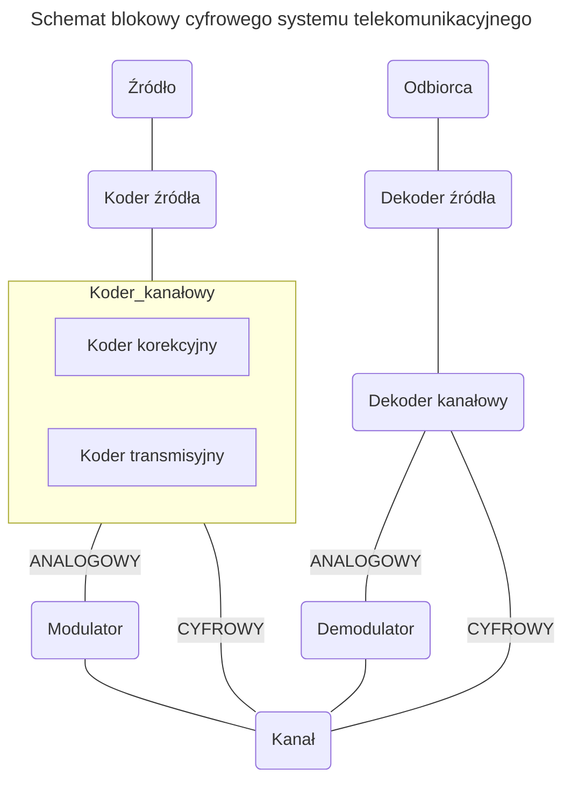

```yaml
author:       "BO$"
date:         [27.02.2024, 14.06.2024]
copyright:    "All rights reserved (c) 2024 WEEK-END DEVELOPMENT"
version:      0x0001
```
> [!CAUTION]
> **WEEK-END DEVELOPMENT** ***Nie gwarantuje poprawności informacji!!!***

- [Rozwiązania teleinformatyczne sieci Internet - CHEAT SHEET](#rozwiązania-teleinformatyczne-sieci-internet---cheat-sheet)
- [Medium transmisyjne](#medium-transmisyjne)
  - [Przewodowe](#przewodowe)
    - [Światłowód](#światłowód)
      - [Jednomodowy](#jednomodowy)
      - [Wielomodowy](#wielomodowy)
      - [Plastikowy](#plastikowy)
      - [Elementy składowe transmisji optycznej](#elementy-składowe-transmisji-optycznej)
      - [Złącza](#złącza)
      - [Przepustowość włókien światłowodowych](#przepustowość-włókien-światłowodowych)
    - [Miedziane](#miedziane)
      - [Koncentryk](#koncentryk)
      - [RJ45](#rj45)
        - [Kategorie](#kategorie)
      - [Parametry techniczne](#parametry-techniczne)
      - [RS232](#rs232)
      - [RS485](#rs485)
  - [Radiowe](#radiowe)
    - [IEEE 802.11](#ieee-80211)
    - [Modulacja](#modulacja)
      - [BPSK - Binary Phase Shift Keying](#bpsk---binary-phase-shift-keying)
      - [QPSK - Quadrature Phase Shift Keying](#qpsk---quadrature-phase-shift-keying)
        - [16QAM](#16qam)
      - [OFDM](#ofdm)
    - [Siła sygnału](#siła-sygnału)
  - [Rodzaj transmisji](#rodzaj-transmisji)
- [ISO/OSI](#isoosi)
  - [Zalety wprowadzenia standardu](#zalety-wprowadzenia-standardu)
  - [PODZIAŁ NA WARSTWY](#podział-na-warstwy)
    - [WYŻSZA](#wyższa)
    - [NIŻSZA](#niższa)
  - [Warstwa łącza danych](#warstwa-łącza-danych)
    - [Podwarstwy](#podwarstwy)
      - [LLC - Logical Link Control](#llc---logical-link-control)
      - [MAC - Media Access Control](#mac---media-access-control)
  - [Protokoły](#protokoły)
    - [LAN - sieci lokalnych](#lan---sieci-lokalnych)
    - [WAN - sieci rozległych](#wan---sieci-rozległych)
    - [Trasowania](#trasowania)
    - [Sieciowe](#sieciowe)
- [Modulacja i Kodowanie](#modulacja-i-kodowanie)
  - [Problemy](#problemy)
  - [Kodowanie liniowe](#kodowanie-liniowe)
    - [Charakterystyka](#charakterystyka)
  - [Cel kodowania](#cel-kodowania)
  - [Właściwości kodu](#właściwości-kodu)
  - [Wymagania własności kodu](#wymagania-własności-kodu)
  - [Kodowanie blokowe](#kodowanie-blokowe)
  - [Kodowanie liniowe](#kodowanie-liniowe-1)
  - [Kody pierwotne](#kody-pierwotne)
    - [NRZ - Not Return to Zero](#nrz---not-return-to-zero)
    - [RZ - Return to Zero](#rz---return-to-zero)
  - [Kody wielopoziomowe](#kody-wielopoziomowe)
  - [Kody bifazowe](#kody-bifazowe)
    - [KOD MENCHESTER](#kod-menchester)
  - [Kody typu nb/mb](#kody-typu-nbmb)
    - [Kod bipolarny 4b5b](#kod-bipolarny-4b5b)
  - [Detekcja i korekcja błędów](#detekcja-i-korekcja-błędów)
    - [Wykrycie](#wykrycie)
    - [Korekcja](#korekcja)
- [Urządzenia](#urządzenia)
  - [Aktywne](#aktywne)
- [DEFINICJE](#definicje)
  - [Rozpraszanie Rayleigha](#rozpraszanie-rayleigha)
  - [Dyspersja](#dyspersja)
  - [CSMA/CD](#csmacd)
  - [Protokół](#protokół)
  - [MIMO](#mimo)
  - [Unipolarny sygnał](#unipolarny-sygnał)
  - [Bipolarny sygnał](#bipolarny-sygnał)
  - [BER - Bit Error Rate](#ber---bit-error-rate)
  - [ARQ - Automatic Reapeat reQuest](#arq---automatic-reapeat-request)
  - [FEC - Forward Error Correction](#fec---forward-error-correction)
  - [Kod detekcyjny](#kod-detekcyjny)
  - [Odległość Hamminga](#odległość-hamminga)
  - [Kodowanie blokowe](#kodowanie-blokowe-1)
  - [Zysk kodowy](#zysk-kodowy)
- [ZADANIA](#zadania)

---
Rozwiązania teleinformatyczne sieci Internet - CHEAT SHEET
==========================================================

# Medium transmisyjne


[PLIK](https://github.com/Week-end-Development/INF-I/blob/main/sem6/tel-inf-solution/tis-cheat-sheet.md)