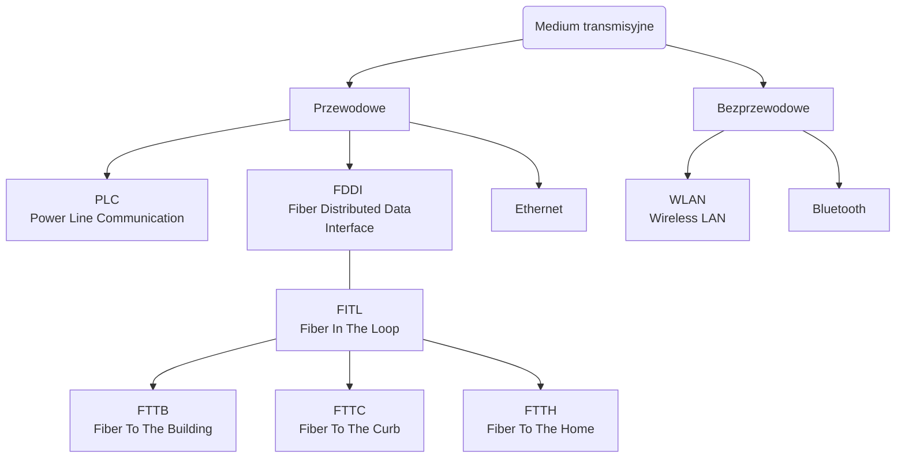

```yaml
author:       ["BO$"]
date:         [27.02.2024, 14.06.2024]
copyright:    "All rights reserved (c) 2024 WEEK-END DEVELOPMENT"
status:       "IN PROGRESS"
version:      0x0001
```
- [ROZWIĄZANIA TELEINFORMATYCZNE SIECI INTERNET - WYKŁADY](#rozwiązania-teleinformatyczne-sieci-internet---wykłady)
- [Medium transmisyjne](#medium-transmisyjne)
  - [Przewodowe](#przewodowe)
    - [Światłowód](#światłowód)
    - [8P8C RJ45](#8p8c-rj45)
    - [Koncentryk](#koncentryk)
  - [Bezprzewodowe](#bezprzewodowe)
    - [Bluethoot](#bluethoot)
    - [5G](#5g)
- [BIBLIOGRAFIA](#bibliografia)

# ROZWIĄZANIA TELEINFORMATYCZNE SIECI INTERNET - WYKŁADY
```yaml
wykład: 1
temat:  Wprowadzenie
data:   27.02.2024
```
# Medium transmisyjne

## Przewodowe
### Światłowód
### 8P8C RJ45
### Koncentryk
## Bezprzewodowe
### Bluethoot
### 5G
Scenariusze zastosowań zdefiniowane przez ITU dla sieci 5G:
- eMBB (enhanced Mobile Broadband) – dostęp wysokich prędkości, w tym również dla użytkowników stacjonarnych (Fixed Wireless Access).
- URLLC (Ultra Reliable Low Latency Communications) – zastosowania wymagające bardzo niskich opóźnień (**poniżej 1 ms**) i/lub bardzo wysokiej niezawodności (poziom błędów 10^(−5))
- mMTC (massive Machine Type Communications) – dla szerokiego spektrum zastosowań Internetu Rzeczy, z możliwością obsłużenia do **1 mln urządzeń na km^2**.

# BIBLIOGRAFIA
- [Speed test wiki](https://www.speedtest.pl/wiki/technologie/swiatlowod-ftth-fttb-fttc)
- [Wiki-Medium transmisyjne](https://pl.wikipedia.org/wiki/Medium_transmisyjne)
- [Wykresy Mermaid](https://mermaid.js.org/syntax/timeline.html)