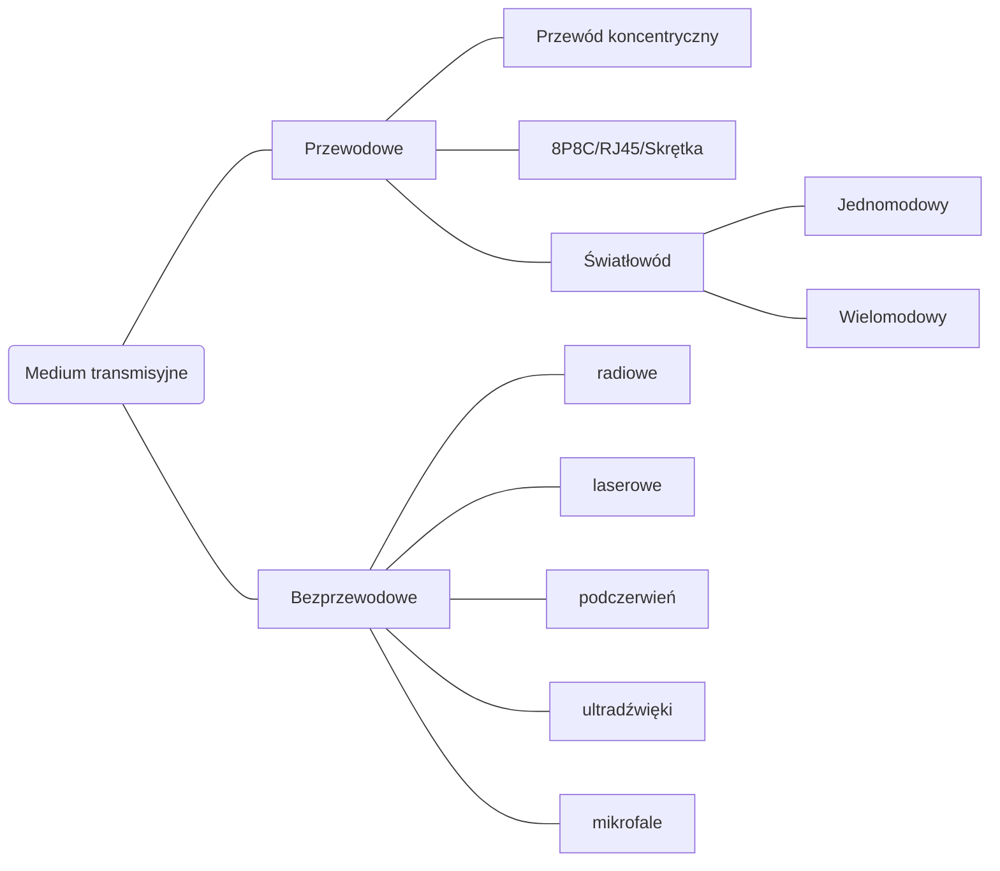

```yaml
author:       ["BO$", "SzymonProgrammer"]
date:         [27.02.2024, 14.06.2024]
copyright:    "All rights reserved (c) 2024 WEEK-END DEVELOPMENT"
status:       "IN PROGRESS"
version:      0x0006
```
> [!CAUTION]
> **WEEK-END DEVELOPMENT** ***Nie gwarantuje poprawności informacji!!!***

- [ROZWIĄZANIA TELEINFORMATYCZNE SIECI INTERNET - WYKŁADY](#rozwiązania-teleinformatyczne-sieci-internet---wykłady)
- [Medium transmisyjne](#medium-transmisyjne)
- [Przewodowe](#przewodowe)
  - [Światłowód](#światłowód)
    - [Jednomodowy](#jednomodowy)
    - [Wielomodowy](#wielomodowy)
    - [Budowa](#budowa)
    - [Rodzaje zakończeń](#rodzaje-zakończeń)
    - [Systemy światłowodowy](#systemy-światłowodowy)
    - [FITL](#fitl)
  - [8P8C RJ45 Skrętka](#8p8c-rj45-skrętka)
    - [Typy](#typy)
    - [Kategorie](#kategorie)
    - [Parametry techniczne](#parametry-techniczne)
  - [Przewód koncentryczny](#przewód-koncentryczny)
    - [Typy](#typy-1)
    - [Budowa](#budowa-1)
- [Bezprzewodowe](#bezprzewodowe)
  - [Bluethoot](#bluethoot)
  - [5G](#5g)
- [DEFINICJE](#definicje)
  - [MIMO](#mimo)
    - [Transmisja](#transmisja)
    - [Kanał komunikacyjny](#kanał-komunikacyjny)
  - [Model ISO/OSI](#model-isoosi)
  - [Podział na 2 obszary](#podział-na-2-obszary)
    - [WYŻSZY](#wyższy)
    - [NIŻSZY](#niższy)
    - [Kabel miedziany](#kabel-miedziany)
    - [Bezprzewodowy](#bezprzewodowy)
    - [Światłowodowe](#światłowodowe)
    - [Dostęp na kablach współosiowych i światłowodowych](#dostęp-na-kablach-współosiowych-i-światłowodowych)
- [Rodzaj transmisji](#rodzaj-transmisji)
  - [SIMPLEX](#simplex)
  - [HALF-DUPLEX](#half-duplex)
  - [FULL-DUPLEX](#full-duplex)
  - [Równoległa transmisja](#równoległa-transmisja)
  - [Szeregowa transmisja](#szeregowa-transmisja)
  - [sygnał cyfrowy](#sygnał-cyfrowy)
  - [sygnał analogowy](#sygnał-analogowy)
  - [Schemat blokowy cyfrowego systemu telekomunikacyjnego](#schemat-blokowy-cyfrowego-systemu-telekomunikacyjnego)
- [Modulacja](#modulacja)
  - [Rodzaje modulacji](#rodzaje-modulacji)
  - [Modulacja](#modulacja-1)
  - [OFDM](#ofdm)
  - [QAM ?](#qam-)
  - [Kanał komunikacyjny](#kanał-komunikacyjny-1)
  - [Twierdzenie Nyquista](#twierdzenie-nyquista)
  - [Szybkość transmisji](#szybkość-transmisji)
  - [Szybkość modulacji](#szybkość-modulacji)
  - [Twierdzenie Shannona](#twierdzenie-shannona)
  - [PON](#pon)
  - [QAM](#qam)
  - [Kanał](#kanał)
  - [Połączenie radiowe](#połączenie-radiowe)
  - [Kodowanie i Modulacja](#kodowanie-i-modulacja)
  - [Kody transmisyjne](#kody-transmisyjne)
    - [Dla medium światłowodowych](#dla-medium-światłowodowych)
    - [Dla medium miedzianego](#dla-medium-miedzianego)
  - [Kod liniowy](#kod-liniowy)
  - [Kody bipolarne unipolarne](#kody-bipolarne-unipolarne)
  - [Kody światłowodowe](#kody-światłowodowe)
    - [Kody blokowe](#kody-blokowe)
    - [Kod liniowy](#kod-liniowy-1)
  - [Kod 64b/66b](#kod-64b66b)
- [Kodery korekcyjne](#kodery-korekcyjne)
  - [Definicja Odległość Hamminga](#definicja-odległość-hamminga)
    - [Medium optyczne - Światłowody](#medium-optyczne---światłowody)
    - [Podział światłowodów](#podział-światłowodów)
    - [Elementy składowe transmisji optycznej (na egzamin)](#elementy-składowe-transmisji-optycznej-na-egzamin)
    - [4 okna transmisyjne](#4-okna-transmisyjne)
      - [1mW = 0dBm](#1mw--0dbm)
    - [Zadanie](#zadanie)
  - [Wartości definiowania anteny](#wartości-definiowania-anteny)
  - [Zadanie](#zadanie-1)
- [BIBLIOGRAFIA](#bibliografia)

# ROZWIĄZANIA TELEINFORMATYCZNE SIECI INTERNET - WYKŁADY
```yaml
wykład: 1
temat:  Wprowadzenie
data:   27.02.2024
```
# Medium transmisyjne

[PLIK](https://github.com/Week-end-Development/INF-I/blob/main/sem6/tel-inf-solution/tis-summary.md)