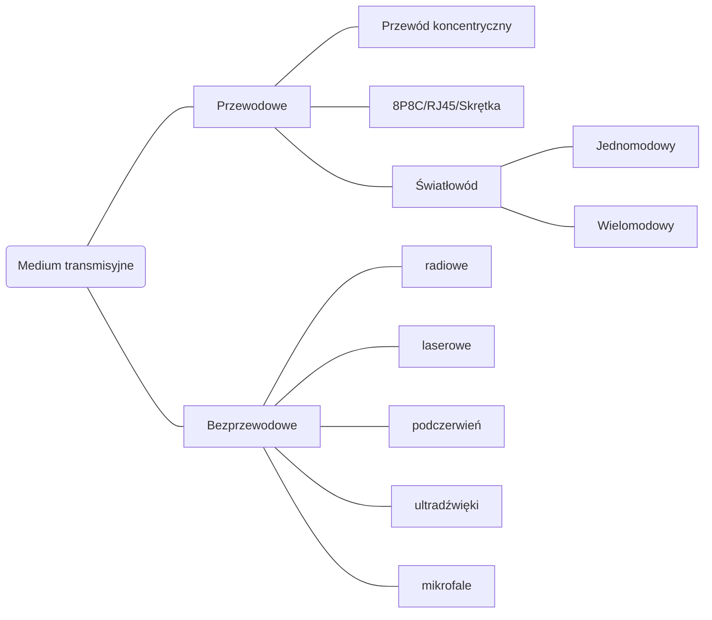
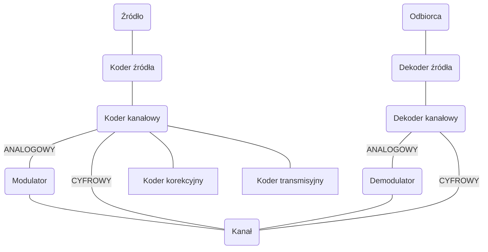
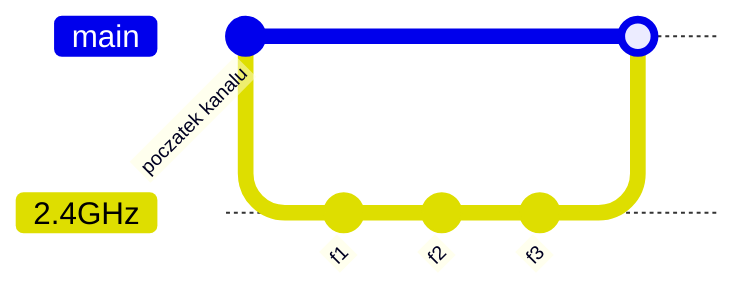
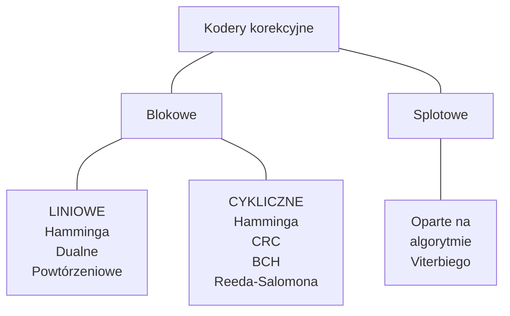
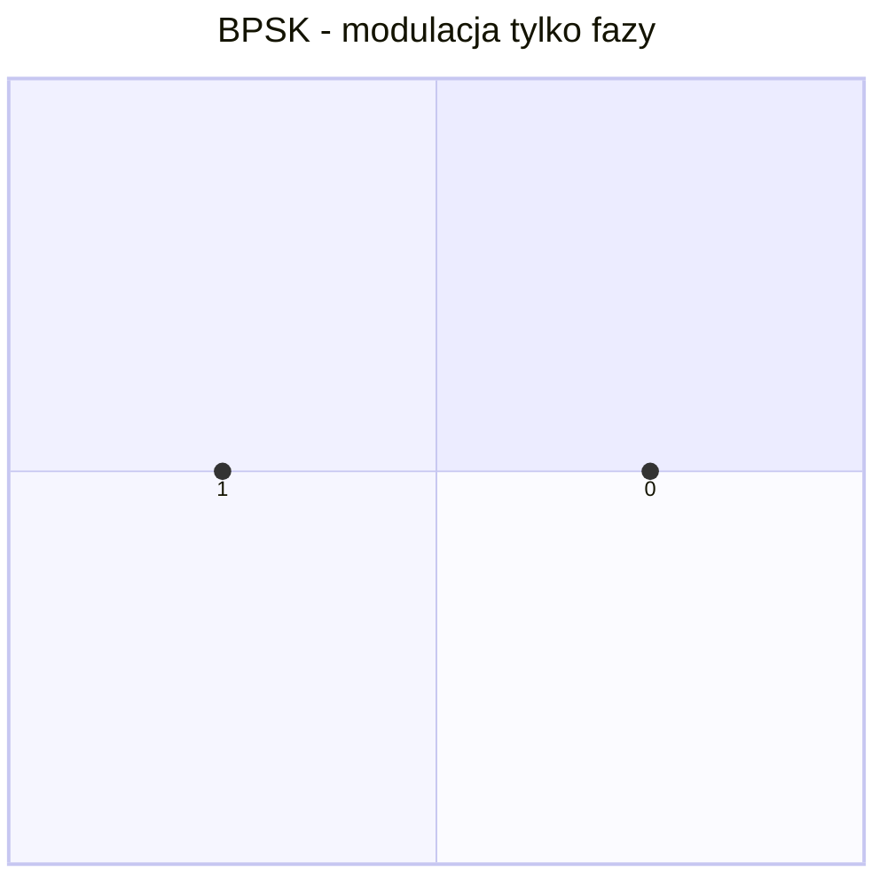
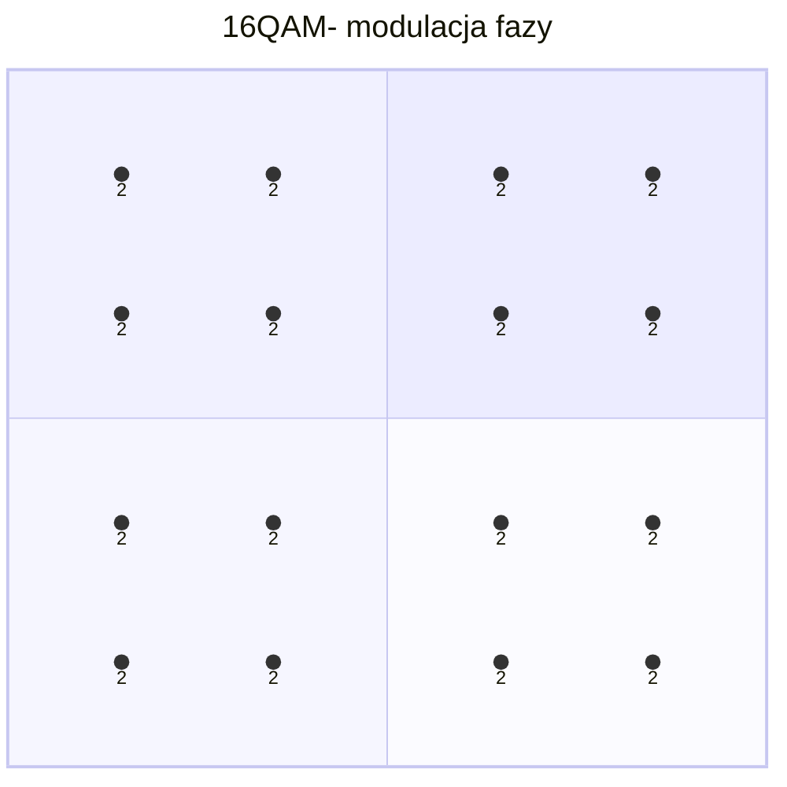

```yaml
author:       ["BO$", "SzymonProgrammer"]
date:         [27.02.2024, 14.06.2024]
copyright:    "All rights reserved (c) 2024 WEEK-END DEVELOPMENT"
status:       "IN PROGRESS"
version:      0x0006
```
- [ROZWIĄZANIA TELEINFORMATYCZNE SIECI INTERNET - WYKŁADY](#rozwiązania-teleinformatyczne-sieci-internet---wykłady)
- [Medium transmisyjne](#medium-transmisyjne)
- [Przewodowe](#przewodowe)
  - [Światłowód](#światłowód)
    - [Jednomodowy](#jednomodowy)
    - [Wielomodowy](#wielomodowy)
    - [Budowa](#budowa)
    - [Rodzaje zakończeń](#rodzaje-zakończeń)
    - [Systemy światłowodowy](#systemy-światłowodowy)
    - [FITL](#fitl)
  - [8P8C RJ45 Skrętka](#8p8c-rj45-skrętka)
    - [Typy](#typy)
    - [Kategorie](#kategorie)
    - [Parametry techniczne](#parametry-techniczne)
  - [Przewód koncentryczny](#przewód-koncentryczny)
    - [Typy](#typy-1)
    - [Budowa](#budowa-1)
- [Bezprzewodowe](#bezprzewodowe)
  - [Bluethoot](#bluethoot)
  - [5G](#5g)
- [DEFINICJE](#definicje)
  - [MIMO](#mimo)
    - [Transmisja](#transmisja)
    - [Kanał komunikacyjny](#kanał-komunikacyjny)
  - [Model ISO/OSI](#model-isoosi)
  - [Podział na 2 obszary](#podział-na-2-obszary)
    - [WYŻSZY](#wyższy)
    - [NIŻSZY](#niższy)
    - [Kabel miedziany](#kabel-miedziany)
    - [Bezprzewodowy](#bezprzewodowy)
    - [Światłowodowe](#światłowodowe)
    - [Dostęp na kablach współosiowych i światłowodowych](#dostęp-na-kablach-współosiowych-i-światłowodowych)
- [Rodzaj transmisji](#rodzaj-transmisji)
  - [SIMPLEX](#simplex)
  - [HALF-DUPLEX](#half-duplex)
  - [FULL-DUPLEX](#full-duplex)
  - [Równoległa transmisja](#równoległa-transmisja)
  - [Szeregowa transmisja](#szeregowa-transmisja)
  - [sygnał cyfrowy](#sygnał-cyfrowy)
  - [sygnał analogowy](#sygnał-analogowy)
  - [Schemat blokowy cyfrowego systemu telekomunikacyjnego](#schemat-blokowy-cyfrowego-systemu-telekomunikacyjnego)
- [Modulacja](#modulacja)
  - [Rodzaje modulacji](#rodzaje-modulacji)
  - [Modulacja](#modulacja-1)
  - [OFDM](#ofdm)
  - [QAM ?](#qam-)
  - [Kanał komunikacyjny](#kanał-komunikacyjny-1)
  - [Twierdzenie Nyquista](#twierdzenie-nyquista)
  - [Szybkość transmisji](#szybkość-transmisji)
  - [Szybkość modulacji](#szybkość-modulacji)
  - [Twierdzenie Shannona](#twierdzenie-shannona)
  - [PON](#pon)
  - [QAM](#qam)
  - [Kanał](#kanał)
  - [Połączenie radiowe](#połączenie-radiowe)
  - [Kodowanie i Modulacja](#kodowanie-i-modulacja)
  - [Kody transmisyjne](#kody-transmisyjne)
    - [Dla medium światłowodowych](#dla-medium-światłowodowych)
    - [Dla medium miedzianego](#dla-medium-miedzianego)
  - [Kod liniowy](#kod-liniowy)
  - [Kody bipolarne unipolarne](#kody-bipolarne-unipolarne)
  - [Kody światłowodowe](#kody-światłowodowe)
    - [Kody blokowe](#kody-blokowe)
    - [Kod liniowy](#kod-liniowy-1)
  - [Kod 64b/66b](#kod-64b66b)
- [Kodery korekcyjne](#kodery-korekcyjne)
  - [Definicja Odległość Hamminga](#definicja-odległość-hamminga)
    - [Medium optyczne - Światłowody](#medium-optyczne---światłowody)
    - [Podział światłowodów](#podział-światłowodów)
    - [Elementy składowe transmisji optycznej (na egzamin)](#elementy-składowe-transmisji-optycznej-na-egzamin)
    - [4 okna transmisyjne](#4-okna-transmisyjne)
      - [1mW = 0dBm](#1mw--0dbm)
    - [Zadanie](#zadanie)
  - [Wartości definiowania anteny](#wartości-definiowania-anteny)
  - [Zadanie](#zadanie-1)
- [BIBLIOGRAFIA](#bibliografia)

# ROZWIĄZANIA TELEINFORMATYCZNE SIECI INTERNET - WYKŁADY
```yaml
wykład: 1
temat:  Wprowadzenie
data:   27.02.2024
```
# Medium transmisyjne

# Przewodowe
## Światłowód
### Jednomodowy
Pracuje w oknach transmisji 1310nm i 1550nm, przy czym wartość dyspersji jest najmniejsza dla okna 1310nm.

Światłowody jednomodowe o przesuniętej dyspersji są optymalizowane do pracy w oknie transmisyjnym 1550nm i zapewniają szersze pasmo przenoszenia od światłowodu jednomodowego w tym samym oknie. Umożliwia to budowę dłuższych odcinków bez konieczności stosowania regeneracji sygnału (100-150km).

Światłowód będzie prowadził tylko jeden mod, jeżeli jego częstotliwość znormalizowana V będzie mniejsza niż 2,405.

$$ V = \frac{\pi d}{\lambda} \sqrt{n^2_1 - n^2_2} $$

Gdzie: $d$ - średnica rdzenia światłowodu, $\lambda$ - długość fali optycznej transmitowanej, $n_1$ - współczynnik załamania rdzenia,  $n_2$ współczynnik załamania płaszcza

### Wielomodowy
(ang. Multi Mode Fiber, MMF)

### Budowa
| OD ŚRODKA          | Jednomodowy  | Wielomodowy   |
| ------------------ | ------------ | ------------- |
| Rdzeń              | 9μm (8-10μm) | 50μm / 62.5μm |
| Płaszcz            | 125μm        |
| Pokrycie pierwotne | 245μm        |
| Warstwa barwna     |              |
| Bufor              | 400μm        |

### Rodzaje zakończeń
- ST
- SC
- FC

### Systemy światłowodowy
- OLT (ang. Optical Line Termination) - zakończenie linii optycznej zwane czasami HDT (and. Host Digital Termination),
- ONU (ang. Optical Network Unit) - jednostka sieci optycznej,
- ODN (ang. Optical Distribution Network) - optyczna sieć dystrybucyjna.

### FITL
 (ang. Fiber In The Loop - światłowodowy system sieci abonenckiej)
Zależnie od ulokowania optycznej jednostki sieciowej ONU (Optical Network Unit) można wyróżnić trzy architektury sieci:
- FTTB (ang. Fiber To The Building) -  jest architekturą idealną dla zapewnienia zaawansowanych usług multimedialnych dla abonentów w budynkach z wieloma apartamentami np. biurowców, hoteli, centrów biznesu i zakładów przemysłowych.
- FTTC (ang. Fiber To The Curb) - jest rozwiązaniem efektywnym pod względem ceny dla grupy zabudowań i osiedli mieszkaniowych.
- FTTH (ang.Fiber To The Home) - polega na doprowadzeniu osobnego światłowodu do domu każdego abonenta (zespół ONU/NT jest umieszczany bezpośrednio u użytkownika).

## 8P8C RJ45 Skrętka
### Typy
- UTP - nieekranowana
- FTP - ekranowana folią
- STP - ekranowana siatką

### Kategorie
| Cat. | Standard sieci              | Przepustowość |
| ---: | --------------------------- | ------------- |
|    1 | -                           | 0.4MHz        |
|    2 | -                           | 4MHz          |
|    3 | Ethernet10Base-T            | 16MHz         |
|    4 | Token Ring 16Mb/s           | 20MHz         |
|    5 | FastEthernet100Base-TX      | 100MHz        |
|   5e | GigabitEthernet1000Base-T   | 100MHz        |
|    6 | GigabitEthernet1000Base-T   | 250MHz        |
|   6a | 10-GigabitEthernet10GBase-T | 500MHz        |
|    7 | 10-GigabitEthernet10GBase-T | 600MHz        |
|   7a | 10GBase-T                   | 1000MHz       |
|  8.1 | 40GBase-T                   | 1600-2000MHz  |
|    - | Koncentryk                  | 1000MHz       |
|    - | Światłowód                  | 35THz         |

### Parametry techniczne
- **Tłumienie sygnału** - to stosunek napięcia wyjściowego do napięcia wejściowego wyrażony w decybelach [dB]
- **Propagacja sygnału** – to prędkość impulsu elektrycznego w stosunku do prędkości światła wyrażona w procentach [%]
- **Rezystancja** – to opór jaki kabel stawia prądowi elektrycznemu wyrażony w omach [ $\Omega$ ]
- **Przesłuch zbliżny (NEXT)** – to zakłócenie generowane w danej parze na skutek transmisji danych w sąsiedniej parze żył

> [!WARNING]
> Nie przekraczać maksymalnego zagięcia kabla, który wynosi standardowo 4x $\phi$ kabla typu skrętka.

## Przewód koncentryczny
### Typy
| Rodzaj | Grubość | Max długość | Standard sieci | Max przepustowość |
| ------ | ------- | ----------- | -------------- | ----------------- |
| cienki | 5mm     | 185m        | 10base-2       | 10Mb/s            |
| gruby  | 10mm    | 500m        | 10base-5       | 10Mb/s            |
### Budowa
OD ŚRODKA: miedziany rdzeń -> plastikowa izolacja -> miedziany ekran -> osłona/bufor

Zakończony złączem BNC lub zakończeniem kabla `terminatorem BNC`

# Bezprzewodowe
## Bluethoot

## 5G
Scenariusze zastosowań zdefiniowane przez ITU dla sieci 5G:
- eMBB (enhanced Mobile Broadband) – dostęp wysokich prędkości, w tym również dla użytkowników stacjonarnych (Fixed Wireless Access).
- URLLC (Ultra Reliable Low Latency Communications) – zastosowania wymagające bardzo niskich opóźnień (**poniżej 1 ms**) i/lub bardzo wysokiej niezawodności (poziom błędów 10^(−5))
- mMTC (massive Machine Type Communications) – dla szerokiego spektrum zastosowań Internetu Rzeczy, z możliwością obsłużenia do **1 mln urządzeń na km^2**.


# DEFINICJE
## MIMO
(Multiple Input, Multiple Output) w telekomunikacji to technologia wykorzystująca wielokierunkowość anten zarówno po stronie nadawczej, jak i odbiorczej, celem zwiększenia przepustowości i efektywności łączności radiowej.
- MISO - kilka anten nadawczych, 1 odbiorcza
- SIMO - 1 nadawcza, kilka odbiorczych,
- SISO - 1 nadawcza, 1 odbiorcza.

```yaml
wykład: 2
temat:  Model OSI, definicje tw. Nyquista i Shannona
data:   05.03.2024
```
### Transmisja
to proces przesyłania dowolnej wiadomości, lub ogólnie danych,
między nadawcą (nadajnikiem) a odbiorcą (odbiornikiem) zapisanej określonym, zrozumiałym dla obu stron kodem i po określonej drodze.

### Kanał komunikacyjny
Światłowody, kable miedziane, komunikacja bezprzewodowa.

## Model ISO/OSI
Aplikacji-Prezentacji-Sesji-Transportowa-Sieciowa-Łącza_danych-Fizyczna

Model Odniesienia dla Współdzielenia Systemów Otwartych.

Celem standardu jest także określenie kierunku rozwoju i doskonalenia standardów.

**Zalety:**
- uporządkowanie rozwoju sieci telekomunikacyjnych,
- uniezależnienie sposobów realizacji procedur warstw modelu,
- zdynamizowanie rozwoju sieci telekomunikacyjnych.

## Podział na 2 obszary
### WYŻSZY
- aplikacji
- prezentacji
- sesji

### NIŻSZY
Zajmuje się odnajdywaniem drogi do celu, gdzie ma być przekazana konkretna informacja.
Dodatkowa weryfikacja bezbłędności przesyłania danych.
Istnieją tylko pakiety/ramki danych.

- transportowa
    Segmentuje dane oraz składa je w tzw. strumień
- sieciowa
    Zadaniem tej warstwy to zapewnienie sprawnej łączności miedzy punktami.
- łącza danych (liniową/kanałową)
    Nadzoruje jakość przekazywania danych.

    Ramka danych przeważnie skłąda się z:
    1. ID odbiorcy - najczęściej adres MAC stacji docelowej,
    2. ID nadawcy - najczęściej adres MAC stacji źródłowej
    3. informacji sterującej - zawiera dane o typie ramki, trasowaniu, segmentacji,
    4. CRC - kod kontroli cyklicznej - odpowiada za korekcję błędów i weryfikację poprawności danych otrzymywanych przez stację docelową
    5. pola danych - pole informacyjne

    Dzieli się na 2 podwarstwy:
    - LLC (ang. logical link control) - sterowanie łaczem danych
    - MAC (ang. media access control) - sterowanie dostępem do nośnika
- fizyczna
    Obejmuje 4 obszary:
    - mechaniczny,
    - elektryczny,
    - funkcjonalny,
    - proceduralny.

1. Warstwa Fizyczna
   1. Channel coding including
      1. Digital modulation schema
      2. Line coding schemas
      3. Forward error correction FEC codes
   2. Bit synchronization
   3. Multiplex
   4. Equalization
   5. Channel models
2. Data link layer
   1. Channel access schemas, media accesss control MAC
   2. Packet mode communication and Frame


### Kabel miedziany
- Modemy
- IDSL
- VDSL
- ADSL
- SVDL
- HDSL
- RADSL

### Bezprzewodowy
- Satelitarny
- GSM WAP
- PCS
- MMDS
- LMDS
- UTMS

### Światłowodowe
- PON
- SDH/SONET

### Dostęp na kablach współosiowych i światłowodowych
- HFC
Bidr???

# Rodzaj transmisji
| #         | SIMPLEX                                      | HALF-DUPLEX                         | FULL-DUPLEX                         |
| --------- | -------------------------------------------- | ----------------------------------- | ----------------------------------- |
| Kierunek  | Jednokierunkowa                              | Dwukierunkowa naprzemienna          | Dwukierunkowa niezależna            |
| Wydajność | Tylko wysyłanie informacji, lub tylko odbiór | Naprzemienne wysyłanie i odbieranie | Wysyłka i odbiór danych niezależnie |
| Przykład  | Komunikacja broadcast Radio/TV               | RS485, Modbus RTU                   | Ethernet                            |

## SIMPLEX
## HALF-DUPLEX
## FULL-DUPLEX

| #                  | TRANSMISJA RÓWNOLEGŁA                 | TRANSMISJA SZEREGOWA            |
| ------------------ | ------------------------------------- | ------------------------------- |
| Przesyłanie danych | w danej chwili przesłanie kilka bitów | bity przesyłane jeden po drugim |
| Liczba połączeń    | Wymagane kilka połączeń               | Wymagany jeden przewód          |

## Równoległa transmisja
## Szeregowa transmisja

## sygnał cyfrowy
Nadawca -> Encoder -> Decoder -> Odbiorca
## sygnał analogowy
Nadawca -> Modulator ->


## Schemat blokowy cyfrowego systemu telekomunikacyjnego
Źródło -> Koder źródła -> Koder kanałowy -> Modulator -> Kanał -> Demodulator -> Dekoder kanałowy -> Dekoder źródła -> Odbiorca
Koder kanałowy (Koder korekcyjny, Koder transmisyjny)



# Modulacja
w technice nazywamy się celowy proces zmiany parametrów fali

$$ A\sin(\omega t + \phi) $$


W przypadku fal prostokątnych (często stosowanych w technice cyfrowej) procesowi modulacji podlega szerokość, amplituda, pozycja (układ) oraz gęstość impulsów.

$$ A \sin ( 2\pi f t + y ) $$

## Rodzaje modulacji
- Amplitudy, 1-obszary podwyższonej amplitudzie fali nośnej
- częstotliwości, 1-obszar obniżonej częstotliwości fali nośnej
- **fazy. Używana teraz - zmiana stanu za pomoca zmiany fazy fali nośnej**

```yaml
wykład: 3
temat:  Modulacja
data:   12.03.2024
```

Charakterystyka widmowa
Pasmo przenoszenia = Charakterystyka widma dla pasma
Widmo sygnału = Charakterystyka widmowa źródła

## Modulacja
w technice nazywa się celowy proces zmiany parametrów fali nośnej umożliwiając przesyłanie informacji (komunikację).
Jest konieczna, aby sygnał mógł być nadany poprzez sieć telekomunikacyjną.

## OFDM
Zwielokrotnienie częstotliwości

## QAM ?
Kwadrantowa modulacja fazy
- BPSK
- QPSK
- QAM
- 4KQAM - najnowszy - 12 bit
- 4096

## Kanał komunikacyjny
jest charakteryzowany (opisem) różnymi parametrami
- szerokość pasma,
  - Szerokość pasma B (przepustowość) - różnica pomiędzy ... - w elektryce komunikacji, szerokość zasięgu (bądź zakresu) częstotliwości, który jest wykorzystywany przez sygnał elektroniczny w danym medium transmisyjnym
  - Szerokość pasma - jest wyrażona jako różnica pomiędzy najwyższym ...
  - Pasmo podstawowe - odnosi sie do pierwotnego zakresu cząstotliwości (20Hz- 20kHz)
  - Pasmo rozszerzone (szerokopasmowe) - przesunięcie oraz modulowany sygnał
- poziom szumów w kanale,
  - Stosunek sygnału do szumu (SNR)
- tłumienie [dB]
- opór
- szybkość propagacji impulsów
- przenikami
- prędkość transmisji
- stopą błędów
- przepustowość - maksymalna prędkość transmisji [b/s]

## Twierdzenie Nyquista
Dla danego kanału bez szumu o paśmie o szerokości B, szykość transmisji R jest mniejsza lub równa 2xB.

## Szybkość transmisji
Bit Rate

## Szybkość modulacji
Baud Rate

## Twierdzenie Shannona
Twierdzenie o kodowaniu kanału

Twierdzenie to mówi, że tak długo, jak szybkość przesyła

$$ C = B \log_2(1 + \frac{S}{N})[b/s] $$

C- przepustowość sygnału,
B - szerokość pasma Hz
S - moc sygnału w W
N - moc szumów w W

Skuteczność widma [b/s/Hz]

> [!IMPORTANT]
> Do przeczytania i zapoznania się
>
> Jacek Jarmakiewicz: Sieci telekomunikacyjne rozdział 2 Model odniesienia dla sieci teleinformatycznej
>
> Psik Wojciech: Podstawy teleinformatyki rozdział 2.9 Algorytmy kodowania danych

## PON
Pasywna Optyczna

```yaml
wykład: 4
temat:  Modulacja - kontynuacja
data:   19.03.2024
```

$$ A \sin (2 \pi t + \phi) $$

Blok estymacji kanału - informacje o jakości kanału.


4096-QAM (Quadrature Amplitude Modulation)

bity na symbol = 12 bit

## QAM
| Bity na symbol | Modulacja QAM | Pojemność Mbps | Inkrementacja % |
| :------------: | :-----------: | :------------: | :-------------: |
|       8        |      256      |      370       |        -        |
|       9        |      512      |      421       |     13.80%      |
|       10       |     1024      |      472       |     11.98%      |
|       11       |     2048      |      523       |     10.83%      |
|       12       |     4096      |      575       |      9.77%      |

## Kanał
Kanał 20MHz/40MHz dla 2.4GHz



## Połączenie radiowe
| Standard | WI-FI | Częstotliwość | Przepustowość |
| :------: | :---: | :-----------: | :-----------: |
|  802.11  |   -   |    2.4GHz     |     2Mbps     |
...


## Kodowanie i Modulacja
Cztery kombinacje modulacji/kodowania
Sygnał
Analogowy Cyfrowy
Takie samo widmo np. rozmowa telefoniczna   Zastosowanie konwertera


|   Medium   |     Blisko      |  Daleko   |
| :--------: | :-------------: | :-------: |
|   miedź    | Kodowanie (LAN) | Modulacja |
| Światłowód |    Kodowanie    | Kodowanie |
|   Radio    |    Modulacja    | Modulacja |


## Kody transmisyjne
W celu otrzymania pożądanego własności sygnału cyfrowego (binarnego) z punktu widzenia toru ...
### Dla medium światłowodowych

### Dla medium miedzianego

## Kod liniowy
Charakterystyka
- nie może zawierać składowej stałej
- przenosi informacje o sygnale taktowania

```yaml
wykład: 5
temat:  Modulacja - kontynuacja - 2
data:   26.03.2024
```

> [!IMPORTANT]
> Pytanie ile bitów jest kodowane w tej konstelacji/modulacji?
>
> Co przedstawia ta konstelacja?
>
> Odległość Hamminga (Oraz minimalna)?
## Kody bipolarne unipolarne

## Kody światłowodowe
- AMI I, AMI II, AMI III
  - Kody 1b-2b, 2b-3b, ...

Typ kodowania |  Sieć  | Efektywność
4b/5b
64b/66b
8b/10b

### Kody blokowe
Wymaganie jest poznanie całego bloku aby wykonać analizę

### Kod liniowy

## Kod 64b/66b
początek zawiera
01 64bity danych
10

# Kodery korekcyjne


## Definicja Odległość Hamminga
- Liczba pozycji bitów na których dwa słowa kodowe sie różnią
Jeśli minimalna długość Hamminga jes co najmiej 3 może wykryć 1 błąd


|        ALFABET        |   1   |    2    |                 3                 |
| :-------------------: | :---: | :-----: | :-------------------------------: |
|          NIE          |   0   |   00    |                000                |
|          TAK          |   1   |   11    |                111                |
|      odległość H      |   1   |    2    |                 3                 |
| słowa z jednym błędem | 1 \ 0 | 10 \ 01 | 100 \ 010 \ 001 \ 011 \ 101 \ 110 |

> [!IMPORTANT]
> Czy informacja jest poprawna czy nie oraz na jakiej pozycji jest błąd

Obliczyć odległość Hamminga dla słowa
xxxoxoo 16 pozycji

```yaml
wykład: 6
temat:  "Medium optyczne"
data:   16.04.2024
```
### Medium optyczne - Światłowody
Struktura włókna światłowodu:
- Pokrycie lakierowane
- Płaszcz

### Podział światłowodów
- Plastikowe (płaszcz 1000um) rdzeń: 980um
- Szklane (płaszcz 125um):
  - wielomodowe - rdzeń: 50um
  - jednomodowe - rdzeń: 9um

### Elementy składowe transmisji optycznej (na egzamin)
 - Źródło promieniowania - Laser / dioda
   - długośc fali
   - moc promieniowania
 - Śwaitłowód
 - Fotodioda
 Digital Optical:
 A/D Converter -> Pulse Light Source -> Pulse Light Source -> D/A Converter

Nadajnik -> światłowód -> detektor


### 4 okna transmisyjne
- I okno 850nm - 0.7dB/km
- II okno 1310nm - 0.4dB/km
- III okno 1550nm - 0.2dB/km
- IV okno 1625nm - 0.15dB/km
Oś Y - Tłumienie
Oś X długośc fali
Bilans mocy z charakterystyki

#### 1mW = 0dBm


1. Czas trwania bitu:
   - Dane mówią, że system ma szybkość transmisji **1 Mb/s**. Czas trwania jednego bitu wynosi zatem:
     $$ \ T_{\text{bit}} = \frac{1}{1 \, \text{Mb/s}} = 1 \, \mu\text{s} \$$

2. Opóźnienie spowodowane dyspersją chromatyczną:
   - Dyspersja chromatyczna dla światłowodu wynosi **3.5 ps/(nm*km)**.
   - Długość fali nadajnika to **1310 nm**.
   - Opóźnienie spowodowane dyspersją chromatyczną na jednostkę długości wynosi:
     $$ \Delta t_{\text{ch}} = D_{\text{ch}} \cdot L $$
   - Chcemy, aby to opóźnienie nie przekraczało 20% czasu trwania bitu, czyli:
     $$ \Delta t_{\text{ch}} \leq 0.2 \cdot T_{\text{bit}} $$
   - Podstawmy wartości:
     $$ 3.5 \cdot 10^{-12} \cdot L \leq 0.2 \cdot 10^{-6} $$
     $$ L \leq \frac{0.2 \cdot 10^{-6}}{3.5 \cdot 10^{-12}} $$
     $$ L \leq 57.14 \, \text{km} $$

3. Maksymalna odległość **L** wynosi zatem **57.14 km**.


```yaml
wykład: 7
temat:  "Warstwa fizyczna"
data:   23.04.2024
```
Szerokość pasma 2.4GHz jest równe 20MHz.

Modulacja OFDM

$$ c = \frac{s}{t} $$

$$ u(t) = A \sin (2 \pi f t + \phi) $$

Obliczanie 1. podnośnej dla 2.4GHZ dla pasma 20MHz

$$ f_{sc1} = \frac{20MHZ}{64} = 312.5 kHz, \Delta f = 312.5kHz $$

BPSK - modulacja tylko fazy


16QAM


$$ R = t_{sym} * N, N = \frac{1s}{3.2 \mu s} = 312500 $$

$$ R = N_{sym} * M_{1sym} =\\ \frac{1s}{t_{sym} + t_{gap}} * N f_{subcarrier-danych} * Cod * Modulacja [Mb/s] =\\ \frac{1s}{312.5kHz + 0.8\mu s} * 48 * 1/2 * 1 = 6 [Mb/s] $$

| KONSTELACJA | Ilość bitów na 1 punkt konstelacji |
| :---------: | :--------------------------------: |
|    16QAM    |                 4                  |
|    32QAM    |                 5                  |
|    64QAM    |                 6                  |
|   128QAM    |                 7                  |
|   256QAM    |                 8                  |
|   512QAM    |                 9                  |
|   1024QAM   |                 10                 |
|    4kQAM    |                 12                 |

### Zadanie
Na odległość przesyłany jest sygnał czy jest to możliwe?
Dane: f=2.4GHz, d=1km, Szukane: $FSL_{dB}$

$$ FSL_{dB} = -27.55 + \log_{10}{f} + \log_{10}{d} =\\-27.55 + \log_{10}{2400MHz} + \log_{10}{1000m} = \\ -27.55 + 67.60 + 60.00 = 100.05 dB $$

$$ CL_t = \text{długość} * \alpha_{\text{tłumienie kabel miedzianego}} = 10m * 2dB - 20dB $$


## Wartości definiowania anteny
$G_T = 23dB_i$

i - antena izotropowa

## Zadanie
> Czy system o podanych parametrach spełnia wszystkie wymagania w zakresie transmisji radiowej?
>
> DANE:


# BIBLIOGRAFIA
- [WYKŁADY]
- [Speed test wiki](https://www.speedtest.pl/wiki/technologie/swiatlowod-ftth-fttb-fttc)
- [Wiki-Medium transmisyjne](https://pl.wikipedia.org/wiki/Medium_transmisyjne)
- [Wykresy Mermaid](https://mermaid.js.org/syntax/timeline.html)
- [Światłowód jedno/wielomodowy](https://www.dipol.com.pl/swiatlowod_jednomodowy_i_wielomodowy_-_wprowadzenie_bib321.htm)
- [Światłowody WIKI](https://pl.wikipedia.org/wiki/%C5%9Awiat%C5%82ow%C3%B3d)
- [Bezprzewodowe](https://allinonebyplucek.blogspot.com/2017/11/sieci-komputerowe-media-bezprzewodowe.html)