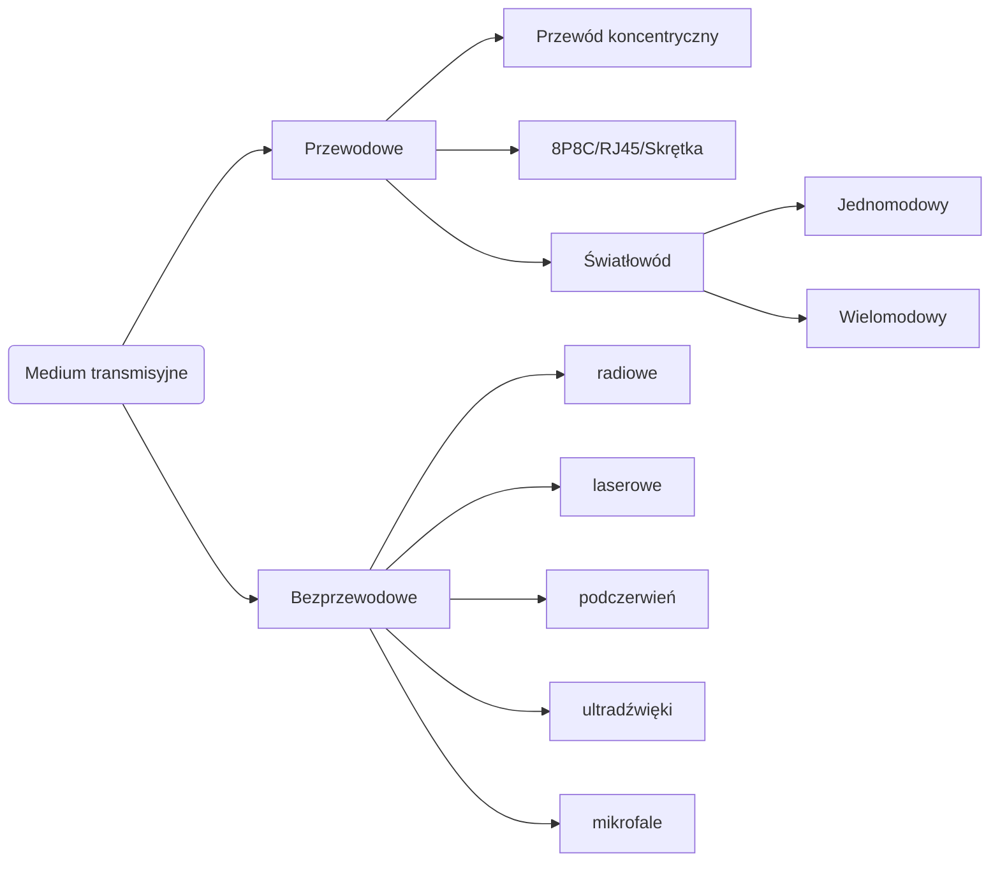

```yaml
author:       ["BO$"]
date:         [27.02.2024, 14.06.2024]
copyright:    "All rights reserved (c) 2024 WEEK-END DEVELOPMENT"
status:       "IN PROGRESS"
version:      0x0002
```
- [ROZWIĄZANIA TELEINFORMATYCZNE SIECI INTERNET - WYKŁADY](#rozwiązania-teleinformatyczne-sieci-internet---wykłady)
- [Medium transmisyjne](#medium-transmisyjne)
- [Przewodowe](#przewodowe)
  - [Światłowód](#światłowód)
    - [Jednomodowy](#jednomodowy)
    - [Wielomodowy](#wielomodowy)
    - [Budowa](#budowa)
    - [Rodzaje zakończeń](#rodzaje-zakończeń)
    - [Systemy światłowodowy](#systemy-światłowodowy)
    - [FITL](#fitl)
  - [8P8C RJ45 Skrętka](#8p8c-rj45-skrętka)
    - [Typy](#typy)
    - [Kategorie](#kategorie)
    - [Parametry techniczne](#parametry-techniczne)
  - [Przewód koncentryczny](#przewód-koncentryczny)
    - [Typy](#typy-1)
    - [Budowa](#budowa-1)
- [Bezprzewodowe](#bezprzewodowe)
  - [Bluethoot](#bluethoot)
  - [5G](#5g)
- [Rodzaj transmisji](#rodzaj-transmisji)
  - [SIMPLEX](#simplex)
  - [HALF-DUPLEX](#half-duplex)
  - [FULL-DUPLEX](#full-duplex)
- [DEFINICJE](#definicje)
  - [MIMO](#mimo)
- [BIBLIOGRAFIA](#bibliografia)

# ROZWIĄZANIA TELEINFORMATYCZNE SIECI INTERNET - WYKŁADY
```yaml
wykład: 1
temat:  Wprowadzenie
data:   27.02.2024
```
# Medium transmisyjne

# Przewodowe
## Światłowód
### Jednomodowy
Pracuje w oknach transmisji 1310nm i 1550nm, przy czym wartość dyspersji jest najmniejsza dla okna 1310nm.

Światłowody jednomodowe o przesuniętej dyspersji są optymalizowane do pracy w oknie transmisyjnym 1550nm i zapewniają szersze pasmo przenoszenia od światłowodu jednomodowego w tym samym oknie. Umożliwia to budowę dłuższych odcinków bez konieczności stosowania regeneracji sygnału (100-150km).

Światłowód będzie prowadził tylko jeden mod, jeżeli jego częstotliwość znormalizowana V będzie mniejsza niż 2,405.

$$ V = \frac{\pi d}{\lambda} \sqrt{n^2_1 - n^2_2} $$

Gdzie: $d$ - średnica rdzenia światłowodu, $\lambda$ - długość fali optycznej transmitowanej, $n_1$ - współczynnik załamania rdzenia,  $n_2$ współczynnik załamania płaszcza

### Wielomodowy
(ang. Multi Mode Fiber, MMF)

### Budowa
| OD ŚRODKA          | Jednomodowy  | Wielomodowy   |
| ------------------ | ------------ | ------------- |
| Rdzeń              | 9μm (8-10μm) | 50μm / 62.5μm |
| Płaszcz            | 125μm        |
| Pokrycie pierwotne | 245μm        |
| Warstwa barwna     |              |
| Bufor              | 400μm        |

### Rodzaje zakończeń
- ST
- SC
- FC

### Systemy światłowodowy
- OLT (ang. Optical Line Termination) - zakończenie linii optycznej zwane czasami HDT (and. Host Digital Termination),
- ONU (ang. Optical Network Unit) - jednostka sieci optycznej,
- ODN (ang. Optical Distribution Network) - optyczna sieć dystrybucyjna.

### FITL
 (ang. Fiber In The Loop - światłowodowy system sieci abonenckiej)
Zależnie od ulokowania optycznej jednostki sieciowej ONU (Optical Network Unit) można wyróżnić trzy architektury sieci:
- FTTB (ang. Fiber To The Building) -  jest architekturą idealną dla zapewnienia zaawansowanych usług multimedialnych dla abonentów w budynkach z wieloma apartamentami np. biurowców, hoteli, centrów biznesu i zakładów przemysłowych.
- FTTC (ang. Fiber To The Curb) - jest rozwiązaniem efektywnym pod względem ceny dla grupy zabudowań i osiedli mieszkaniowych.
- FTTH (ang.Fiber To The Home) - polega na doprowadzeniu osobnego światłowodu do domu każdego abonenta (zespół ONU/NT jest umieszczany bezpośrednio u użytkownika).

## 8P8C RJ45 Skrętka
### Typy
- UTP - nieekranowana
- FTP - ekranowana folią
- STP - ekranowana siatką

### Kategorie
| Cat. | Standard sieci              | Przepustowość |
| ---: | --------------------------- | ------------- |
|    1 | -                           | 0.4MHz        |
|    2 | -                           | 4MHz          |
|    3 | Ethernet10Base-T            | 16MHz         |
|    4 | Token Ring 16Mb/s           | 20MHz         |
|    5 | FastEthernet100Base-TX      | 100MHz        |
|   5e | GigabitEthernet1000Base-T   | 100MHz        |
|    6 | GigabitEthernet1000Base-T   | 250MHz        |
|   6a | 10-GigabitEthernet10GBase-T | 500MHz        |
|    7 | 10-GigabitEthernet10GBase-T | 600MHz        |
|   7a | 10GBase-T                   | 1000MHz       |
|  8.1 | 40GBase-T                   | 1600-2000MHz  |

### Parametry techniczne
- **Tłumienie sygnału** - to stosunek napięcia wyjściowego do napięcia wejściowego wyrażony w decybelach [dB]
- **Propagacja sygnału** – to prędkość impulsu elektrycznego w stosunku do prędkości światła wyrażona w procentach [%]
- **Rezystancja** – to opór jaki kabel stawia prądowi elektrycznemu wyrażony w omach [ $\Omega$ ]
- **Przesłuch zbliżny (NEXT)** – to zakłócenie generowane w danej parze na skutek transmisji danych w sąsiedniej parze żył

> [!WARNING]
> Nie przekraczać maksymalnego zagięcia kabla, który wynosi standardowo 4x $\phi$ kabla typu skrętka.

## Przewód koncentryczny
### Typy
| Rodzaj | Grubość | Max długość | Standard sieci | Max przepustowość |
| ------ | ------- | ----------- | -------------- | ----------------- |
| cienki | 5mm     | 185m        | 10base-2       | 10Mb/s            |
| gruby  | 10mm    | 500m        | 10base-5       | 10Mb/s            |
### Budowa
OD ŚRODKA: miedziany rdzeń -> plastikowa izolacja -> miedziany ekran -> osłona/bufor

Zakończony złączem BNC lub zakończeniem kabla `terminatorem BNC`

# Bezprzewodowe
## Bluethoot

## 5G
Scenariusze zastosowań zdefiniowane przez ITU dla sieci 5G:
- eMBB (enhanced Mobile Broadband) – dostęp wysokich prędkości, w tym również dla użytkowników stacjonarnych (Fixed Wireless Access).
- URLLC (Ultra Reliable Low Latency Communications) – zastosowania wymagające bardzo niskich opóźnień (**poniżej 1 ms**) i/lub bardzo wysokiej niezawodności (poziom błędów 10^(−5))
- mMTC (massive Machine Type Communications) – dla szerokiego spektrum zastosowań Internetu Rzeczy, z możliwością obsłużenia do **1 mln urządzeń na km^2**.


# Rodzaj transmisji
| #         | SIMPLEX                                      | HALF-DUPLEX                         | FULL-DUPLEX                         |
| --------- | -------------------------------------------- | ----------------------------------- | ----------------------------------- |
| Kierunek  | Jednokierunkowa                              | Dwukierunkowa naprzemienna          | Dwukierunkowa niezależna            |
| Wydajność | Tylko wysyłanie informacji, lub tylko odbiór | Naprzemienne wysyłanie i odbieranie | Wysyłka i odbiór danych niezależnie |
| Przykład  | Komunikacja broadcast                        | RS485, Modbus RTU                   | Ethernet                            |

## SIMPLEX
## HALF-DUPLEX
## FULL-DUPLEX

# DEFINICJE
## MIMO
(Multiple Input, Multiple Output) w telekomunikacji to technologia wykorzystująca wielokierunkowość anten zarówno po stronie nadawczej, jak i odbiorczej, celem zwiększenia przepustowości i efektywności łączności radiowej.
- MISO - kilka anten nadawczych, 1 odbiorcza
- SIMO - 1 nadawcza, kilka odbiorczych,
- SISO - 1 nadawcza, 1 odbiorcza.

# BIBLIOGRAFIA
- [Speed test wiki](https://www.speedtest.pl/wiki/technologie/swiatlowod-ftth-fttb-fttc)
- [Wiki-Medium transmisyjne](https://pl.wikipedia.org/wiki/Medium_transmisyjne)
- [Wykresy Mermaid](https://mermaid.js.org/syntax/timeline.html)
- [Światłowód jedno/wielomodowy](https://www.dipol.com.pl/swiatlowod_jednomodowy_i_wielomodowy_-_wprowadzenie_bib321.htm)
- [Światłowody WIKI](https://pl.wikipedia.org/wiki/%C5%9Awiat%C5%82ow%C3%B3d)
- [Bezprzewodowe](https://allinonebyplucek.blogspot.com/2017/11/sieci-komputerowe-media-bezprzewodowe.html)